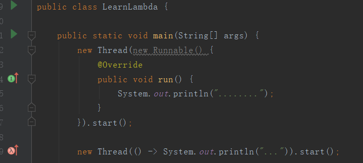
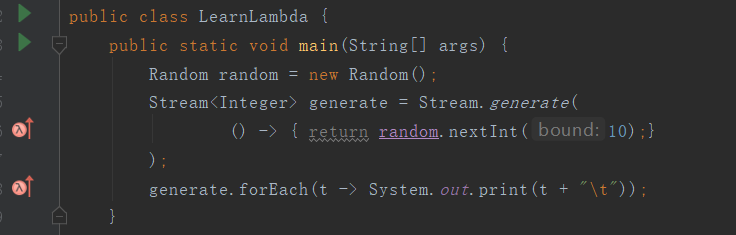
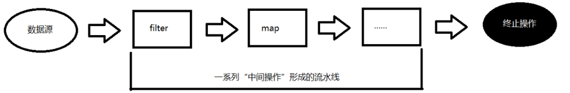
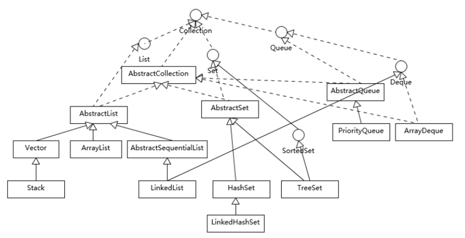

# Java

Java连接数据库资源，为什么要释放资源，不释放行么？因为在创建连接对象的时候会消耗非常大，如果你暂存资源的话性能就会收到极大的损害，所以我们用完了要马上释放那个资源，让别人可以用

**RMI（Remote Method Invoke）： RPC** 该技术遵循了一个协议，就是RPC协议。

以上的内容和连接的内容有关


本文更多的简述Java8的相关知识，因为Java 8 于2014年3月14号发布以来，可以看成是自Java 5 以来最具革命性的版本。Java 8为Java语言、编译器、类库、开发工具与JVM带来了大量新特性。

* 速度更快
* 代码更少(增加了新的语法：Lambda 表达式)
* 强大的 Stream API
* 便于并行
* 最大化减少空指针异常：Optional


## Java访问权限

本类中的方法可以直接访问本类中的成员变量。**特殊**：static成员访问非static成员，编译不通过。

### 内部类

当一个事物的内部，还有一个部分需要一个完整的结构进行描述，而这个内部的完整的结构又只为外部事物提供服务，那么整个内部的完整结构最好使用内部类。而且**声明为内部类可以直接使用访问外部类的所有的成员，包括私有的**。JRE核心类库集合的迭代器大量使用内部类。

内部类分为：

* 静态内部类
* 非静态内部类
  * 成员内部类
  * 局部内部类
  * 匿名内部类

比较常见的就是**非静态成员内部类**，关于这部分类:

内部类仍然是一个独立的类，在编译之后内部类会被编译成独立的.class文件，但是前面冠以外部类的类名和`$`符号。例如：`Outer$Inner.class`；成员内部类可以使用修饰符public,protected,default,private；成员内部类还可以使用final和abstract修饰；成员内部类中**不可以包含静态成员；** 成员内部类可以直接使用外部类的所有成员，包括私有的。如果成员内部类有与外部类的非静态属性重名时，可以通过“外部类名.this.属性”进行区别，如果与外部类的静态属性重名时，可以通过“外部类名.类变量”进行区别；

关于非静态成员内部类的使用：

* 在外部类中使用成员内部类：

* 在外部类的静态成员中**不能**使用非静态的成员内部类

* 在外部类的非静态成员中，直接创建内部类的对象来访问内部类的属性与方法。此时把它当做一个普通的类即在外部类的外面使用成员内部类：需要外部类的对象才能创建成员内部类的对象


## Java反射

[参考链接]()

### 反射的作用：

* 在运行期间，确定某个类型，动态的创建一个对象
* 在运行期间，获取某个对象的类型的全部信息
* 在运行期间，动态的为某个对象的某个属性赋值，获取或者某个属性值
* 在运行期间，动态的调用某个对象的某个方法***

### 反射的根源（java.lang.Class）

~~~java
/**
 * Instances of the class {@code Class} represent classes and
 * interfaces in a running Java application.  An enum is a kind of
 * class and an annotation is a kind of interface. ery array also
 * belongs to a class that is reflected as a {@code Class} object
 * that is shared by all arrays with the same element type and number
 * of dimensions.  The primitive Java types ({@code boolean},
 * {@code byte}, {@code char}, {@code short},
 * {@code int}, {@code long}, {@code float}, and
 * {@code double}), and the keyword {@code void} are also
 * represented as {@code Class} objects.
*/
public final class Class<T>
extends Object
implements Serializable, GenericDeclaration, Type, AnnotatedElement
~~~

在Java中，每一个类在加载到了JVM中后，都会有一个该类的Class对象，根据这个Class对象，我们可以获取到该类的类信息，如此一来我们就能够创建该类的对象了。**每一个被加载到JVM中的类的存在形式，表面是类文件（即字节码文件）实际上是该类的Class类对象**。

**Java中任意类型，在运行期间都对应一个唯一的Class类对象。**

> Java的类型：
> ​        8种基本数据类型和void
> ​        引用数据类型：类（class，enum）、接口(interface,@interface)、数组([])

> `Class` has no public constructor. Instead `Class` objects are constructed automatically by the Java Virtual Machine as classes are loaded and by calls to the `defineClass` method in the class loader.

**Class类没有公共的构造方法，Class类对象是在类加载时由JVM及通过调用调用类加载器中的defineClass方法自动构造的**。这句话，说明我们无法new 一个 Class类的对象，只能通过某种方式去获取这个Class对象。因为一个类型只有一个Class类的对象，而且在加载到JVM时候必须有且仅有一个Class对象，那么JVM自动给我们创建以此来确保唯一也帮我们省事，如果我们需要使用这个类的Class对象，java提供获取方式给我们，接下来我们来认识一个获取**Class类对象的方法。一共有四种方法**，我们依次来说：

#### :one:类名/型.class

**适用于所有的类型。**

~~~java
System.out.println("void的类对象：" + void.class);//void的类对象：void
System.out.println("Object的类对象：" + Object.class);//Object的类对象：class java.lang.Object
System.out.println(int[].class);//class [I
System.out.println(int[][].class);//class [[I
System.out.println(Override.class);//interface java.lang.Override
System.out.println(ElementType.class);//class java.lang.annotation.ElementType
System.out.println(Serializable.class);//interface java.io.Serializable
System.out.println(TestClass.class);//class com.isea.java.TestClass
~~~

#### :two:对象名.getClass()

适用于引用数据类型，必须有对象才能用，如类，接口，枚举，数据等的对象都可以得到，它对应的运行时的类型。

~~~java
Object obj = new String();
Class<? extends Object> c1 = obj.getClass();
System.out.println(c1);//class java.lang.String
~~~

#### :three:Class.forName("类型的全名称")

适用于类，接口，枚举，注解，基本数据类型，数组是不能使用这个方法得到的。

~~~java
Class c1 = String.class;
Class c2 = new String().getClass();
Class c3 = Class.forName("java.lang.String");
System.out.println(c1 == c2);//true
System.out.println(c1 == c3);//true
System.out.println(c2 == c3);//true 证明一个类对应的Class对象是唯一的
~~~

#### :four: 类加载器对象.loadClass("类型的全名称")

适用于类，接口，枚举，注解。所谓的类加载器，我们可以简单的理解为用来加载类的东西。这种方式，我们首先要得到类加载器的对象，介绍其中一种方式：

~~~java
ClassLoarder.getSystemClassLoader()
~~~

~~~java
ClassLoader loader = ClassLoader.getSystemClassLoader();
Class<?> c1 = loader.loadClass("java.lang.Object");
System.out.println(c1);//class java.lang.Object
~~~

**调用该方法的对象对应的类要含有public类型的无参构造**

### 反射的应用

我们先来看看，如果不使用反射，假如在编译期间，我们就已经知道类型：

~~~java
public class Student {}
public class TestClass {
    public static void main(String[] args){
        Student student = new Student();
    }
}
~~~

以上的例子中，我们已经知道有了Student类，我们直接创建该对象，这样做虽然非常的简洁，但是Student类和我们的TestClass直接发生了联系（耦合）一旦我们修改了Student类，我们就得修改TestClass中的代码。再来看另外的一种场景，假如我们在编译期间不确定某个类型，只知道这个某个接口的实现类，但是我们能够在配置文件中获取类名。（广泛使用在web和框架中）来看下面的例子：配置文件dao.properties：

~~~properties
dao = com.isea.dao.StudentDaoImp
~~~

~~~java
public interface IStudentDao {
    void test();
}
~~~

测试代码：

~~~java
Properties properties = new Properties();
properties.load(new FileInputStream("dao.properties"));//加载的是项目于根目录src（目录下）文件下
String name = properties.getProperty("dao");
Class c = Class.forName(name);
IStudentDao iStudentDao = (IStudentDao) c.newInstance();
iStudentDao.test();
~~~

以上代码，在编译期间是不会报错的，但是在运行的时候回报如下的异常：

~~~java
Exception in thread "main" java.lang.ClassNotFoundException:
 com.isea.dao.StudentDaoImp
~~~

找不到该类！以上的这段代码利用了反射通过编译，但是**并不表示运行期间这个类型可以不存在**。代码中我们并没有出现我们要创建的类型（即从配置文件读取的文件类型）。假如我们创建这个类：

~~~java
import com.isea.java.IStudentDao;
public class StudentDaoImp implements IStudentDao {
    @Override
    public void test() {
        System.out.println("Just for test...");
    }
}
~~~

这样代码就能够正常的运行。这个时候，我们编写的测试类没有直接和StudentDao发生任何的关系（解耦合）。实际上，这个例子中的获得Class对象，并获得这个对象的实例都将由一些框架完成，如javaWeb中Servelet对象都是TomCat创建的，一些接口的实现类都交由Spring等框架来做，可以理解为框架帮助我们管理写在配置文件中的那些类，获取类的信息，创建该类实例等。

本例子模拟了框架中对于反射的应用，值得把玩，框架提前在不知道要创建什么类的情况下通过反射，获取相关要创建类的信息（其实没有，但是能够通过编译）在运行之前，我们需要编写配置文件，将要创建的类告诉框架；框架并能够帮我们创建我们写在配置文件中的类的对象。

## Java多态相关

#### 重写

* 父类引用指向子类对象

* 编译时多态，方法的重载

* 运行时多态，动态绑定  

一个对象的多种形态。多指的是运行时多态，即在编译期间不能确定具体调用的是哪些方法，在运行的时候能知道。

>  多态，有点像是，蜘蛛侠：蜘蛛侠有一个人的形态，有一个蜘蛛超人的形态，要是世界没有危险，就是正常的人的形态，要是世界存在了危险，就有了蜘蛛超人的形态。需要根据具体的场景来判断是使用超人的形态，还是普通人的形态。在java中，一个对象可能有多个方法，有的是来自于对象本身，有的是来自于父类，在调用运行自己的方法的时候具体使用哪一个，JVM需要辨别出来，java使用的是动态绑定机制。

jvm在执行对象的**成员方法**时，会将这个**方法和对象的实际内存进行绑定**，然后进行调用；动态绑定和变量没有关系，只和方法有关系，也即**成员方法参与绑定，变量不参与绑定，方法看内存，变量看声明（父类的引用取父类的字段，子类的引用取子类的字段）**。

~~~java
public class Test {
 
    public static void main(String[] args) {
        AA aa = new BB();
        System.out.println(aa.getResult());
    }
}
 
class AA{
    private int i = 10;
 
    public int getResult(){
        return i + 10;
    }
}
 
class BB extends AA{
        private int i = 20;
 
        public int getResult(){
            return i + 20;
        }
}
/**
这里注意的是在BB中有几个getResult的方法，是两个，一个是自己的，一个是从父类继承来的当前的实际内
存是BB，所以会查看BB中有没有这个方法（也即getResult方法），有，调用的就是本身的getResult方法 所
以打印的是40
*/
~~~

~~~java
public class Test {
    public static void main(String[] args) {
        AA aa = new BB();
 
        System.out.println(aa.getResult());//20
    }
}
 
class AA{
    private int i = 10;
 
    public int getResult(){
        return i + 10;
    }
}
 
class BB extends AA{
    private int i = 20;
}
 
/**
这里打印的结果是20，这里只有一个getResult方式，是父类的，所以调用从父类继承来的getResult方法， 
但是这个i的值是多少呢？又因为 动态绑定机制和变量没有关系，不会看i 的内存是谁，只看在哪里声明的，
所以这里会在哪里声明，在哪里使用，在父类声明，（父类中的方法中使用的变量可能在子类中声明么？不可能）
*/
~~~

~~~java
public class Test {
    public static void main(String[] args) {
        AA aa = new BB();
        System.out.println(aa.getResult());//30
    }
}
 
class AA{
    public int i = 10;
 
    public int getResult(){
        return getI() + 10;
    }
 
    public int getI() {
        return i;
    }
}
 
class BB extends AA{
    public int i = 20;
 
    @Override
    public int getI() {
        return i; 
    }
}

/**
此时的打印结果是30，为什么呢？来一起分析一下，首先这调用了getResult方法，会发现当前对象的实际内
存中没有这个方法，在没有的情况下，一定会找父类中的getResult方法，在这个getResult方法中的getI也
是一个成员方法，只要是成员方法就会受到动态绑定机制的影响，就会看看当前对象中有没有这个方法，有这
个方法，返回i值， 这里并不是因为BB中的成员变量就是一个 i， 实际上是有两个 i ，因为从父类还继承了
一个 i，还可以访问到，所有有两个 i 。 所有这里有两个 i，因为这里是的this i，
*/
~~~

#### 重载：

* 在同一个类中

* 只和方法的名字和参数有关（方法名相同，方法的参数不同）

~~~java
public class Test {
    public static void main(String[] args) {
        AA aa = new BB();
        test(aa);
    }
}

public static void test(AA aa){
    System.out.println("aaaa");
}

public static void test(BB bb){
    System.out.println("bbbb");
}


class AA{
}

class BB extends AA{
}
/**
此时打印的是aaaa，因为方法的重载只和方法的名字和参数列表有关系，（使用哪个方法，在编译期间就已经
确定了，但是和方法的重写是在运行的确定的，运行时体现了方法的多态。）这里参数一个，只能看参数的类
型，这里是参数aa是AA类型的，所以会调用第一个test方法。
*/
~~~

#### 面向接口编程

~~~java
//1,
List<String> list = new ArrayList<String>();
//2,
ArrayList<String> arrayList = new ArrayList<String>();
~~~

①是面向接口编程，什么时候写成②写法呢？有些时候使用到了该类特定的方法的时候，需要使用到下面的写法，因为虽然接口有特定的规范，但是这个规范不可能什么都包括，什么功能都覆盖，所以使用下面的写法。

java中的动态代理是面向接口代理的。这句话应该怎么去理解？你有接口才能做动态代理，也即谁实现了这个接口，那么该接口就可以做实现类的代理。

~~~java
public class Test {
    public static void main(String[] args) {
        A a = new C();
    }
}

interface A {}

class B implements A {}

class C extends B {}
~~~

这里面构建类的时候之所以可以这样写，并不是因为 B实现了A，C继承了B，所以 C也实现了A，于是接口引用指向实现类的地址。为什么呢？我们获取interface的个数：

~~~ java
System.out.println(C.class.getInterfaces().length); // 0
~~~

这里面 A a = new C(); 为什么可以呢？因为子类对象可以代替父类对象出现，因此A a = new B() 是可以的，使用一个B的子类来代替了他，所以语法结构这里有两个关系，一个是接口和实现类的关系，一个是父类和子类的关系。不能说C 实现了 A。


## Lambda表达式

<https://blog.csdn.net/qq_31807385/article/details/82670505>该博文，说的还算清楚。


### 使用逻辑

从**I** 入口进入，是对接口的实现；从**lambda**进入，是对函数式接口的实现，**所谓函数式接口就是一个接口，只有一个抽象方法**，该接口在在作为另外一个方法（可能是构造方法，也可能是其他方法）的参数，的时候，（比如这里在做为Thread类的构造函数的参数）就可以使用**lambda**表达式来。逻辑应该是这样的：

* Thread类的构造可以传入Runnable接口的实现类，
* Runnable接口是一个函数式接口，
* 所以Thread类的构造函数中使用Lambda表达式来实现

在来看看新的例子：

~~~java
public class LearnLambda {
    public static void main(String[] args) {
        List<String> list = new ArrayList<>();
        list.add("one");
        list.add("two");
        list.add("three");
        list.add("four");
        list.forEach(w -> System.out.println(w));
    }
}
/*  one
    two
    three
    four
 */
~~~

这里的逻辑是：

* forEach方法的的参数是**Consumer**接口
* 该接口是一个函数式接口
* 所以直接在forEach方法中使用Lambda表达式来实现

在来一个例子：



这里的逻辑是：

* generate()方法参数是**Supplier** 接口
* 该接口是一个函数式接口
* 所以直接在generate()方法中直接使用Lambda表达式

这里，必须要有返回值，

~~~java 
public class LearnLambda {
    public static void main(String[] args) {
        Random random = new Random();
        Stream<Integer> generate = Stream.generate(
                () ->  random.nextInt(10)
        );
        generate.forEach(t -> System.out.print(t + "\t"));
    }
}
~~~

还有一处逻辑，这里不再举例，

* 某某方法的参数是**Function**接口
* 该接口是一个函数式接口，要求有返回值，有参数
* 所以在某某方法内可以使用lambda表达式

在java.util.function包下还有很多函数式接口可供使用。也即，如果某个方法中传入的参数是`function`包下的函数式接口，那么就可以直接使用Lambda表达式。

### 方法引用

**当Lambda表达式满足某种条件的时候，使用方法引用，可以再次简化代码**

## Stream流

> the Stream API is used to process collections of objects.

`Stream API ( java.util.stream) `把真正的函数式编程风格引入到Java中。这是目前为止对Java类库最好的补充，因为Stream API可以极大提高Java程序员的生产力，让程序员写出高效率、干净、简洁的代码。

Stream 是 Java8 中处理集合的关键抽象概念，它可以指定你希望对集合进行的操作，可以执行非常复杂的查找、过滤和映射数据等操作。 使用Stream API 对集合数据进行操作，就类似于使用 SQL 执行的数据库查询。也可以使用 Stream API 来并行执行操作。简言之，Stream API 提供了一种高效且易于使用的处理数据的方式。

### Stream是什么？

**是数据渠道，用于操作数据源（集合、数组等）所生成的元素序列。**“集合讲的是数据，Stream流讲的是计算！”

* Stream 自己不会存储元素。

* Stream 不会改变源对象。相反，他们会返回一个持有结果的新Stream。

* Stream 操作是延迟执行的。这意味着他们会等到需要结果的时候才执行。

### Stream怎么玩？

* 创建 Stream，一个数据源（如：集合、数组），获取一个流

* 中间操作，一个中间操作链，对数据源的数据进行处理

* 终止操作(终端操作)，一旦执行终止操作，就执行中间操作链，并产生结果




**代码例子：**

~~~java
public class LearnStream {
    public static void main(String[] args) {
        List<Integer> numbers = Arrays.asList(1, 2, 3, 4, 5, 6);

        // demonstration of map method
        List<Integer> queue = numbers.stream().map(x -> x * x).collect(Collectors.toList());
        System.out.println(queue); // [1, 4, 9, 16, 25, 36]

        // create a list of String
        List<String> names = Arrays.asList("Reflection", "Collection", "Stream");
        // demonstration of filter method
        List<String> result = names.stream().filter(s -> s.startsWith("S")).collect(Collectors.toList());
        System.out.println(result); // [Stream]

        List<String> show = names.stream().sorted().collect(Collectors.toList());
        System.out.println(show); // [Collection, Reflection, Stream]

        // collect method returns a set
        Set<Integer> toSet = numbers.stream().map(x -> x * x).collect(Collectors.toSet());
        System.out.println(toSet); // [16, 1, 4, 36, 9, 25]

        // demonstration of forEach method
        numbers.stream().map(x -> x * 2).forEach(t -> System.out.print(t + "\t")); //  2	4	6	8	10	12

        System.out.println();
        // demonstration of reduce method
        Integer reduce = numbers.stream().filter(x -> x % 2 == 0).reduce(1, (initial, b) -> initial + b);
        System.out.println(reduce); // 13 ,第一个参数为0的时候，结果为12
    }
}
~~~


## 基础知识

### 注解

注解不是程序本身，可以对程序作出解释。Annotation 可以像修饰符一样被使用, 可用于修饰包，类, 构造器, 方法, 成员变量, 参数, 局部变量。相当于给它们添加了额外的辅助信息，而且有些注解我们可以通过反射机制编程实现对这些元数据的访问。

~~~java
/**
@author 标明开发该类模块的作者，多个作者之间使用,分割
@version 标明该类模块的版本
@see 参考转向，也就是相关主题
@since 从哪个版本开始增加的
@param 对方法中某参数的说明，如果没有参数就不能写
@return 对方法返回值的说明，如果方法的返回值类型是void就不能写
@exception 对方法可能抛出的异常进行说明 ，如果方法没有用throws显式抛出的异常就不能写
其中 @param  @return 和 @exception 这三个标记都是只用于方法的。

@param的格式要求：@param 形参名 形参类型  形参说明
@return 的格式要求：@return 返回值类型 返回值说明
@exception的格式要求：@exception 异常类型 异常说明
@param和@exception可以并列多个
*/
~~~

#### 自定义注解与反射读取注解

* 定义新的 Annotation 类型使用 `@interface` 关键字

* Annotation 的成员变量在 Annotation 定义中以**无参数方法**的形式来声明。 其**方法名和返回值定义了该成员的名字和类型**，我们称为**配置参数**。类型只能是八种基本数据类型、String类型、Class类型、enum类型、Annotation类型、以上所有类型的数组

* 可以在定义 Annotation 的成员变量时为其指定初始值, 指定成员变量的初始值可使用 default 关键字
* 如果只有一个参数成员，建议使用参数名为value
*  如果定义的注解含有配置参数，那么使用时必须指定参数值，除非它有默认值。格式是“参数名 = 参数值”，如果只有一个参数成员，且名称为value，可以省略“value=”
* 没有成员定义的 Annotation 称为标记; 包含成员变量的 Annotation 称为元数据 Annotation

注意：自定义注解必须配上注解的信息处理流程才有意义。

#### 元注解

Java5.0，`java.lang.annotation`包定义了4个标准的meta-annotation类型，它们被用来提供对其它 annotation类型作说明。

~~~java
- @Target
- @Retention
- @Documented
- @Inherited
    
// 举个例子
@Documented // @Documented是否生成文档的标注, 也就是生成接口文档, 是否生成注解文档
@Retention(RetentionPolicy.RUNTIME)  // 注解表示的是本注解(标注这个注解的注解保留时期)
@Target(ElementType.METHOD)  // @Target注解是标注这个类它可以标注的位置,常用的元素类型(ElementType)
~~~

### 枚举

 某些类的对象只有确定的有限个的时候，可以将这样的类声明为枚举类。

- 星期：Monday(星期一)......Sunday(星期天)

- 性别：Man(男)、Woman(女)

**JDK1.5**之前：

- 私有化类的构造方法，保证类的外部不能不能创建对象
- 在类的内部创建对象，声明为`public static final`

```java
package com.isea.others;

public class JDK5Enum {
    public static void main(String[] args) {
        System.out.println(Season.SPRING);
    }
}

class Season{
    public static final Season SPRING = new Season();
    public static final Season SUMMER = new Season();
    public static final Season AUTUMN = new Season();
    public static final Season WINTER = new Season();
    private Season(){}

    @Override
    public String toString(){
        if(this == SPRING){
            return "SPRING";
        }else if(this == SUMMER){
            return "SUMMER";
        }else if(this == AUTUMN){
            return "AUTUMN";
        }else{
            return "WINTER";
        }
    }
}
```

**JDK1.8**之后：

- 使用`enum`定义了枚举类，默认继承了` java.lang.Enum`类，因此不能继承其他的类

- 形式如下：

  ```java
  [修饰符] enum 枚举类{
      常量对象列表
      其他成员
  }
  ```

- 枚举类的所有构造器都只能使用`private`关键字

- 枚举类的所有实例都必须在首行列出，以','分隔

- jdk1.5之后，可以使用枚举作为`swich`后面的表达式

```java
package com.isea.others;

public class JDK8Enum {
    public static void main(String[] args) {
        Period p = Period.SPRING;
        switch(p){
            case SPRING:
                System.out.println("春暖花开");break;
            case SUMMER:
                System.out.println("夏日炎炎");break;
            case AUTUMN:
                System.out.println("秋高气爽");break;
            case WINTER:
                System.out.println("白雪皑皑");break;
        }
    }
}
enum Period{
    SPRING,SUMMER,AUTUMN,WINTER;
}
```

### 泛型

使用泛型的目的，不说了，举个例子：

`ArrayList<String> ` 表示的就是在动态数组中只能存放String类型的元素。

#### 泛型类和泛型接口

拿一个类来说，我们希望该类的成员的类型在创建的时候在指定，我们可以定义一个泛型类，如下：

~~~java
public class Student<T>{
    private String name;
    privete T score; // 这里就可以声明为泛型，在创建Student的对象的时候，在指定score的类型，可见，泛型能够体现出代码的重用性。T 可以是任意的类型，也可以是自定义类型
}

// 创建的时候
Student stu = new Student<Integer>();

// 泛型接口
public interface List<E> extends Collection<E>{
//***
}

ArrayList<? extends Person>  //使用泛型类或接口作为形参时，此处指定为Person或其子类
    
ArrayList<? super Son>     //使用泛型类或接口作为形参时，此处指定为Son或其父类  
~~~

#### 泛型方法

* 如果某个类不是泛型类，而某个方法需要使用泛型
* 如果某个类是泛型类，但是需要在静态方法上使用泛型

~~~java
public class Student{
    public static <T> method(E e){ // 参数E不能变为<E> 
        // 要求传入的类型为E，返回的类型为T
    }
    
    public <E> method(){
        // 要求返回的类型为E
    }
}

public <E> method(){
    // 
}
~~~

## java.collection

下图没有将java.util.concurrent包下的线程安全容器添加到进去，也么有列出Map容器，但是Map也是作为集合框架的一部分，再但是本身Map并不是真正的Collection。



| List        | 有序集合，可以重复                     |
| ----------- | -------------------------------------- |
| Set         | 不允许重复元素                         |
| Queue/Deque | Java提供的标准队列的实现，还支持FIFO， |

| TreeSet      | 支持自然顺序访问 |
| ------------ | ---------------- |
| HashSet      | 没有顺序         |
| LinkedHahSet | 保持插入的顺序   |

如何实现线程不安全的集合支持并发编程的场景：`List list = Collections.synchronizedList(new ArrayList());  `该方法的实现，就是在get，set，add等基本方法前面添加了`synchronizd`关键字**Set的底层实现是**Map，具体的value的值是虚拟对象Dummy对象，PRESENT。在Java9 中，Java标准库提供了一系列的静态工厂方法，比如List.of() ， Set.of()，创建不可变的集合。

| Hashtable     | 早期提供的哈希表的实现，本身是同步的，不支持null键和值，不推荐用 |
| ------------- | ------------------------------------------------------------ |
| HashMap       | 不是同步的，支持null键和值，   （并发编程中产生，无限占用CPUsize不准等异常） |
| TreeMap       | 基于红黑树 的一种提供**顺序访问的Map**，它的get，put，remove等方法都是log（N）的时间复杂度，顺序由比较器（comparator）或自然顺序（comparable）来决定。 |
| LinkedHashMap | 遍历顺序符合插入顺序（也维护了双向链表）场景：比如释放空间占用敏感的资源池中，将最不长访问的对象释放掉。如LRU。 |


#### HashMap的源码：

putVal 方法本身逻辑非常集中，从初始化、扩容到树化，全都和该方法有关

~~~java
// HashMap默认的初始大小是16
 static final int *DEFAULT_INITIAL_CAPACITY* = 1 << 4; // aka 16

 // 默认装载因子，当HashMap中的元素超过了0.75 * capacity的时候，扩容为原来的两倍
 static final float *DEFAULT_LOAD_FACTOR* = 0.75f;

 // 当链表的长度超过了8的时候，就需要treeify
 static final int *TREEIFY_THRESHOLD* = 8
~~~

HashMap的也是Lazy-load的模式，在首次使用的时候，才别初始化，new的时候只是被声明（特殊的构造除外）扩容的门限值：装载因子 * 容量 ，当达到了门限值的时候，就需要给Map扩容。扩容的时候，由于Map是成倍扩容的，门限值也成倍扩容的。

## java.sql.

### Connection

都听过JDBC，这个JDBC中的C就是Connection，这个Connection是一个接口，是Sun公司定义的规范，标准化了Java连接MySQL的方式

~~~java
/**
 * <P>A connection (session) with a specific
 * database. SQL statements are executed and results are returned
 * within the context of a connection.
 */
public interface Connection  extends Wrapper, AutoCloseable {
~~~

### Statement

~~~java
/**
 * The object used for executing a static SQL statement
 * and returning the results it produces.
 */
public interface Statement extends Wrapper, AutoCloseable {
~~~

## java.util.concurrent.

Java中创建线程的三个方式：

- Callable
- Runnable
- Thread

### Callable

~~~java
/**
 * A task that returns a result and may throw an exception.
 * Implementors define a single method with no arguments called
 * {@code call}.
 *
 * <p>The {@code Callable} interface is similar to {@link
 * java.lang.Runnable}, in that both are designed for classes whose
 * instances are potentially executed by another thread.  A
 * {@code Runnable}, however, does not return a result and cannot
 * throw a checked exception.
 */

// 这里说明了callable和Runnable的区别，前者有返回值，后者没有返回值。
~~~

一个例子：

~~~java
package com.isea.learn.apolloclient;

import java.util.concurrent.Callable;
import java.util.concurrent.ExecutionException;
import java.util.concurrent.FutureTask;

public class Test {
    public static void main(String[] args) throws ExecutionException, InterruptedException {
        FutureTask<Integer> futureTask01 = new FutureTask(new MyCallable01());
        FutureTask<Integer> futureTask02 = new FutureTask(new MyCallable02());
        FutureTask<Integer> futureTask03 = new FutureTask(new MyCallable03());
        new Thread(futureTask01).start();
        new Thread(futureTask02).start();
        new Thread(futureTask03).start();

        // 只要调用了这个get方法，当前的线程就会阻塞，这里的调用者是main线程，所以主线程会阻塞。
        System.out.println("计算结果 " + (futureTask01.get() + futureTask02.get() + futureTask03.get()));

    }
}

class MyCallable01 implements Callable<Integer>{

    @Override
    public Integer call() throws Exception {
        int sum = 0;
        for (int i = 0; i < 100; i++) {
            sum += i;
        }
        System.out.println("计算结果为：" + sum);

        return sum;
    }
}
class MyCallable02 implements Callable<Integer>{

    @Override
    public Integer call() throws Exception {
        int sum = 0;
        for (int i = 0; i < 1000; i++) {
            sum += i;
        }
        System.out.println("计算结果为：" + sum);

        return sum;
    }
}
class MyCallable03 implements Callable<Integer>{

    @Override
    public Integer call() throws Exception {
        int sum = 0;
        for (int i = 0; i < 10000; i++) {
            sum += i;
        }
        System.out.println("计算结果为：" + sum);
        return sum;
    }
}
~~~


## 类库

### ThreadLocal

[参考文章](<https://droidyue.com/blog/2016/03/13/learning-threadlocal-in-java/>)

ThreadLocal是一个关于创建线程局部变量的类。我们创建的变量是可以被任何一个线程访问并修改的。而使用ThreadLocal创建的变量只能被当前线程访问，其他线程则无法访问和修改。

该对象是放在了堆中还是栈中？堆中，只是通过了一些手段来将**可见性**改变为线程可见。