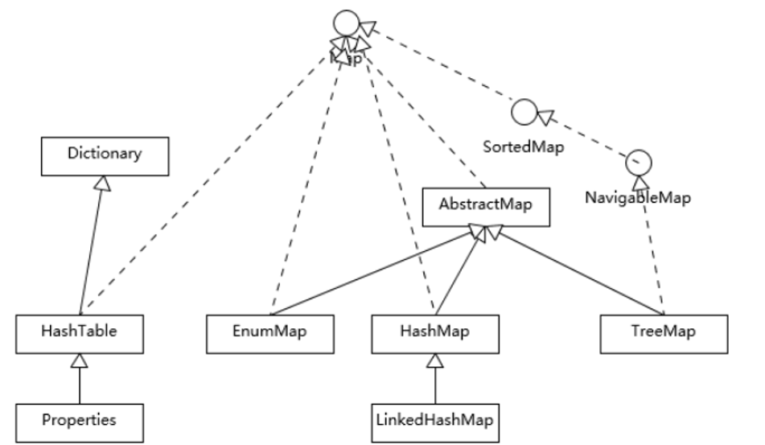

# Java规范

# Java

本文更多的简述Java8的相关知识，因为Java 8 于2014年3月14号发布以来，可以看成是自Java 5 以来最具革命性的版本。Java 8为Java语言、编译器、类库、开发工具与JVM带来了大量新特性。

* 速度更快
* 代码更少(增加了新的语法：Lambda 表达式)
* 强大的 Stream API
* 便于并行
* 最大化减少空指针异常：Optional

## Java反射

[参考链接]()

### 反射的作用：

* 在运行期间，确定某个类型，动态的创建一个对象
* 在运行期间，获取某个对象的类型的全部信息
* 在运行期间，动态的为某个对象的某个属性赋值，获取或者某个属性值
* 在运行期间，动态的调用某个对象的某个方法***

### 反射的根源（java.lang.Class）

~~~java
/**
 * Instances of the class {@code Class} represent classes and
 * interfaces in a running Java application.  An enum is a kind of
 * class and an annotation is a kind of interface. ery array also
 * belongs to a class that is reflected as a {@code Class} object
 * that is shared by all arrays with the same element type and number
 * of dimensions.  The primitive Java types ({@code boolean},
 * {@code byte}, {@code char}, {@code short},
 * {@code int}, {@code long}, {@code float}, and
 * {@code double}), and the keyword {@code void} are also
 * represented as {@code Class} objects.
*/
public final class Class<T>
extends Object
implements Serializable, GenericDeclaration, Type, AnnotatedElement
~~~

在Java中，每一个类在加载到了JVM中后，都会有一个该类的Class对象，根据这个Class对象，我们可以获取到该类的类信息，如此一来我们就能够创建该类的对象了。**每一个被加载到JVM中的类的存在形式，表面是类文件（即字节码文件）实际上是该类的Class类对象**。

**Java中任意类型，在运行期间都对应一个唯一的Class类对象。**

> Java的类型：
> ​        8种基本数据类型和void
> ​        引用数据类型：类（class，enum）、接口(interface,@interface)、数组([])

> `Class` has no public constructor. Instead `Class` objects are constructed automatically by the Java Virtual Machine as classes are loaded and by calls to the `defineClass` method in the class loader.

**Class类没有公共的构造方法，Class类对象是在类加载时由JVM及通过调用调用类加载器中的defineClass方法自动构造的**。这句话，说明我们无法new 一个 Class类的对象，只能通过某种方式去获取这个Class对象。因为一个类型只有一个Class类的对象，而且在加载到JVM时候必须有且仅有一个Class对象，那么JVM自动给我们创建以此来确保唯一也帮我们省事，如果我们需要使用这个类的Class对象，java提供获取方式给我们，接下来我们来认识一个获取**Class类对象的方法。一共有四种方法**，我们依次来说：

#### :one:类名/型.class

**适用于所有的类型。**

~~~java
System.out.println("void的类对象：" + void.class);//void的类对象：void
System.out.println("Object的类对象：" + Object.class);//Object的类对象：class java.lang.Object
System.out.println(int[].class);//class [I
System.out.println(int[][].class);//class [[I
System.out.println(Override.class);//interface java.lang.Override
System.out.println(ElementType.class);//class java.lang.annotation.ElementType
System.out.println(Serializable.class);//interface java.io.Serializable
System.out.println(TestClass.class);//class com.isea.java.TestClass
~~~

#### :two:对象名.getClass()

适用于引用数据类型，必须有对象才能用，如类，接口，枚举，数据等的对象都可以得到，它对应的运行时的类型。

~~~java
Object obj = new String();
Class<? extends Object> c1 = obj.getClass();
System.out.println(c1);//class java.lang.String
~~~

#### :three:Class.forName("类型的全名称")

适用于类，接口，枚举，注解，基本数据类型，数组是不能使用这个方法得到的。

~~~java
Class c1 = String.class;
Class c2 = new String().getClass();
Class c3 = Class.forName("java.lang.String");
System.out.println(c1 == c2);//true
System.out.println(c1 == c3);//true
System.out.println(c2 == c3);//true 证明一个类对应的Class对象是唯一的
~~~

#### :four: 类加载器对象.loadClass("类型的全名称")

适用于类，接口，枚举，注解。所谓的类加载器，我们可以简单的理解为用来加载类的东西。这种方式，我们首先要得到类加载器的对象，介绍其中一种方式：

~~~java
ClassLoarder.getSystemClassLoader()
~~~

~~~java
ClassLoader loader = ClassLoader.getSystemClassLoader();
Class<?> c1 = loader.loadClass("java.lang.Object");
System.out.println(c1);//class java.lang.Object
~~~

**调用该方法的对象对应的类要含有public类型的无参构造**

### 反射的应用

我们先来看看，如果不使用反射，假如在编译期间，我们就已经知道类型：

~~~java
public class Student {}
public class TestClass {
    public static void main(String[] args){
        Student student = new Student();
    }
}
~~~

以上的例子中，我们已经知道有了Student类，我们直接创建该对象，这样做虽然非常的简洁，但是Student类和我们的TestClass直接发生了联系（耦合）一旦我们修改了Student类，我们就得修改TestClass中的代码。再来看另外的一种场景，假如我们在编译期间不确定某个类型，只知道这个某个接口的实现类，但是我们能够在配置文件中获取类名。（广泛使用在web和框架中）来看下面的例子：配置文件dao.properties：

~~~properties
dao = com.isea.dao.StudentDaoImp
~~~

~~~java
public interface IStudentDao {
    void test();
}
~~~

测试代码：

~~~java
Properties properties = new Properties();
properties.load(new FileInputStream("dao.properties"));//加载的是项目于根目录src（目录下）文件下
String name = properties.getProperty("dao");
Class c = Class.forName(name);
IStudentDao iStudentDao = (IStudentDao) c.newInstance();
iStudentDao.test();
~~~

以上代码，在编译期间是不会报错的，但是在运行的时候回报如下的异常：

~~~java
Exception in thread "main" java.lang.ClassNotFoundException:
 com.isea.dao.StudentDaoImp
~~~

找不到该类！以上的这段代码利用了反射通过编译，但是**并不表示运行期间这个类型可以不存在**。代码中我们并没有出现我们要创建的类型（即从配置文件读取的文件类型）。假如我们创建这个类：

~~~java
import com.isea.java.IStudentDao;
public class StudentDaoImp implements IStudentDao {
    @Override
    public void test() {
        System.out.println("Just for test...");
    }
}
~~~

这样代码就能够正常的运行。这个时候，我们编写的测试类没有直接和StudentDao发生任何的关系（解耦合）。实际上，这个例子中的获得Class对象，并获得这个对象的实例都将由一些框架完成，如javaWeb中Servelet对象都是TomCat创建的，一些接口的实现类都交由Spring等框架来做，可以理解为框架帮助我们管理写在配置文件中的那些类，获取类的信息，创建该类实例等。

本例子模拟了框架中对于反射的应用，值得把玩，框架提前在不知道要创建什么类的情况下通过反射，获取相关要创建类的信息（其实没有，但是能够通过编译）在运行之前，我们需要编写配置文件，将要创建的类告诉框架；框架并能够帮我们创建我们写在配置文件中的类的对象。

## Java多态相关

#### 重写

* 父类引用指向子类对象

* 编译时多态，方法的重载

* 运行时多态，动态绑定  

一个对象的多种形态。多指的是运行时多态，即在编译期间不能确定具体调用的是哪些方法，在运行的时候能知道。

>  多态，有点像是，蜘蛛侠：蜘蛛侠有一个人的形态，有一个蜘蛛超人的形态，要是世界没有危险，就是正常的人的形态，要是世界存在了危险，就有了蜘蛛超人的形态。需要根据具体的场景来判断是使用超人的形态，还是普通人的形态。在java中，一个对象可能有多个方法，有的是来自于对象本身，有的是来自于父类，在调用运行自己的方法的时候具体使用哪一个，JVM需要辨别出来，java使用的是动态绑定机制。

jvm在执行对象的**成员方法**时，会将这个**方法和对象的实际内存进行绑定**，然后进行调用；动态绑定和变量没有关系，只和方法有关系，也即**成员方法参与绑定，变量不参与绑定，方法看内存，变量看声明（父类的引用取父类的字段，子类的引用取子类的字段）**。

~~~java
public class Test {
 
    public static void main(String[] args) {
        AA aa = new BB();
        System.out.println(aa.getResult());
    }
}
 
class AA{
    private int i = 10;
 
    public int getResult(){
        return i + 10;
    }
}
 
class BB extends AA{
        private int i = 20;
 
        public int getResult(){
            return i + 20;
        }
}
/**
这里注意的是在BB中有几个getResult的方法，是两个，一个是自己的，一个是从父类继承来的当前的实际内
存是BB，所以会查看BB中有没有这个方法（也即getResult方法），有，调用的就是本身的getResult方法 所
以打印的是40
*/
~~~

~~~java
public class Test {
    public static void main(String[] args) {
        AA aa = new BB();
 
        System.out.println(aa.getResult());//20
    }
}
 
class AA{
    private int i = 10;
 
    public int getResult(){
        return i + 10;
    }
}
 
class BB extends AA{
    private int i = 20;
}
 
/**
这里打印的结果是20，这里只有一个getResult方式，是父类的，所以调用从父类继承来的getResult方法， 
但是这个i的值是多少呢？又因为 动态绑定机制和变量没有关系，不会看i 的内存是谁，只看在哪里声明的，
所以这里会在哪里声明，在哪里使用，在父类声明，（父类中的方法中使用的变量可能在子类中声明么？不可能）
*/
~~~

~~~java
public class Test {
    public static void main(String[] args) {
        AA aa = new BB();
        System.out.println(aa.getResult());//30
    }
}
 
class AA{
    public int i = 10;
 
    public int getResult(){
        return getI() + 10;
    }
 
    public int getI() {
        return i;
    }
}
 
class BB extends AA{
    public int i = 20;
 
    @Override
    public int getI() {
        return i; 
    }
}

/**
此时的打印结果是30，为什么呢？来一起分析一下，首先这调用了getResult方法，会发现当前对象的实际内
存中没有这个方法，在没有的情况下，一定会找父类中的getResult方法，在这个getResult方法中的getI也
是一个成员方法，只要是成员方法就会受到动态绑定机制的影响，就会看看当前对象中有没有这个方法，有这
个方法，返回i值， 这里并不是因为BB中的成员变量就是一个 i， 实际上是有两个 i ，因为从父类还继承了
一个 i，还可以访问到，所有有两个 i 。 所有这里有两个 i，因为这里是的this i，
*/
~~~

#### 重载：

* 在同一个类中

* 只和方法的名字和参数有关（方法名相同，方法的参数不同）

~~~java
public class Test {
    public static void main(String[] args) {
        AA aa = new BB();
        test(aa);
    }
}

public static void test(AA aa){
    System.out.println("aaaa");
}

public static void test(BB bb){
    System.out.println("bbbb");
}


class AA{
}

class BB extends AA{
}
/**
此时打印的是aaaa，因为方法的重载只和方法的名字和参数列表有关系，（使用哪个方法，在编译期间就已经
确定了，但是和方法的重写是在运行的确定的，运行时体现了方法的多态。）这里参数一个，只能看参数的类
型，这里是参数aa是AA类型的，所以会调用第一个test方法。
*/
~~~

#### 面向接口编程

~~~java
//1,
List<String> list = new ArrayList<String>();
//2,
ArrayList<String> arrayList = new ArrayList<String>();
~~~

①是面向接口编程，什么时候写成②写法呢？有些时候使用到了该类特定的方法的时候，需要使用到下面的写法，因为虽然接口有特定的规范，但是这个规范不可能什么都包括，什么功能都覆盖，所以使用下面的写法。

java中的动态代理是面向接口代理的。这句话应该怎么去理解？你有接口才能做动态代理，也即谁实现了这个接口，那么该接口就可以做实现类的代理。

~~~java
public class Test {
    public static void main(String[] args) {
        A a = new C();
    }
}

interface A {}

class B implements A {}

class C extends B {}
~~~

这里面构建类的时候之所以可以这样写，并不是因为 B实现了A，C继承了B，所以 C也实现了A，于是接口引用指向实现类的地址。为什么呢？我们获取interface的个数：

~~~ java
System.out.println(C.class.getInterfaces().length); // 0
~~~

这里面 A a = new C(); 为什么可以呢？因为子类对象可以代替父类对象出现，因此A a = new B() 是可以的，使用一个B的子类来代替了他，所以语法结构这里有两个关系，一个是接口和实现类的关系，一个是父类和子类的关系。不能说C 实现了 A。


## Lambda表达式

<https://blog.csdn.net/qq_31807385/article/details/82670505>该博文，说的还算清楚。


### 使用逻辑

从**I** 入口进入，是对接口的实现；从**lambda**进入，是对函数式接口的实现，**所谓函数式接口就是一个接口，只有一个抽象方法**，该接口在在作为另外一个方法（可能是构造方法，也可能是其他方法）的参数，的时候，（比如这里在做为Thread类的构造函数的参数）就可以使用**lambda**表达式来。逻辑应该是这样的：

* Thread类的构造可以传入Runnable接口的实现类，
* Runnable接口是一个函数式接口，
* 所以Thread类的构造函数中使用Lambda表达式来实现

在来看看新的例子：

~~~java
public class LearnLambda {
    public static void main(String[] args) {
        List<String> list = new ArrayList<>();
        list.add("one");
        list.add("two");
        list.add("three");
        list.add("four");
        list.forEach(w -> System.out.println(w));
    }
}
/*  one
    two
    three
    four
 */
~~~

这里的逻辑是：

* forEach方法的的参数是**Consumer**接口
* 该接口是一个函数式接口
* 所以直接在forEach方法中使用Lambda表达式来实现

在来一个例子：


这里的逻辑是：

* generate()方法参数是**Supplier** 接口
* 该接口是一个函数式接口
* 所以直接在generate()方法中直接使用Lambda表达式

这里，必须要有返回值，

~~~java 
public class LearnLambda {
    public static void main(String[] args) {
        Random random = new Random();
        Stream<Integer> generate = Stream.generate(
                () ->  random.nextInt(10)
        );
        generate.forEach(t -> System.out.print(t + "\t"));
    }
}
~~~

还有一处逻辑，这里不再举例，

* 某某方法的参数是**Function**接口
* 该接口是一个函数式接口，要求有返回值，有参数
* 所以在某某方法内可以使用lambda表达式

在java.util.function包下还有很多函数式接口可供使用。也即，如果某个方法中传入的参数是`function`包下的函数式接口，那么就可以直接使用Lambda表达式。

### 方法引用

**当Lambda表达式满足某种条件的时候，使用方法引用，可以再次简化代码**

## Stream流

> the Stream API is used to process collections of objects.

`Stream API ( java.util.stream) `把真正的函数式编程风格引入到Java中。这是目前为止对Java类库最好的补充，因为Stream API可以极大提高Java程序员的生产力，让程序员写出高效率、干净、简洁的代码。

Stream 是 Java8 中处理集合的关键抽象概念，它可以指定你希望对集合进行的操作，可以执行非常复杂的查找、过滤和映射数据等操作。 使用Stream API 对集合数据进行操作，就类似于使用 SQL 执行的数据库查询。也可以使用 Stream API 来并行执行操作。简言之，Stream API 提供了一种高效且易于使用的处理数据的方式。

### Stream是什么？

**是数据渠道，用于操作数据源（集合、数组等）所生成的元素序列。**“集合讲的是数据，Stream流讲的是计算！”

* Stream 自己不会存储元素。

* Stream 不会改变源对象。相反，他们会返回一个持有结果的新Stream。

* Stream 操作是延迟执行的。这意味着他们会等到需要结果的时候才执行。

### Stream怎么玩？

* 创建 Stream，一个数据源（如：集合、数组），获取一个流

* 中间操作，一个中间操作链，对数据源的数据进行处理

* 终止操作(终端操作)，一旦执行终止操作，就执行中间操作链，并产生结果


**代码例子：**

~~~java
public class LearnStream {
    public static void main(String[] args) {
        List<Integer> numbers = Arrays.asList(1, 2, 3, 4, 5, 6);

        // demonstration of map method
        List<Integer> queue = numbers.stream().map(x -> x * x).collect(Collectors.toList());
        System.out.println(queue); // [1, 4, 9, 16, 25, 36]

        // create a list of String
        List<String> names = Arrays.asList("Reflection", "Collection", "Stream");
        // demonstration of filter method
        List<String> result = names.stream().filter(s -> s.startsWith("S")).collect(Collectors.toList());
        System.out.println(result); // [Stream]

        List<String> show = names.stream().sorted().collect(Collectors.toList());
        System.out.println(show); // [Collection, Reflection, Stream]

        // collect method returns a set
        Set<Integer> toSet = numbers.stream().map(x -> x * x).collect(Collectors.toSet());
        System.out.println(toSet); // [16, 1, 4, 36, 9, 25]

        // demonstration of forEach method
        numbers.stream().map(x -> x * 2).forEach(t -> System.out.print(t + "\t")); //  2	4	6	8	10	12

        System.out.println();
        // demonstration of reduce method
        Integer reduce = numbers.stream().filter(x -> x % 2 == 0).reduce(1, (initial, b) -> initial + b);
        System.out.println(reduce); // 13 ,第一个参数为0的时候，结果为12
    }
}
~~~


## 基础知识

### 枚举

 某些类的对象只有确定的有限个的时候，可以将这样的类声明为枚举类。

- 星期：Monday(星期一)......Sunday(星期天)

- 性别：Man(男)、Woman(女)

**JDK1.5**之前：

- 私有化类的构造方法，保证类的外部不能不能创建对象
- 在类的内部创建对象，声明为`public static final`

```java
package com.isea.others;

public class JDK5Enum {
    public static void main(String[] args) {
        System.out.println(Season.SPRING);
    }
}

class Season{
    public static final Season SPRING = new Season();
    public static final Season SUMMER = new Season();
    public static final Season AUTUMN = new Season();
    public static final Season WINTER = new Season();
    private Season(){}

    @Override
    public String toString(){
        if(this == SPRING){
            return "SPRING";
        }else if(this == SUMMER){
            return "SUMMER";
        }else if(this == AUTUMN){
            return "AUTUMN";
        }else{
            return "WINTER";
        }
    }
}
```

**JDK1.8**之后：

- 使用`enum`定义了枚举类，默认继承了` java.lang.Enum`类，因此不能继承其他的类

- 形式如下：

  ```java
  [修饰符] enum 枚举类{
      常量对象列表
      其他成员
  }
  ```

- 枚举类的所有构造器都只能使用`private`关键字

- 枚举类的所有实例都必须在首行列出，以','分隔

- jdk1.5之后，可以使用枚举作为`swich`后面的表达式

```java
package com.isea.others;

public class JDK8Enum {
    public static void main(String[] args) {
        Period p = Period.SPRING;
        switch(p){
            case SPRING:
                System.out.println("春暖花开");break;
            case SUMMER:
                System.out.println("夏日炎炎");break;
            case AUTUMN:
                System.out.println("秋高气爽");break;
            case WINTER:
                System.out.println("白雪皑皑");break;
        }
    }
}
enum Period{
    SPRING,SUMMER,AUTUMN,WINTER;
}
```

### 泛型

使用泛型的目的，不说了，举个例子：

`ArrayList<String> ` 表示的就是在动态数组中只能存放String类型的元素。

#### 泛型类和泛型接口

拿一个类来说，我们希望该类的成员的类型在创建的时候在指定，我们可以定义一个泛型类，如下：

~~~java
public class Student<T>{
    private String name;
    privete T score; // 这里就可以声明为泛型，在创建Student的对象的时候，在指定score的类型，可见，泛型能够体现出代码的重用性。T 可以是任意的类型，也可以是自定义类型
}

// 创建的时候
Student stu = new Student<Integer>();

// 泛型接口
public interface List<E> extends Collection<E>{
//***
}

ArrayList<? extends Person>  //使用泛型类或接口作为形参时，此处指定为Person或其子类
    
ArrayList<? super Son>     //使用泛型类或接口作为形参时，此处指定为Son或其父类  
~~~

#### 泛型方法

* 如果某个类不是泛型类，而某个方法需要使用泛型
* 如果某个类是泛型类，但是需要在静态方法上使用泛型

~~~java
public class Student{
    public static <T> method(E e){ // 参数E不能变为<E> 
        // 要求传入的类型为E，返回的类型为T
    }
    
    public <E> method(){
        // 要求返回的类型为E
    }
}

public <E> method(){
    // 
}
~~~

## java.collection

下图没有将java.util.concurrent包下的线程安全容器添加到进去，也么有列出Map容器，但是Map也是作为集合框架的一部分，再但是本身Map并不是真正的Collection。


| List        | 有序集合，可以重复                     |
| ----------- | -------------------------------------- |
| Set         | 不允许重复元素                         |
| Queue/Deque | Java提供的标准队列的实现，还支持FIFO， |

| TreeSet      | 支持自然顺序访问 |
| ------------ | ---------------- |
| HashSet      | 没有顺序         |
| LinkedHahSet | 保持插入的顺序   |

如何实现线程不安全的集合支持并发编程的场景：`List list = Collections.synchronizedList(new ArrayList());  `该方法的实现，就是在get，set，add等基本方法前面添加了`synchronizd`关键字**Set的底层实现是**Map，具体的value的值是虚拟对象Dummy对象，PRESENT。在Java9 中，Java标准库提供了一系列的静态工厂方法，比如List.of() ， Set.of()，创建不可变的集合。

| Hashtable     | 早期提供的哈希表的实现，本身是同步的，不支持null键和值，不推荐用 |
| ------------- | ------------------------------------------------------------ |
| HashMap       | 不是同步的，支持null键和值，   （并发编程中产生，无限占用CPUsize不准等异常） |
| TreeMap       | 基于红黑树 的一种提供**顺序访问的Map**，它的get，put，remove等方法都是log（N）的时间复杂度，顺序由比较器（comparator）或自然顺序（comparable）来决定。 |
| LinkedHashMap | 遍历顺序符合插入顺序（也维护了双向链表）场景：比如释放空间占用敏感的资源池中，将最不长访问的对象释放掉。如LRU。 |



#### HashMap的源码：

putVal 方法本身逻辑非常集中，从初始化、扩容到树化，全都和该方法有关

~~~java
// HashMap默认的初始大小是16
 static final int *DEFAULT_INITIAL_CAPACITY* = 1 << 4; // aka 16

 // 默认装载因子，当HashMap中的元素超过了0.75 * capacity的时候，扩容为原来的两倍
 static final float *DEFAULT_LOAD_FACTOR* = 0.75f;

 // 当链表的长度超过了8的时候，就需要treeify
 static final int *TREEIFY_THRESHOLD* = 8
~~~

HashMap的也是Lazy-load的模式，在首次使用的时候，才别初始化，new的时候只是被声明（特殊的构造除外）扩容的门限值：装载因子 * 容量 ，当达到了门限值的时候，就需要给Map扩容。扩容的时候，由于Map是成倍扩容的，门限值也成倍扩容的。

## java.sql.

### Connection

都听过JDBC，这个JDBC中的C就是Connection，这个Connection是一个接口，是Sun公司定义的规范，标准化了Java连接MySQL的方式

~~~java
/**
 * <P>A connection (session) with a specific
 * database. SQL statements are executed and results are returned
 * within the context of a connection.
 */
public interface Connection  extends Wrapper, AutoCloseable {
~~~

### Statement

~~~java
/**
 * The object used for executing a static SQL statement
 * and returning the results it produces.
 */
public interface Statement extends Wrapper, AutoCloseable {
~~~

## java.util.concurrent.

Java中创建线程的三个方式：

- Callable
- Runnable
- Thread

### Callable

~~~java
/**
 * A task that returns a result and may throw an exception.
 * Implementors define a single method with no arguments called
 * {@code call}.
 *
 * <p>The {@code Callable} interface is similar to {@link
 * java.lang.Runnable}, in that both are designed for classes whose
 * instances are potentially executed by another thread.  A
 * {@code Runnable}, however, does not return a result and cannot
 * throw a checked exception.
 */

// 这里说明了callable和Runnable的区别，前者有返回值，后者没有返回值。
~~~

一个例子：

~~~java
package com.isea.learn.apolloclient;

import java.util.concurrent.Callable;
import java.util.concurrent.ExecutionException;
import java.util.concurrent.FutureTask;

public class Test {
    public static void main(String[] args) throws ExecutionException, InterruptedException {
        FutureTask<Integer> futureTask01 = new FutureTask(new MyCallable01());
        FutureTask<Integer> futureTask02 = new FutureTask(new MyCallable02());
        FutureTask<Integer> futureTask03 = new FutureTask(new MyCallable03());
        new Thread(futureTask01).start();
        new Thread(futureTask02).start();
        new Thread(futureTask03).start();

        // 只要调用了这个get方法，当前的线程就会阻塞，这里的调用者是main线程，所以主线程会阻塞。
        System.out.println("计算结果 " + (futureTask01.get() + futureTask02.get() + futureTask03.get()));

    }
}

class MyCallable01 implements Callable<Integer>{

    @Override
    public Integer call() throws Exception {
        int sum = 0;
        for (int i = 0; i < 100; i++) {
            sum += i;
        }
        System.out.println("计算结果为：" + sum);

        return sum;
    }
}
class MyCallable02 implements Callable<Integer>{

    @Override
    public Integer call() throws Exception {
        int sum = 0;
        for (int i = 0; i < 1000; i++) {
            sum += i;
        }
        System.out.println("计算结果为：" + sum);

        return sum;
    }
}
class MyCallable03 implements Callable<Integer>{

    @Override
    public Integer call() throws Exception {
        int sum = 0;
        for (int i = 0; i < 10000; i++) {
            sum += i;
        }
        System.out.println("计算结果为：" + sum);
        return sum;
    }
}
~~~


## 类库

### Error和Exception

相同点：都继承了Throwable类， 不同点：Error是指在正常的情况下不太可能出现的情况，一旦发生，程序就处于非正常的，不可恢复的状态。Exception 分为可检查异常，和不可检查异常（也即运行时异常），可检查异常在代码中必须进行显示的捕获和声明。而不可检查异常，并不需要。


***NoClassDefFoundError  和 ClassNotFoundException的区别***

类的装载分为显示和隐式两种方式， **显示装载类**：当调用下面的方法：

- 类 Class 中的 forName() 方法。
- 类 ClassLoader 中的 findSystemClass() 方法。
- 类 ClassLoader 中的 loadClass() 方法。

指定类（以类名作为参数）有类装载器装入的时候，就是显示的装载类，如果类应装入，那么会返回一个引用，如果没有，则装载器会通过委托模式来装载类。以上如果没有找到这个类，就会发生ClassNotFoundException；

**隐式装载类：**发生在由于引用，实例化或继承导致装载类的时候，在这样的情况下，装入都是在幕后进行，JVM会解析必要的引用并装入类。如果引用的类在类路径中没有找到，就会发生NoClassDefFoundError。 

Java的异常处理机制，会消耗一定的性能：


### Class

~~~java
package com.isea.jvm;

import java.lang.reflect.Method;

/**
 *  Instances of the class {@code Class} represent classes and
 *  interfaces in a running Java application.  An enum is a kind of
 *  class and an annotation is a kind of interface.
 */
public class LearnJVM {

    public static void main(String[] args) {
        Student student = new Student();
        Class<? extends Student> stuClass = student.getClass();
        System.out.println(stuClass); // class com.isea.jvm.Student
        System.out.println(Student.class); // class com.isea.jvm.Student
        Method[] declaredMethods = stuClass.getDeclaredMethods();
        for (Method method : declaredMethods) {
            System.out.println(method.getName());
        }
        /*
            getName
            setName
            setAge
            getAge
         */
        ClassLoader classLoader = Student.class.getClassLoader();
        System.out.println(classLoader);  // sun.misc.Launcher$AppClassLoader@18b4aac2
    }
}

class  Student{
    private String name;
    private int age;

    public Student(String name, int age) {
        this.name = name;
        this.age = age;
    }

    public Student() {}

    public String getName() {
        return name;
    }

    public void setName(String name) {
        this.name = name;
    }

    public int getAge() {
        return age;
    }

    public void setAge(int age) {
        this.age = age;
    }
}
~~~


### Runnable

~~~java
/**
 * The <code>Runnable</code> interface should be implemented by any
 * class whose instances are intended to be executed by a thread. The
 * class must define a method of no arguments called <code>run</code>.
 * <p>
 */
~~~

该接口应该被实现，被谁实现呢？被所有想要被执行的线程实现。


### Regex

~~~java
package com.isea.springboot;
import java.util.regex.Pattern;
/**
 * @author isea_you
 * @date 2019/8/21
 * @time 21:06
 * @target:
 */
public class HelloRegex {
    public static void main(String[] args) {
                // \s 表示的是匹配1个以上的空格，matches()接收两个参数
        System.out.println(Pattern.matches("this\\s+is\\s+text", "this is text")); // true
        System.out.println(Pattern.matches("this\\s+is\\s+text", "this     is     text"));  // true
        System.out.println(Pattern.matches("this\\s+is\\s+text", "thisistext")); // false

        // \d匹配一个或者多个数字，^以某某开头，该表达式的意思是以任意的数字开头，？设置括号的选项是可选的\.匹配"."
        System.out.println(Pattern.matches("^\\d+(\\.\\d+)?", "2.21")); // true
        System.out.println(Pattern.matches("^\\d+(\\.\\d+)?", "5")); // true

        // 匹配 + ，- ，* ， /
        System.out.println(Pattern.matches("\\+|-|\\*|/", "-")); // true
        System.out.println(Pattern.matches("\\+|-|\\*|/", "+")); // true
        System.out.println(Pattern.matches("\\+|-|\\*|/", "*")); // true
        System.out.println(Pattern.matches("\\+|-|\\*|/", "/")); // true
        System.out.println(Pattern.matches("\\+|-|\\*|/", "/")); // true
    }
}

~~~


### Properties

~~~java
/**
 * The {@code Properties} class represents a persistent set of
 * properties. The {@code Properties} can be saved to a stream
 * or loaded from a stream. Each key and its corresponding value in
 * the property list is a string.
 */ 

// 该类代表着持久的属性集，为什么叫做持久，持久化，就是本地化。
~~~

Properties 继承于 Hashtable.表示一个持久的属性集.属性列表中每个键及其对应值都是一个字符串。

| **序号** | **方法描述**                                                 |
| -------- | ------------------------------------------------------------ |
| 1        | **String getProperty(String key)**  用指定的键在此属性列表中搜索属性。 |
| 2        | **String getProperty(String key, String defaultProperty)** 用指定的键在属性列表中搜索属性。 |
| 3        | **void list(PrintStream streamOut)**  将属性列表输出到指定的输出流。 |
| 4        | **void list(PrintWriter streamOut)** 将属性列表输出到指定的输出流。 |
| 5        | **void load(InputStream streamIn) throws IOException**  从输入流中读取属性列表（键和元素对）。 |
| 6        | **Enumeration propertyNames( )** 按简单的面向行的格式从输入字符流中读取属性列表（键和元素对）。 |
| 7        | **Object setProperty(String key, String value)**  调用 Hashtable 的方法 put。 |
| 8        | **void store(OutputStream streamOut, String description)**  以适合使用  load(InputStream)方法加载到 Properties 表中的格式，将此 Properties 表中的属性列表（键和元素对）写入输出流。 |


### ResourceBundle

~~~java
/**
 * Resource bundles contain locale-specific objects.  When your program needs a
 * locale-specific resource, a <code>String</code> for example, your program can
 * load it from the resource bundle that is appropriate for the current user's
 * locale. In this way, you can write program code that is largely independent
 * of the user's locale isolating most, if not all, of the locale-specific
 * information in resource bundles.
*/

public class Bundles {
    public static void main(String[] args) {
        ResourceBundle locale = ResourceBundle.getBundle("bundles/locale");
        System.out.println(locale.getString("name"));
    }
}
~~~


### `Runtime`类

> ```java
> /* Every Java application has a single instance of class
> * <code>Runtime</code> that allows the application to interface with
> * the environment in which the application is running. The current
> * runtime can be obtained from the <code>getRuntime</code> method.
> /
> ```

> 每一个Java的应用都有自己对应着的一个Runtime实例，利用这个实例，该应用可以访问到自己运行的JVM情况，并进行相关的操作，比如利用此类操作本地的一些程序。

这么说可能有点抽象，举个例子：

~~~java
package com.isea.others;

public class LearnRunTime {
    public static void main(String[] args) {
        Runtime run = Runtime.getRuntime();
        System.out.println("JVM最大内存量：" + run.maxMemory()) ;	
        // 观察最大的内存，根据机器的不同，环境也会有所不同
        System.out.println("JVM空闲内存量：" + run.freeMemory()) ;  
        // 取得程序运行的空闲内存
        run.gc() ;		// 进行垃圾收集，释放空间 ,不建议这样做

        Process p = null ;	// 定义进程变量
        try{
            p = run.exec("notepad.exe") ;	// 调用本机程序，此方法需要异常处理
        }catch(Exception e){
            e.printStackTrace() ;	// 打印异常信息
            // System.out.println(e) ;
        }
        try{
            Thread.sleep(5000) ;	// 让此线程存活5秒
        }catch(Exception e){
        }
        p.destroy() ;	// 结束此进程
    }
}
~~~

### `optional`类

`option`类相当于是一个容器，里面可以放东西，也可以是空，好处是在也不用担心空的问题。

~~~java
package com.isea;

import java.util.Optional;

public class Java8Tester {
    public static void main(String args[]){

        Java8Tester java8Tester = new Java8Tester();
        Integer value1 = null;
        Integer value2 = new Integer(10);

        // Optional.ofNullable - 允许传递为 null 参数
        Optional<Integer> a = Optional.ofNullable(value1);
        System.out.println(a); // Optional.empty

        // Optional.of - 如果传递的参数是 null，抛出异常 NullPointerException
        Optional<Integer> b = Optional.of(value2);
        System.out.println(b); // Optional[10]
        System.out.println(java8Tester.sum(a,b));  // 10
    }

    public Integer sum(Optional<Integer> a, Optional<Integer> b){

        // Optional.isPresent - 判断值是否存在
        System.out.println("第一个参数值存在: " + a.isPresent()); // 第一个参数值存在: false
        System.out.println("第二个参数值存在: " + b.isPresent()); //第二个参数值存在: true

        // Optional.orElse - 如果值存在，返回它，否则返回默认值
        Integer value1 = a.orElse(new Integer(0));

        //Optional.get - 获取值，值需要存在
        Integer value2 = b.get();
        return value1 + value2;
    }
}
~~~

### `ExecutorService `

`ExecutorService `是java中线程池的实现。

**`Executor`框架简介**      

 Java从1.5版本开始，为简化多线程并发编程，引入全新的并发编程包:`java.util.concurrent`及其并发编程框架（Executor框架）。 Executor框架是指java 5中引入的一系列并发库中与executor相关的一些功能类，其中包括线程池，`Executor，Executors，ExecutorService，CompletionService，Future，Callable`等。他们的关系为  

在Executor框架中，使用执行器(Executor)来管理Thread对象，从而简化了并发编程。

**二、认识Executor（执行器）**

* 并发编程的一种编程方式是把任务拆分为一系列的小任务，即Runnable，然后将这些任务提交给一个Executor执行，**`Executor.execute(Runnalbe)`** 。Executor在执行时使用其内部的线程池来完成操作。Executor的子接口有：**ExecutorService**,`ScheduledExecutorService,`已知实现类：`AbstractExecutorService,ScheduledThreadPoolExecutor,ThreadPoolExecutor`。 
* Executor属于public类型的接口。可以用于提交，管理或者执行Runnable任务。实现Executor接口的class还可以控制Runnable任务执行线程的具体细节。包括线程使用的**细节、调度**等。一般来说，Runnable任务开辟在新线程中的使用方法为：`new Thread(new RunnableTask())).start()`
* 在Executor中，可以使用Executor而不用显示地创建线程。例如，可以使用以下方法创建线程，而不是像第2点中为一种任务中的每个任务都调用new Thread(...)的方法。

~~~java
Exectuor executor = anExecutor();  
executor.execute(new RunnableTask()); // 异步执行  
executor.execute(new RunnableTask()); 
~~~

**三、Executors类： ·主要用于提供线程池相关的操作**

Executors类，提供了一系列工厂方法用于创建线程池，返回的线程池都实现了`ExecutorService`接口。

* `public static ExecutorService newFiexedThreadPool(int Threads) `创建固定数目线程的线程池。

* `public static ExecutorService newCachedThreadPool()：`创建一个可缓存的线程池，调用execute 将重用以前构造的线程（如果线程可用）。如果没有可用的线程，则创建一个新线程并添加到池中。终止并从缓存中移除那些已有 60 秒钟未被使用的线程。
* `public static ExecutorService newSingleThreadExecutor()：`创建一个单线程化的Executor
* `public static ScheduledExecutorService newScheduledThreadPool(int corePoolSize)`创建一个支持定时及周期性的任务执行的线程池，多数情况下可用来替代Timer类。

**四、ExecutorService与生命周期**

 **`ExecutorService`可以理解为程序员提供了一堆操作Executor的API**

*  `ExecutorService`扩展了Executor并添加了一些生命周期管理的方法。一个Executor的生命周期有三种状态**运行、关闭和终止。**Executor创建时处于运行状态。当调用`ExecutorService.shutdown()`后，处于关闭状态，`isShutdown()`方法返回true。这时，不应该再向Executor中添加任务，所有已添加的任务执行完毕后，Executor处于终止状态，`isTerminated()`返回true。如果Executor处于关闭状态，往Executor提交任务会抛出`unchecked exception RejectedExecutionException。`
* 本质，接口`ExecutorService `表述了异步执行的机制，并且可以让任务在后台执行。一个`ExecutorService `实例因此特别像一个线程池。事实上，在 `java.util.concurrent` 包中的 `ExecutorService `的实现就是一个线程池的实现。

~~~java
/**
Executor : 
an object that executes submitted {@link Runnable} tasks


Executors:
Factory and utility methods for {@link Executor}, {@link
 * ExecutorService}, {@link ScheduledExecutorService}, {@link
 * ThreadFactory}, and {@link Callable} classes defined in this
 * package.
/
~~~

查考：<https://josh-persistence.iteye.com/blog/2145120>；

## IO

IO一是软件开发的核心部分，随着海量数据的增长和分布式系统的发展，IO扩展能力变得相对重要。在java中，最早出现的是java.io包，该包中对应着Java的IO操作。`BufferOutputStream`等带有缓冲区的实现，利用了缓冲区，实现对数据进行批量操作，可以避免频繁的磁盘读写，进而提高IO处理的效率，但在使用中，别忘了flush。


```SQL
(select *, rank() over(partition by area order by clickcount desc) rk from result2) tmp

Select area,click_product_id, clickcount from (select *, rank() over(partition by area order by clickcount desc) rk from result2) tmp
where rk <= 3 
```

### BIO

**阻塞式IO**，在读取输入流或者是写入输出流时，读写动作完成之前，线程会一直阻塞在哪里，他们之间的调用是可靠的线性顺序。比如Tomcat就是一个阻塞式IO，当一个请求达到Tomcat的时候，Tomcat会生成一个线程，来处理这个请求，这个线程只能用来处理这个请求，不能干别的事情，也就是说该线程和请求绑定在了一起。这样一来效率是比较低的，所以一般来说，会使用一个线程池来提高效率。 

网络通信也是IO行为，所以，人们把Java.net下面提供的部分网络API，比如Socket，ServerSocket，HTTPURLConnection也归类到同步阻塞IO类库。 

### NIO

非阻塞式IO，Java1.4中引入了NIO框架（Java.nio包）提供了**Channel**，**Selector**，**Buffer**等新的抽象，**可以构建多路复用**，同步非阻塞IO，提供了更接近操作系统底层的高性能数据操作方式。比如Redis中的多路IO复用（底层使用的就是**Linux中的EPOl l方法**）目前Linux只能使用NIO，无法使用AIO，Windows可以做AIO。

非阻塞的意义在于可以使用一个线程对大量的数据连接进行处理,非常适用于"短数据长连接"的应用场景,例如即时通讯软件。

在一个阻塞C/S系统中,服务器要为每一个客户连接开启一个线程阻塞等待客户端发送的消息.若使用非阻塞技术,服务器可以使用一个线程对连接进行轮询,无须阻塞等待.这大大减少了内存资源的浪费,也避免了服务器在客户线程中不断切换带来的CPU消耗,服务器对CPU的有效使用率大大提高.

#### NIO的组成部分：

:one: Buffer，高效的数据容器，所有的基本数据类型都有对应的Buffer实现

:two: Channel，是NIO中被用来支持批量式IO操作的一种抽象,File或者是Socket通常被认为是较高层次的抽象，而channel则是操作系统底层的一种抽象。

:three:  Selector，**是NIO实现多路复用的基础**，可以检测到注册在selector上的多个channel中，是否有channel处于就绪状态，进而实现了单线程对于多channel的高效管理。 

### IO和NIO的区别

| IO               | NIO                 |
| ---------------- | ------------------- |
| 面向流（Stream） | 面向缓冲（Buffer）  |
| 阻塞IO           | 非阻塞IO            |
| 无               | 选择器（Selectors） |

#### 面向流和面向缓冲

Java IO 面向流意味着每次从流中读一个或多个字节，直至读取所有字节，只能顺序读取所有数据。如果想要跳过一些字节或者想要读取已经读取过的数据，则必须将从流中的数据线缓存起来。

Java NIO的处理方式不一样。数据一开始就被读写到缓冲区（Buffer），根据需要你可以控制读取什么位置的数据。这就增加了处理过程中的灵活性。然而，你需要额外做的工作是检查你需要的数据是否已经全部到了Buffer中，你还需要保证当有更多的数据进入Buffer中时，Buffer中未处理的数据不会被覆盖

~~~properties
# kafka相关配置
kafka2db.application.id=kafka2tsdb-test
kafka2db.kafka.source.topics=seconddata-topic

# 写入InfluxDB
kafka2db.datasource.type=influxdb

# InfluxDB相关配置=====================================
influxdb.url=http://192.168.1.212:8086
influxdb.dbname=pyd
# influxdb-pool的配置 -------------------------
#池中保留的最多连接总数量
influxdb.pool.max.total=100
#池中保留的最多空闲连接数量
influxdb.pool.max.idle=30
#池中保留的最少空闲连接数量
influxdb.pool.min.idle=20  
#获取连接的等待时间
influxdb.pool.max.wait.millis=3000

kafka2db.num.stream.threads=1 
~~~


### AIO

异步非阻塞式IO，Java7中，NIO有了进一步的改进，即NIO2，**异步非阻塞方式**。异步IO操作基于时间和回调机制，应用操作之后，不会阻塞，当后台处理完成之后，操作系统会通知相应的线程进行后续的工作。

比如吃饭的时候，只能在饭店等着，在饭店吃饭的时候，先去买点东西（但是需要不断的轮询，没有耦合性），订餐（存在着耦合性，获知了地址）。

**Netty**是一个IO框架，刚开始的时候使用的是AIO，后来使用的是NIO。

## JVM

JRE，包含了JVM，和Java类库，JDK包含了JRE 和一些工具（如编译工具，各种诊断工具）

### JVM的内存结构图


上图也叫做Java虚拟机运行时数据区；

#### 程序计数器

可以看做是**当前线程所执行的字节码的行号指示器**，在虚拟机里有更高效的实现方式，字节码解释器工作时就是用过计数器的值来选取下一条需要执行的字节码 指令，分支，循环，异常，线程恢复等基础的功能都需要依赖这个计数器来完成。**Java虚拟机的多线程是通过线程轮流切换并分配处理器执行时间的方式来实现的，在任何一个时刻，一个处理器（对于多核处理器来说是一个内核）都只会执行一条线程中的指令**。因此，**为了线程切换之后能够恢复到正确的执行位置，每条线程都需要有一个独立的程序计数器，各个线程的计数器之间互不影响，独立存储，是线程私有的内存。**

如果线程正在执行一个Java方法，这个计数器记录的是正在执行的虚拟机字节码指令的地址，如果正在执行的是一个Native方法，这个计数器值则为空（Undefined）。

#### Java虚拟机栈（Java方法栈）

Java虚拟机栈也是线程私有的，它的生命周期和线程相同，虚拟机栈描述的是Java方法执行的内存模型，每个方法在执行的时候都会创建一个**栈帧**，用来存储***局部变量变***，操作数，等信息，每个方法从调用直到到执行完成的过程，就对应着一个栈帧在虚拟机栈中入栈和出栈的过程。

局部变量表所需要的内存空间在编译期间完成分配，当进入一个方法时，这个方法所需要在栈帧中分配多大的局部变量空间是完全确定的，在方法运行期间，不会改变局部变量表的大小。

该区域规定了两种异常：

* StackOverflowError ：栈帧的深度大于虚拟机所规定的深度
* 如果虚拟机栈可以动态扩容（当前大部分的Java虚拟机都可以动态扩容，在虚拟机规范中也允许固定长度的虚拟机栈）如果扩展时无法申请到足够的内存，就会报 OutOfMemoryError。

#### 本地方法栈

和虚拟机栈的作用类似，只不过该栈服务的对象是Native方法。同样定义了上述的两种异常。

#### 堆

Java堆是所有线程共享的一块内存区域，在虚拟机启动的时候创建。所有的对象实例和数组都要在堆上分配内存，但是随着***JIT编译器的发展和逃逸分析技术*** 的发展，所有的对象在堆上分配内存并不是一定的。

堆是垃圾收集器管理的主要区域，也被称作为**“GC堆”** （垃圾堆，哈哈）从内存回收的角度来看，由于现在收集器基本上都是分代收集算法，所以堆中还可以分为新生代，老年代，还可以对新生代进一步细分，划分的目的是为了**更好的回收内存或者是更快的分配内存**。

#### 方法区

各个线程共享的区域，用于存储已经被虚拟机加载的类信息，常量，静态变量，即时编译器编译后的代码等数据，Java虚拟机规范把方法去描述为堆的一个逻辑部分，但是他有一个别名：**“非堆”**，目的是为了和Java堆区分开来。


### 类加载器结构图


### 类加载机制

**JVM把class文件加载到内存，并对数据进行校验、解析和初始化，最终形成JVM可以直接使用的Java类型的过程。**

类加载过程分为三个步骤：**装载（Load），链接（Link）和初始化(Initialize)链接**，如下图所示


:one: 加载：将class文件字节码内容加载到内存中，并将这些静态数据转换成方法区的运行时数据结构，然后生成一个代表这个类的java.lang.Class对象，作为方法区中类数据的访问入口（即引用地址）。所有需要访问和使用类数据只能通过这个Class对象。这个加载的过程需要类加载器参与。**将字节码加载到内存中，形成代表以这个类的java.lang.Class对象**

:two:链接：**将Java类的二进制代码合并到JVM的运行状态之中的过程**。

* 验证：确保加载的类信息符合JVM规范，例如：以cafe开头，没有安全方面的问题
* 准备：正式为类变量（static）分配内存并设置类变量**默认**初始值的阶段，这些内存都将在方法区中进行分配
* 解析：虚拟机常量池内的符号引用（常量名）替换为直接引用（地址）的过程

:three: 初始化 ：**通过类<clinit>方法，给静态变量和static中的量赋值**

* 执行**类构造器<clinit>()**方法的过程。**类构造器<clinit>()**方法是由编译期自动收集类中所有类变量的赋值动作和静态代码块中的语句合并产生的。（类构造器是构造类信息的，不是构造该类对象的构造器）
* 当初始化一个类的时候，如果发现其父类还没有进行初始化，则需要先触发其父类的初始化
* 虚拟机会保证一个类的<clinit>()，方法在多线程环境中被正确加锁和同步

~~~java
class A{
	static{
		m = 300; // static中的内容最先被加载
	}
	static int m = 100;
}
~~~

### 什么时候会发生类初始化？

#### 类的主动引用（一定会发生类的初始化）

* 当虚拟机启动，先初始化main方法所在的类

* new一个类的对象

* 调用类的静态成员（除了final常量）和静态方法

* 使用java.lang.reflect包的方法对类进行反射调用

* 当初始化一个类，如果其父类没有被初始化，则先会初始化他的父类

#### 类的被动引用（不会发生类的初始化）

* 当访问一个静态域时，只有真正声明这个域的类才会被初始化

* 当通过子类引用父类的静态变量，不会导致子类初始化

* 通过数组定义类引用，不会触发此类的初始化

* 引用常量不会触发此类的初始化（常量在链接阶段就存入调用类的常量池中了）

### 从哪里加载.class字节码

class字节码

1）从本地系统直接读取.class文件

2）通过网络下载.class文件或数据

3）从zip，jar等归档文件中加载.class文件

4）从专有数据库中提取.class数据

5）将Java源文件数据上传到服务器中动态编译为.class数据

#### 双亲委托模式

Java允许创建和JDK自带类库相同名称类但是JVM不会加载我们自己定义的类，而是加载JDK提供的类,JVM的实现方式为：双亲委派机制

1）如果**应用类加载器**加载一个类，不是马上加载

2）委托父加载器（**扩展类加载器**）加载

3）扩展类加载器加载类的时候，也不是马上加载

4）委托父加载器（**启动类加载器**）加载

5）启动类加载器开始加载这个类，如果加载成功，那么直接使用。

6）如果加载失败，那么会返回到扩展类加载器，由扩展类加载器加载这个类

7) 扩展类加载器开始加载这个类，如果加载成功，那么直接使用。

8）如果加载失败，**会抛出异常给**子加载器**（应用类加载器）**

9）应用类加载器捕捉异常后开始加载这个类，如果加载成功，那么直接使用。    

10）如果加载失败，会将异常抛出给JVM

JVM自身提供了3个类加载器，每一个类加载器会加载不同位置的类:

:one: 启动类加载器：加载JDK核心类库，由C++语言实现,
加载位置： $JRE_HOME/**lib**

:two: 扩展类加载器：是java类，可以加载JDK扩展类库     
加载位置： $JRE_HOME**/lib/ext**

:three: 应用类加载器：是java类，可以加载环境变量classpath中的类     
加载位置：**$classpath**


## final,finally,finalize

| Final    | 修饰类，不可继承；   修饰方法，不可重写；    <br /> 修饰变量，不可修改（在并发编程中，保护只读数据） |
| -------- | ------------------------------------------------------------ |
| finally  | 保证重点代码一定会被执行的机制，比如保证JDBC的关闭链接   <br />更推荐try-with-resources（Java7） |
| finalize | Object的一个方法，保证对象在垃圾回收是完成特定资源的回收   现在已经不再推荐使用，Java9中已经deprecated   推荐使用的是：java.lang.ref.Cleaner，Cleaner 的实现利用了幻象引用（PhantomRefence.） |

## 使用`DecimalFormat`的方式对数字进行格式化

~~~java
package com.isea.dw;

import java.text.DecimalFormat;

public class Test {
    public static void main(String[] args) {
        double p = 453.1415927;

        //获所有的整数
        System.out.println(new DecimalFormat("0").format(p));//453

        //取所有整数部分
        System.out.println(new DecimalFormat("#").format(p));// 453

        //获取整数部分和两位小数
        System.out.println(new DecimalFormat("0.00").format(p));//453.14

        //取四位整数和三位小数，整数不足部分以0填补。
        System.out.println(new DecimalFormat("0000.000").format(p));// 0453.142

        
        // 以百分比方式计数，并取两位小数
        System.out.println(new DecimalFormat("#.##%").format(0.09));//9%

        long c = 299792458;//光速

        //显示为科学计数法，并取五位小数
        System.out.println(new DecimalFormat("#.#####E0").format(c));//2.99792E8

        //显示为两位整数的科学计数法，并取四位小数
        System.out.println(new DecimalFormat("00.####E0").format(c));//29.9792E7

        //每三位以逗号进行分隔。
        System.out.println(new DecimalFormat(",###").format(c));//299,792,458

        // 将格式嵌入文本
        System.out.println(new DecimalFormat("光速大小为每秒,###米。").format(c));
    }
}
~~~


## 数字类型和Sting的转化

~~~java
// 将数字转为字符串
obj.toString()
    
// 将可以转为数字的字符串转为数字的方法
Double.valueOf(obj) // 这里演示的是将某类型转为 Double类型
~~~


## servlet

**Servlet**（Server Applet），全称**Java Servlet**，未有中文译文。是用[Java](https://zh.wikipedia.org/wiki/Java)编写的[服务器](https://zh.wikipedia.org/wiki/%E6%9C%8D%E5%8A%A1%E5%99%A8)端[程序](https://zh.wikipedia.org/wiki/%E7%A8%8B%E5%BA%8F)。其主要功能在于交互式地浏览和修改数据，生成动态[Web](https://zh.wikipedia.org/wiki/Web)内容。狭义的Servlet是指Java语言实现的一个[接口](https://zh.wikipedia.org/wiki/%E6%8E%A5%E5%8F%A3)，广义的Servlet是指任何实现了这个Servlet接口的[类](https://zh.wikipedia.org/wiki/%E7%B1%BB_(%E8%AE%A1%E7%AE%97%E6%9C%BA%E7%A7%91%E5%AD%A6))，一般情况下，人们将Servlet理解为后者。

Servlet运行于支持Java的[应用服务器](https://zh.wikipedia.org/wiki/%E5%BA%94%E7%94%A8%E6%9C%8D%E5%8A%A1%E5%99%A8)中。从实现上讲，Servlet可以响应任何类型的请求，但绝大多数情况下Servlet只用来扩展基于[HTTP](https://zh.wikipedia.org/wiki/HTTP)[协议](https://zh.wikipedia.org/wiki/%E5%8D%8F%E8%AE%AE)的[Web服务器](https://zh.wikipedia.org/wiki/Web%E6%9C%8D%E5%8A%A1%E5%99%A8)。

### HttpServlet

javax.servlet.http.HttpServlet实现了专门用于响应[HTTP](https://zh.wikipedia.org/wiki/HTTP)请求的Servlet，提供了响应对应HTTP标准请求的doGet()、doPost()等方法。

### 生命周期

当servlet被部署在应用服务器中（应用服务器中用于管理Java组件的部分被抽象成为[容器](https://zh.wikipedia.org/wiki/%E5%AE%B9%E5%99%A8_(%E8%AE%A1%E7%AE%97%E6%9C%BA%E7%A7%91%E5%AD%A6))）以后，由容器控制servlet的生命周期。除非特殊指定，否则在容器启动的时候，servlet是不会被加载的，servlet只会在第一次请求的时候被加载和实例化。servlet一旦被加载，一般不会从容器中删除，直至应用服务器关闭或重新启动。但当容器做内存回收动作时，servlet有可能被删除。也正是因为这个原因，第一次访问servlet所用的时间要大大多于以后访问所用的时间。

servlet在服务器的运行生命周期为，在第一次请求（或其实体被内存垃圾回收后再被访问）时被加载并执行一次初始化方法，跟着执行正式运行方法，之后会被常驻并每次被请求时直接执行正式运行方法，直到服务器关闭或被清理时执行一次销毁方法后实体销毁。

**Tomcat**是由Apache软件基金会属下[Jakarta项目](https://zh.wikipedia.org/wiki/Jakarta%E9%A1%B9%E7%9B%AE)开发的[Servlet](https://zh.wikipedia.org/wiki/Servlet)容器，实现了对[Servlet](https://zh.wikipedia.org/wiki/Servlet)和[JavaServer Page](https://zh.wikipedia.org/wiki/JavaServer_Page)（[JSP](https://zh.wikipedia.org/wiki/JSP)）的支持，并提供了作为Web服务器的一些特有功能，如Tomcat管理和控制平台、安全局管理和Tomcat阀等。


