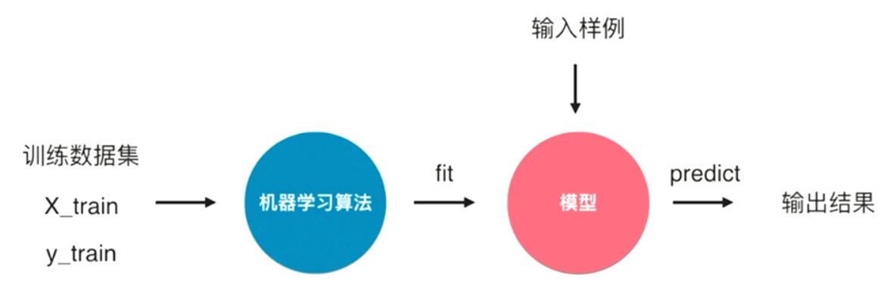
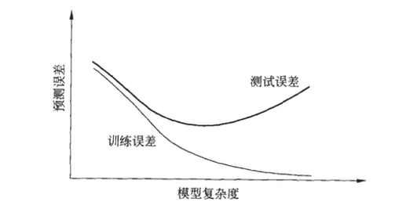
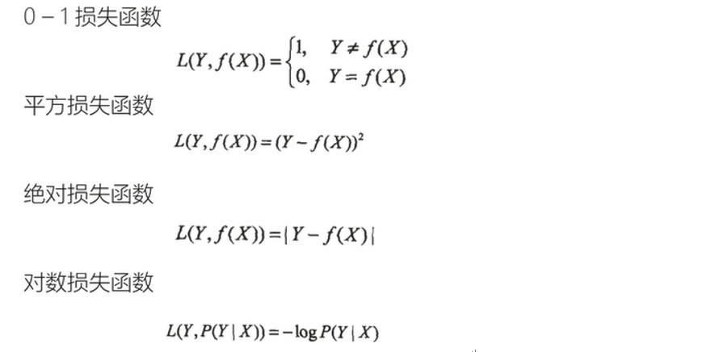
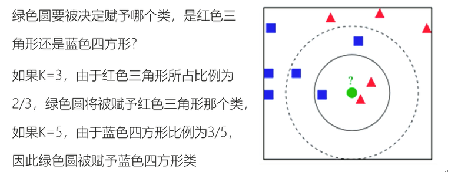
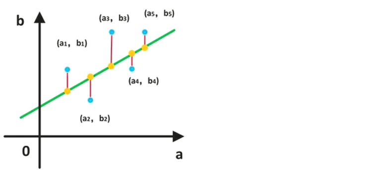
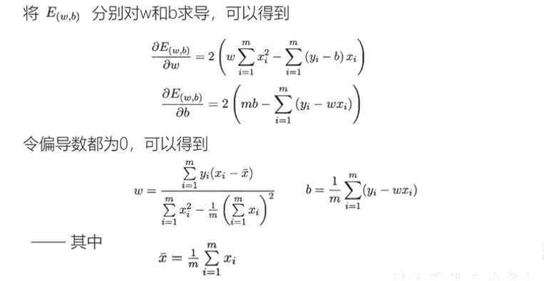
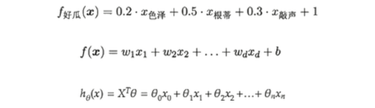
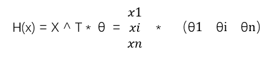

# Machine Learning

#### QA

~~~markdown
Numpy是什么；Python的List和Numpy的区别；Python的生成表达式语法；Numpy对于array的操作；matplotlib的使用，scatter和plot各自作用；

机器学习的分类；谈谈你的对机器学习的理解；机器学习的三要素；过拟合和欠拟合的意思；常见的损失函数；损失函数，结构风险，经验风险各是什么；重复利用数据的方法叫什么（交叉验证）；训练误差，测试误差，和模型复杂度之间的关系；KNN的思想和实现过程；分类算法如何测试？；模型参数和超参数；调参过程中一般使用什么方法；KNN的另外一个超参数，该超参数可以用来解决什么问题？；欧拉距离，曼哈顿距离，明科夫斯基距离；数据归一化的目的；常见的归一化方法；最值归一化和方差归一化适用在什么场景？；KNN适用解决回归问题？KNN的缺点？（不可解释性，维度灾难，效率问题）；KNN优点（简单啊）

回归的分类；线性回归的分类；目标函数可以是哪些；损失函数和效用函数的不同；一元线性回归使用什么方法解参数a和参数b的值，为什么可以基于这种方式？；对于循环计算有什么优化的方式；MSE，RMSE，MAE各是什么；多元线性回归基于什么基础？多元线性回归如何解释，也是优点？（正负相关，截距，sklearn中的实现）；逻辑回归用来解决分类问题还是回归问题，是几分类？；逻辑回归用到了什么函数；sigmod函数的表达式；

梯度下降法是一个什么方法？作用是什么（最小化损失函数）

SVM；什么是不适定问题；泛化能力；决策边界；SVM试图找到一个最优的决策边界，该决策边界距离两个类别的最近的样本最远；
~~~

## 机器学习

现在的机器学习都是基于统计学习；对于机器学习的理解：

一般而言，我们需要就训练数据集作为机器学习算法的输入，以此来训练处一个模型；然后我们在往这个模型中输入样例，就可以得到预测值。 fit：训练，拟合。

### 分类

* 监督学习：可以用一组狗的照片来确定某个照片中的物体是不是狗；

* 非监督学习，可以通过一个照片来找到与其相似的事务的照片。

* 非监督学习，可以为我们找到人类很难发现的数据里面的模型或者是规律，所以也称作是特征点学习，其可以让我们自动地为数据进行分类，并找到分类的模型。非监督学习有也可以用来检测不正常事情的方法，比如信用卡的诈骗。

* 增强学习

### 机器学习的三要素

* 模型：条件概率分布或决策函数，在监督学习中指的是所有可能的目标分布或函数的假设空间。用数学描述的系统；y=f（x）

* 策略，按照什么样的准则学习，从而得到最优的模型，比如损失函数、风险函数、正则化等等。（确定学习方向）

* 算法，学习模型的具体计算方法，比如梯度下降、随机梯度下降等。（确定学习方法）

更为粗暴的玩法：

* 把数据中的特征点抽象成数学中的向量
* 每个向量取一个权重
* 写个算法来找权重是什么

#### 过拟合和欠拟合：

##### 过拟合：

就是特征向量取的太彻底了，以至于把噪声数据也学到了。以至于和标记不相关的特征也取出来了，那么在预测的时候，因为没有那个不相关的特征，也没有被预测正确。 

##### 欠拟合：

模型没有很好的捕捉到数据特征，导致数据不能很好的拟合数据。未能学习到训练中的关系。

##### 模型的选择：

当模型复杂度增大的时候，训练误差会逐渐减小并趋近于0，而测试误差会先减小，达到最小值之后再增大，当模型的复杂度过大的时候，就会发生过拟合，所以模型的复杂度应该始中。

#### 常见损失函数

#### 经验风险

模型f（x）关于训练数据集的平均损失称为经验风险（empirical risk），i是第i个输入数据。经验风险最小化，认为经验风险最小的模型就是最优的模型。

训练误差：是关于训练集的平均损失

测试误差：是关于测试集的平均损失

#### 结构风险

是在经验风险最小化的基础上，为了防止过拟合而提出来的策略；在经验风险的基础上添加表示模型复杂度的正则化项，一般模型越复杂，正则化值越大。

混淆矩阵

|       | Positive                                           | Negative                                           |
| ----- | -------------------------------------------------- | -------------------------------------------------- |
| True  | True Positive(TP)真正 将正类预测为正类        | True Negative(TN)真负 将负类预测为负类        |
| False | False Positive(FP)假正 将负类预测为正类，误报 | False Negative(FN)假负 将正类预测为负类，漏报 |

##### 精确率

在所有预测为正类的数据中，预测正确的比例；

##### 召回率

在所有实际为正类的数据中，被正确找出的比例。

### 分类和回归

* **分类问题**预测数据属于哪一个类别 ----离散

* **回归问题**根据数据预测一个数值   ----连续

分类问题包括两步：

* 根据已知的训练数据集利用学习方法学习一个分类器，
* 分类过程中，利用分类器对新输入的数据对新的输入进行分类。可以用下面的学习方法来解决： 

**K邻近，决策树，感知机，逻辑回归，支撑向量机，朴素贝叶斯，神经网络。** 

回归问题用来预测输入变量和输出变量时间的关系，也就是输入变量到输出变量之间映射的函数。**回归问题的分类按照输入变量的个数，分为一元回归和多元回归；按照模型类型，分成线性回归和非线性回归。**

 如果选取平方损失函数作为损失函数，回归问题可以使用最小二乘法来求解。梯度下降的作用就是用来求结构风险的最小值，或者是使用最小二乘法来求结构风险最小值。

### KNN（K 近邻）

**k-nearest neighbor**：通过测量不同的特征值之间的距离进行分类。最简单的初级分类器，将全部的训练数据所对应的类别记录下来，当测试对象象的属性和某个训练对象的属性完全匹配的时候，就可以对其进行分类,**KNN算法的结果很大程度上取决于K的选择；**例子：

[KNN](<http://localhost:8888/notebooks/%E6%9C%BA%E5%99%A8%E5%AD%A6%E4%B9%A0%E7%AE%97%E6%B3%95/KNN%E7%AE%97%E6%B3%95.ipynb>) 

### 线性回归

[一元线性回归 + 多元线性回归](<http://localhost:8888/notebooks/%E6%9C%BA%E5%99%A8%E5%AD%A6%E4%B9%A0%E7%AE%97%E6%B3%95/%E7%BA%BF%E6%80%A7%E5%9B%9E%E5%BD%92%E6%B3%95.ipynb>)

#### 一元线性回归

- 定义一个**模型**
- 选取合适的**策略**计算该模型的一些参数，该参数目的是为了让模型和实际的误差逼近（最值），所以会形成新的关于参数的函数。
- **算法**解决误差的最值问题，转为关于参数的求导（或者是偏导）的数学问题，也即导数为0 的位置，产生极值。
- 不断的调节参数，使得模型的效果更好；就是调参的过程 

线性回归是一种线性的模型（不大于一次方），可以从一组输入变量x的线性组合中，计算出输出变量y：

​        

在a 和 b的值确定之后，模型就可以确定了。现在**模型**已经确定了，接下来是确定**策略**，这里使用损失函数，其中损失函数定义为预测点和实际点差值的平方和（**平方损失**），也即**均方误差**，如下图

得到如下的公式：

在模型和策略都确定了之后，选择算法来来确定模型的参数，由于这里使用的是均方误差，所以使用最小二乘法。

#### 多元线性回归

如果有两个或者是两个以上的自变量（或者理解为X是一个向量，而不是一个标量），这样的线性回归分析就是多元线性回归，如下面的这个例子：

确定模型：

策略：损失函数，可以添加正则化成为经验风险最小化，

算法：**Gradient Descent，在机器学习领域中使用梯度法来求一个目标函数的最优值是非常重要的。** 梯度学习法不是一个机器学习算法，而时一种基于搜索的最优化方法，作用是：

- 梯度下降法：最小化一个损失函数
- 梯度上升法：最大化一个效用函数。

