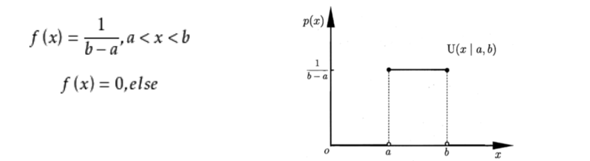

# 数学

### 线性代数

#### 矩阵 

矩阵的构成，最初由方程组的系数构成，然后使用矩阵能够方便的求解；在表示一个矩阵的时候，下标是从1开始的，并不是0。 

如下就是一个矩阵：

方阵左上角到右下角的那条线，叫做主对角线，主对角线的元素叫做主对角线元素。**方阵：**只有一行和只有一列的矩阵分别叫做行向量，和列向量

#### 矩阵运算

##### 加法：

同类型的矩阵；对应的元素相加

##### 数乘：

数值和对应的元素相乘

##### 矩阵相乘

必须要满足一定的条件，才能进行矩阵的相乘，

如果是矩阵A乘以矩阵B，那么矩阵A的列数要和矩阵B的列数相等

从结果的位置来看，结果的第x行第y列由A的第x行和B的第y列相乘得到；

#### 矩阵转置

#### 矩阵的运算法则：

#### 矩阵的逆

这里的E 为单位矩阵。单位矩阵是方阵。

### 高等数学：

#### 导数：

沿X轴方向的y的变化的快慢；

##### 链式求导：

链式求导法则用来求复合函数的导数，所谓的复合函数就是指：一个函数作为另外一个函数的自变量。若h(x)=f(g(x))，则h'(x)=**f'(g(x))g'(x)**   链式法则用文字描述，就是“由两个函数凑起来的复合函数，其导数等于里边函数代入外边函数的值之导   数，乘以里边函数的导数。

#### 偏导数

导数指的是一元函数中，函数 y=f(x)在某一点处沿 x 轴正方向的变化率； 而偏导数，指的是多元函数中，函数 `y=f(x1,x2,…,xn) `在某一点处沿某一坐标轴`（x1,x2,…,xn）`正方向的变化率。**对于X求偏导，将Y视为常数**

#### 方向导数：

#### 梯度

定义：函数在某一点的梯度是这样一个向量，它的方向与取得最大方向导数的方向一致，而它的模为方向导数的最大值梯度是一个向量，即有方向、有大小； **梯度的方向是最大方向导数的方向；梯度的值是最大方向导数的值**

#### 凹凸函数

凹函数：导函数递增;凸函数：导函数递减

#### 阶跃函数

阶跃函数是有限段分段常数函数的组合：

单位阶跃函数

### 概率

#### 常用统计变量：

##### 样本均值

##### 样本方差

方差用来衡量数据点之间的离散程度；或者说：概率论中方差用来度量随机变量和数学期望之间的偏离程度。

##### 样本标准差：

#### 常见分布

##### 均匀分布

##### 正态分布

##### 指数分布

#### 常见概率公式

##### 条件概率

##### 全概率

##### 贝叶斯

 