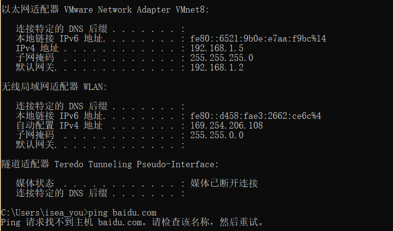
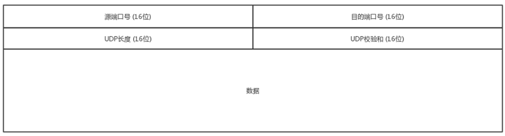

# 计算机网络

鄙人专业是：网络工程，但是网络的知识忘得真TM干净。


## 问题记录：

我的虚拟机主机名是：hadoop104，对应的IP地址是 192.168.1.104，平时使用`xshell`去连接的时候，完全没有什么问题，但是当我把电脑带回宿舍的时候，发现怎么也连接不上了，针对这个问题，我怀疑是IP地址冲突了，然后我查看了我本地的IP地址，发现本机的IP地址竟然也是192.168.1.104。然后我对本机执行了

~~~shell
ipconfig/release # 释放本机从DHCP地址池获取的IP
~~~

然后就可以使用`xshell`连接上虚拟主机了。查看windows主机的IP地址：



其实此时本地的windows主机是无法上网的，因为当前的windows主机没有从DHCP地址池获取到有效的IP地址，需要执行下面的命令：

~~~shell
ipconfig/renew 
~~~

发现获取的IP地址还是192.168.1.104，是因为路由器设置了IP-MAC地址绑定的缘故。不过既然`Xshell`已经连接上了虚拟主机，也就不管那么多了。

### CMD客户端的乱码：

在进入了`CMD`之后，输入：`chcp 65001`即可

## SSL & TLS

互联网的通信安全，建立在SSL/TLS协议之上。Secure Sockets Layer，**Transport Layer Security** 

不使用SSL/TLS的HTTP通信，就是不加密的通信。所有信息明文传播，带来了三大风险。

> （1） **窃听风险**（eavesdropping）：第三方可以获知通信内容。
>
> （2） **篡改风险**（tampering）：第三方可以修改通信内容。
>
> （3） **冒充风险**（pretending）：第三方可以冒充他人身份参与通信。

[学习地址](<https://www.ruanyifeng.com/blog/2014/02/ssl_tls.html>)

## 端口

| FTP             | 21   |
| --------------- | ---- |
| HTTP            | 80   |
| Telnat 远程登录 | 23   |
| QQ              | 1080 |
| HTTPS           | 443  |

## UDP

UDP是面向无连接的，不保证不丢失，不保证数据按照顺序到达。UDP是无状态服务，相对于TCP没有拥塞控制。UDP的数据包格式如下：




## TCP

TCP是面向连接的，TCP会三次握手，建立可靠的连接，从而保证可靠的数据交付，做到数据的无差错，不丢失，不重复，而且按序到达；TCP有拥塞控制，TCP面向字节流。

### TCP的报文格式


* 这里的源端口和目的端口可以保证数据要发送到哪个应用
* 序号，序号可以用来解决包是否乱序的问题
* 确认序号，保证不丢包，发送给你了，我怎么知道对方收到了包，所以确认序号可以获知对方是否收到了，如果没有收到的话，就重发
* 状态位：
  * SYN 发起一个连接
  * ACK是回复
  * RST是重新连接
  * FIN是结束连接
* 窗口大小，有即流量控制，可以解决拥塞问题，

### TCP三次握手

~~~shell
# A ：您好，我是A  	请求
# B : 您好，我是B	 应答

# A ： 您好，B 		 应答之应答	
~~~

## HTTP

我们回顾一下传统的HTTP服务器的原理 

1、创建一个ServerSocket，监听并绑定一个端口

2、一系列客户端来请求这个端口

3、服务器使用Accept，获得一个来自客户端的Socket连接对象  

4、启动一个新线程处理连接 

* 读Socket，得到字节流

* 解码协议，得到Http请求对象 

* 处理Http请求，得到一个结果，封装成一个HttpResponse对象 

* 编码协议，将结果序列化字节流 写Socket，将字节流发给客户端 

5、继续循环步骤3

HTTP服务器之所以称为HTTP服务器，是因为编码解码协议是HTTP协议，如果协议是`Redis`协议，那它就成了`Redis`服务器，如果协议是`WebSocket`，那它就成了`WebSocket`服务器，等等。 使用`Netty`你就可以定制编解码协议，实现自己的特定协议的服务器。

## `websocket`

HTML5推出了`WebSocket`标准，让浏览器和服务器之间可以建立无限制的***全双工通信***，任何一方都可以主动发消息给对方。

`WebSocket`主要的应用场景离不开即时通讯与消息推送，但只要应用程序需要在浏览器和服务器之间来回发送消息，就可以使用`webSocket`来降低客户端流量与服务器的负载。

### WebSocket协议

WebSocket并不是全新的协议，而是利用了HTTP协议来建立连接。我们来看看WebSocket连接是如何创建的。首先，WebSocket连接必须由浏览器发起，因为请求协议是一个标准的HTTP请求，格式如下：

```json
GET ws://localhost:3000/ws/chat HTTP/1.1
Host: localhost
Upgrade: websocket
Connection: Upgrade
Origin: http://localhost:3000
Sec-WebSocket-Key: client-random-string
Sec-WebSocket-Version: 13
```

该请求和普通的HTTP请求有几点不同：

1. GET请求的地址不是类似`/path/`，而是以`ws://`开头的地址；
2. 请求头`Upgrade: websocket`和`Connection: Upgrade`表示这个连接将要被转换为WebSocket连接；
3. `Sec-WebSocket-Key`是用于标识这个连接，并非用于加密数据；
4. `Sec-WebSocket-Version`指定了WebSocket的协议版本。

随后，服务器如果接受该请求，就会返回如下响应：

```json
HTTP/1.1 101 Switching Protocols
Upgrade: websocket
Connection: Upgrade
Sec-WebSocket-Accept: server-random-string
```

* 该响应代码`101`表示本次连接的HTTP协议即将被更改，更改后的协议就是`Upgrade: websocket`指定的WebSocket协议。

版本号和子协议规定了双方能理解的数据格式，以及是否支持压缩等等。如果仅使用WebSocket的API，就不需要关心这些。现在，一个WebSocket连接就建立成功，浏览器和服务器就可以随时主动发送消息给对方。消息有两种，一种是文本，一种是二进制数据。**通常，我们可以发送JSON格式的文本，这样，在浏览器处理起来就十分容易。**

***为什么WebSocket连接可以实现全双工通信而HTTP连接不行呢？***实际上HTTP协议是建立在TCP协议之上的，TCP协议本身就实现了全双工通信，但是HTTP协议的请求－应答机制限制了全双工通信。**WebSocket连接建立以后，其实只是简单规定了一下：接下来，咱们通信就不使用HTTP协议了，直接互相发数据吧。**

安全的WebSocket连接机制和HTTPS类似。首先，浏览器用`wss://xxx`创建WebSocket连接时，会先通过HTTPS创建安全的连接，然后，该HTTPS连接升级为WebSocket连接，底层通信走的仍然是安全的SSL/TLS协议。

### 浏览器

很显然，要支持WebSocket通信，浏览器得支持这个协议，这样才能发出`ws://xxx`的请求。目前，支持WebSocket的主流浏览器如下：

- Chrome
- Firefox
- IE >= 10
- Sarafi >= 6
- Android >= 4.4
- iOS >= 8

当你获取 Web Socket 连接后，你可以通过 **send()** 方法来向服务器发送数据，并通过 **onmessage** 事件来接收服务器返回的数据。

~~~javascript
var Socket = new WebSocket(url, [protocol] );
~~~

以上代码中的第一个参数 url, 指定连接的 URL。第二个参数 protocol 是可选的，指定了可接受的子协议。

### WebSocket 属性

以下是 WebSocket 对象的属性。假定我们使用了以上代码创建了 Socket 对象：

| 属性                  | 描述                                                         |
| --------------------- | ------------------------------------------------------------ |
| Socket.readyState     | 只读属性 **readyState** 表示连接状态，可以是以下值：<br />0 - 表示连接尚未建立。<br />1 - 表示连接已建立，可以进行通信。<br />2 - 表示连接正在进行关闭。<br />3 - 表示连接已经关闭或者连接不能打开。 |
| Socket.bufferedAmount | 只读属性 **bufferedAmount** 已被 send() 放入正在队列中等待传输，但是还没有发出的 UTF-8 文本字节数。 |

### WebSocket 事件

以下是 WebSocket 对象的相关事件。假定我们使用了以上代码创建了 Socket 对象：

| 事件    | 事件处理程序     | 描述                       |
| ------- | ---------------- | -------------------------- |
| open    | Socket.onopen    | 连接建立时触发             |
| message | Socket.onmessage | 客户端接收服务端数据时触发 |
| error   | Socket.onerror   | 通信发生错误时触发         |
| close   | Socket.onclose   | 连接关闭时触发             |

### WebSocket 方法

以下是 WebSocket 对象的相关方法。假定我们使用了以上代码创建了 Socket 对象：

| 方法           | 描述             |
| -------------- | ---------------- |
| Socket.send()  | 使用连接发送数据 |
| Socket.close() | 关闭连接         |

### 服务器

由于WebSocket是一个协议，服务器具体怎么实现，取决于所用编程语言和框架本身。Node.js本身支持的协议包括TCP协议和HTTP协议，要支持WebSocket协议，需要对Node.js提供的HTTPServer做额外的开发。已经有若干基于Node.js的稳定可靠的WebSocket实现，我们直接用npm安装使用即可。

### 例子

说到 websocket 我觉得有必要说下跟 socket 的区别。

软件通信有七层结构，下三层结构偏向与数据通信，上三层更偏向于数据处理，中间的传输层则是连接上三层与下三层之间的桥梁，每一层都做不同的工作，上层协议依赖与下层协议。基于这个通信结构的概念。

Socket 其实并不是一个协议，是应用层与 TCP/IP 协议族通信的中间软件抽象层，它是一组接口。当两台主机通信时，让 Socket 去组织数据，以符合指定的协议。TCP 连接则更依靠于底层的 IP 协议，IP 协议的连接则依赖于链路层等更低层次。

WebSocket 则是一个典型的应用层协议。

总的来说：Socket 是传输控制层协议，WebSocket 是应用层协议。


