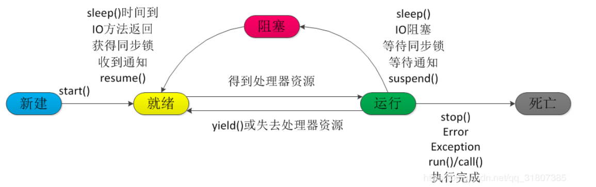

# OS

##### QA

~~~md
线程和进程的区别；单核CPU和双核CPU实现多线程的方式有什么不同；Java中的Thread和Runnable之间的关系；线程的5个生命周期；线程阻塞有哪些原因；sleep()和wait()方法的区别；join()，yield()方法的作用；理解锁：例如公平锁，非公平锁，两者的优势；乐观锁，悲观锁，两者的使用场景；共享锁和独享锁的区别；读写锁，互斥锁和共享独享锁之间的区别；
~~~

## 线程与进程

### 线程和进程的对比：

| 进程 | 资源分配的基本单位 | 每一个进程具有独立的代码和数据空间（内存） | 一个进程具有1~n个线程              | 进程之间的通信和数据交互非常耗时   |
| ---- | ------------------ | ------------------------------------------ | ---------------------------------- | ---------------------------------- |
| 线程 | CPU调度的最小单位  | 同一类线程共享代码和数据空间               | 线程，只能获取所属进程的内存等资源 | 线程之间的通信和数据交换都非常的快 |

举例子：在笔记本上打开word就是一个进程，`winWord.exe` ，打开word写文档，会有一个容灾备份线程，还有语法检测线程，分别是`backup Thread，checkStyle Thread`线程。操作系统给每个线程分配了一块独立的内存空间，这块内存被组织成“栈”这种结构, 用来存储函数调用时的临时变量。

**关于单核和多核和多线程的关系：**

单核CPU，其实是一种假的多线程，因为在一个时间单元内，也只能执行一个线程的任务 双核，跑四个线程，是真实的多线程

**为什么对象能够作为锁？**

角度：线程的五个状态—>Object类能够控制线程的状态（wait方法， notify方法，和notify方法）

多次调用start方法，会产生什么异常？`IllegalThreadStateException`

[Java多线程](<https://blog.csdn.net/qq_31807385/article/details/83035334>)；

### 关于Runnable接口

* run()方法是多线程程序的一个准则，所有的多线程代码都必须放到run()方法中
* 所有的多线程的代码都需要Thread类的start()方法来运行
* 使用runnable接口的线程类，要调用Thread（Runnable target）的构造方法，然后调用Thread类的start方法来启动线程。
* java中所有的线程都是同时启动的，至于什么时候执行才取决于谁先获得CPU的时间片。

#### 线程的生命周期



* 新建（New），new一个线程的对象的时候。

* 就绪状态（Runnable），线程创建了对象之后，其他线程调用该对象的start方法，变的可运行，等待CPU的时间片，一个线程的start方法只能用一次。start()进入就绪（可运行状态）多次调用start方法，会报`IllegalThreadStateException`
* 运行的状态（Running）获得CPU的时间片，正在被CPU调度，执行程序，（此时会释放锁）
* 同步阻塞：运行的线程在获取对象的同步锁时，若该同步锁被别的线程占用，则JVM会把该线程（想要获取该锁的线程）放入锁池中。其他原因，运行的线程执行sleep方法（sleep不会释放所持有的锁的）或者是join方法，或者发出了I/O请求，JVM会把该线程设置为阻塞状态，当sleep()状态超时、join()等待线程终止或者超时、或者I/O处理完毕时，线程重新转入就绪状态

* 死亡状态（Dead），线程执行完了或者因异常退出了run()方法，该线程结束生命周期 绪状态才能重新回到运行状态

**为什么线程会阻塞？** 在Java中对象很多，而对象是可以作为锁存在的，如果某一个线程获取到了某个锁，另外一个线程来访问这个对象的时候，发现该对象已经有锁了，JVM会将该线程放入到锁池中。还有的可能是，运行的线程。

**join的使用场景：**

主线程中生成并行子线程，如果子线程进行了非常耗时的操作的话，主线程往往比子线程先执行完，但是如果主线程需要子线程处理之后的数据，那么这个时候需要使用到join方法，等待子线程执行完毕之后，才能执行主线程。[case 在virgin 的项目中可以看到]。

## 锁

### 锁的分类

#### 公平锁/非公平锁

公平锁是指多个线程按照申请锁的顺序来获取锁。非公平锁是指多个线程获取锁的顺序并不是按照申请锁的顺序，有可能后申请的线程比先申请的线程优先获取锁。有可能，会造成优先级反转或者饥饿现象。Java 中`ReentrantLock`通过构造函数指定该锁是否是公平锁，默认是非公平锁。非公平锁的优点在于吞吐量比公平锁大。Synchronized也是一种非公平锁。由于其并不像`ReentrantLock`是通过AQS（`AbstractQueuedSynchronizer`）的来实现线程调度，所以并没有任何办法使其变成公平锁。

#### 乐观锁/悲观锁

乐观锁认为没有人和我抢；悲观锁认为一定有人和我（当前线程）抢；悲观锁适合写操作非常多的场景，乐观锁适合读操作非常多的场景，不加锁会带来大量的性能提升。悲观锁在Java中的使用，就是利用各种锁。乐观锁在Java中的使用，是无锁编程，常常采用的是CAS算法，典型的例子就是原子类，通过CAS自旋实现原子操作的更新。

#### 独享锁/共享锁

独享锁是指该锁一次只能被一个线程所持有。共享锁是指该锁可被多个线程所持有。对于Java `ReentrantLock`而言，其是独享锁。但是对于Lock的另一个实现类`ReentrantReadWriteLock`其读锁是共享锁，其写锁是独享锁。读锁的共享锁可保证并发读是非常高效的，读写，写读 ，写写的过程是互斥的。独享锁与共享锁也是通过AQS来实现的，通过实现不同的方法，来实现独享或者共享。对于Synchronized而言，当然是独享锁。

#### 互斥锁/读写锁

上面讲的独享锁/共享锁就是一种广义的说法，互斥锁/读写锁就是具体的实现。互斥锁在Java中的具体实现就是`ReentrantLock`，读写锁在Java中的具体实现就是`ReentrantReadWriteLock`

#### 可重入锁

可重入锁又名递归锁，是指在同一个线程在外层方法获取锁的时候，在进入内层方法会自动获取锁。对于Java `ReentrantLock`而言, 他的名字就可以看出是一个可重入锁，其名字是Reentrant Lock重新进入锁。对于Synchronized而言,也是一个可重入锁。可重入锁的一个好处是可一定程度避免死锁。

### CAS

CAS（Compare and swap）比较和替换是设计并发算法时用到的一种技术。简单来说，比较和替换是使用一个期望值和一个变量的当前值进行比较，如果当前变量的值与我们期望的值相等，就使用一个新值替换当前变量的值。

Java5以来，你可以使用`java.util.concurrent.atomic`包中的一些原子类来使用CPU中的这些功能：

```java
private AtomicBoolean locked = new AtomicBoolean(false);
public boolean lock() {
    return locked.compareAndSet(false, true);
}
```

locked变量不再是`boolean`类型而是`AtomicBoolean`。这个类中有一个**`compareAndSet()`**方法，它使用一个期望值和`AtomicBoolean`实例的值比较，和两者相等，则使用一个新值替换原来的值。在这个例子中，它比较locked的值和false，如果locked的值为false，则把修改为true。如果值被替换了，`compareAndSet()`返回true，否则，返回false。

**CAS的ABA问题**

* 进程P1在共享变量中读到值为A
* P1被抢占了，进程P2执行
* P2把共享变量里的值从A改成了B，再改回到A，此时被P1抢占。
* P1回来看到共享变量里的值没有被改变，于是继续执行。

这个例子你可能没有看懂，维基百科上给了一个活生生的例子——

```markdown
你拿着一个装满钱的手提箱在飞机场，此时过来了一个火辣性感的美女，然后她很暖昧地挑逗着你，并趁你不注意的时候，把用一个一模一样的手提箱和你那装满钱的箱子调了个包，然后就离开了，你看到你的手提箱还在那，于是就提着手提箱去赶飞机去了。
```


