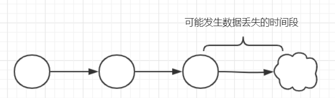
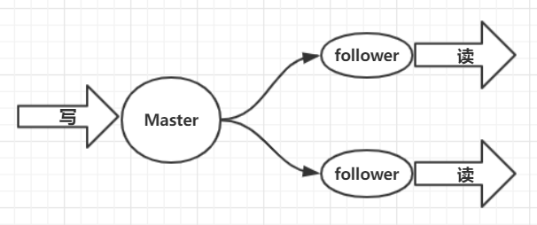
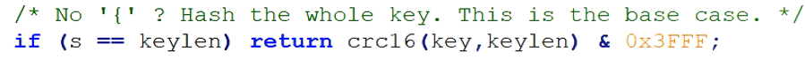

# `Redis`

[参考资料](<https://blog.csdn.net/qq_31807385/article/details/83269329>)

## 简介

基于内存的key-value类型的非关系型数据库，支持持久化。分为客户端和服务端，可以分别部署在不同的机器上，我们通常指的是`Redis`的服务端。`Redis`有两种完备的持久化机制，**AOF和RDB**。

并发场景下，所有的请求都直接访问数据，数据库可能会出现连接异常，此时使用`Redis`做缓冲层，让请求先访问`Redis`，而不是直接访问数据库。 

## 五种数据类型

| String | Redis最基本的数据类型，一个key对应一个value，字符串的value值最多可以存储512M |
| ------ | ------------------------------------------------------------ |
| List   | 单键多值，底层实现是双向链表，可以做为消息队列               |
| Set    | 相对于List是不重复，比如微博中求共同好友                     |
| Hash   | 键值对集合，key为`studentID`，value中存储一个对象（姓名，年龄，性别） |
| `Zset` | 与set相似，但是每个成员都有一个评分。                        |

**[五种数据类型使用](https://blog.csdn.net/qq_31807385/article/details/83269329)** 

## `Redis`的持久化：RDB和AOF

### RDB：

在指定的时间间隔内将内存中的数据集快照写入磁盘（snapshot），它在恢复的时候，直接将快照文件读到内存中。RDB是默认开启的**。`Redis`会单独创建（fork）一个子进程来进行持久化，会先将数据写到一个临时文件中（\.`rdb`），等持久化过程都结束了，在用这个临时文件替换上次持久化的文件，**整个过程中主进程是不会进行任何IO操作的，这样做的缺点是：最后一次持久化后的数据可能会丢失。如果数据恢复的完整性不是恒敏感的数据，RDB要比AOF方式更加高效。

### AOF

Append to File ，AOF是以日志的形式来记录每个写操作，并包存到特定的文件中，默认不开启.当RDB和AOF的数据不一致的情况下，按照AOF来恢复数据。AOF是对于RDB的补充。AOF会占用更多的存储空间，恢复备份的速度也会比较慢。

## `Redis`主从复制

[参考](**https://blog.csdn.net/qq_31807385/article/details/83269329**)

### 主从简介

配置多台`Redis`服务器，将主机和备机的身份分开。主机数据更新后，根据配置和策略，自动同步到备机Master以写为主，Slave以读为主，二者之间自动同步数据。优点：**读写分离提高`Redis`性能；避免单点故障，容灾快速恢复。**

每次从机联通后，都会给主机发送sync指令，主机立刻进行存盘操作，发送RDB文件，从机收到RDB文件后，进行全盘加载。之后每次主机的写操作，都会立刻发送给从机，从机执行相同的命令。

* 从机宕机之后，重启，宕机期间主机新增的记录，从机是否能够顺利复制？可以
* 其中一台从机down机之后重启，能否认识旧主？不一定，如果配置文件中配置了`slaveof `就可以认识旧主，如果没有配置，就会变成master
* 如果所有的从机都从主机同步数据，此时主机的IO压力会比较大，如果解决？使用链式的方式来配置主从机。薪火相传，这样的方式也会有一定的风险。
* 主机down掉之后，从机是原地待命，还是上位 原地待命。
* 从机是从头开始复制主机的信息，还是复制切入以后的信息？从头开始复制，也即完全复制，读取主机的RDB文件。 

### 主从复制原理：

每次从机联通主机之后，都会发动sync指令给主机，主机立即进行存盘操作，发送RDB文件给从机，从机收到RDB文件后，进行全盘加载，之后每次主机的写操作，都会立即发送给从机，从机执行相同的命令。 **只有主机才可以写，从机只能读**。此时读写是分离的。  

### 主从实验

#### 准备

定义一下三个配置文件，分别是6379.conf 6380.conf 6381.conf

~~~shell
[root@hadoop103 bin]# vim 6379.conf
[root@hadoop103 bin]# cp 6379.conf 6380.conf
[root@hadoop103 bin]# vim 6380.conf
[root@hadoop103 bin]# cp 6379.conf 6381.conf
[root@hadoop103 bin]# vim 6381.conf
 
 
 
include /usr/local/redis/bin/redis.conf 
port 6379
pidfile /var/run/redis_6379.pid
dbfilename dump_6379.rdb
~~~

查看这些配置文件是否创建成功，分别启动这些服务器：

~~~shell
[root@hadoop103 bin]# ll
总用量 26420
-rw-r--r--. 1 root root     109 10月 23 19:46 6379.conf
-rw-r--r--. 1 root root     109 10月 23 19:47 6380.conf
-rw-r--r--. 1 root root     109 10月 23 19:48 6381.conf
-rw-r--r--. 1 root root     191 10月 23 19:11 appendonly.aof
-rw-r--r--. 1 root root     116 10月 23 19:12 dump.rdb
-rw-r--r--. 1 root root     123 10月 23 18:36 dump.rdb_backup
-rwxr-xr-x. 1 root root 5580327 10月 22 11:30 redis-benchmark
-rwxr-xr-x. 1 root root   22217 10月 22 11:30 redis-check-aof
-rwxr-xr-x. 1 root root 7829866 10月 22 11:30 redis-check-rdb
-rwxr-xr-x. 1 root root 5709195 10月 22 11:30 redis-cli
-rw-r--r--. 1 root root   46688 10月 23 18:58 redis.conf
lrwxrwxrwx. 1 root root      12 10月 22 11:30 redis-sentinel -> redis-server
-rwxr-xr-x. 1 root root 7829866 10月 22 11:30 redis-server
[root@hadoop103 bin]# ./redis-server ./6379.conf
[root@hadoop103 bin]# ./redis-server ./6380.conf
[root@hadoop103 bin]# ./redis-server ./6381.conf
~~~

然后开启三个窗口，来分别连接这三个服务器并查看该服务器下是否主服务器还是从服务器：

~~~shell
[root@hadoop103 bin]# ./redis-cli -p 6379
127.0.0.1:6379> info replication
# Replication
role:master
connected_slaves:0
master_repl_offset:0
repl_backlog_active:0
repl_backlog_size:1048576
repl_backlog_first_byte_offset:0
repl_backlog_histlen:0
127.0.0.1:6379> 
 
 
 
[root@hadoop103 bin]# ./redis-cli -p 6380
127.0.0.1:6380> info replication
# Replication
role:master
connected_slaves:0
master_repl_offset:0
repl_backlog_active:0
repl_backlog_size:1048576
repl_backlog_first_byte_offset:0
repl_backlog_histlen:0
127.0.0.1:6380> 
 
 
[root@hadoop103 bin]# ./redis-cli -p 6381
127.0.0.1:6381> info replication
# Replication
role:master
connected_slaves:0
master_repl_offset:0
repl_backlog_active:0
repl_backlog_size:1048576
repl_backlog_first_byte_offset:0
repl_backlog_histlen:0
127.0.0.1:6381> 
~~~

#### 配置主从

有两种配置方式，第一种方式是**临时配置**，第二种是**永久配置**：**原则配从不配主**，

[配置方法 - 零时配置](<https://blog.csdn.net/qq_31807385/article/details/83314750>)  介绍一个永久的配置：在从机6380和6381的配置文件中：

~~~shell
[root@hadoop103 bin]# vim 6380.conf
[root@hadoop103 bin]# vim 6381.conf
 
slaveof 127.0.0.1 6379
~~~

然后分别启动对应的服务器，打开对应的客户端，对master执行添加操作，再在slave上测试获取数据，然后关闭从服务器，在重新开启，尝试获取并**`info replication：`**

~~~shell
127.0.0.1:6379> set s3 v3
OK
127.0.0.1:6379> keys *
1) "s1"
2) "k2"
3) "s3"
 
 
127.0.0.1:6380> shutdown  # down机之后，还能够找到主机
not connected> 
[root@hadoop103 bin]# ./redis-server ./6380.conf 
[root@hadoop103 bin]# ./redis-cli -p 6380
127.0.0.1:6380> info replication
# Replication
role:slave
master_host:127.0.0.1
master_port:6379
master_link_status:up
master_last_io_seconds_ago:1
master_sync_in_progress:0
slave_repl_offset:473
slave_priority:100
slave_read_only:1
connected_slaves:0
master_repl_offset:0
repl_backlog_active:0
repl_backlog_size:1048576
repl_backlog_first_byte_offset:0
repl_backlog_histlen:0
127.0.0.1:6380> get s3
"v3"
127.0.0.1:6380> keys *
1) "s3"
2) "k2"
3) "s1"
~~~

现在测试一台主机只有一台从机的情况，**将6380 设置为6379的从机，将6381设置为6380的从机。**直接对6381临时设置。

~~~shell

127.0.0.1:6381> slaveof 127.0.0.1 6380
OK
127.0.0.1:6381> info replication
# Replication
role:slave
master_host:127.0.0.1
master_port:6380
master_link_status:up
master_last_io_seconds_ago:2
master_sync_in_progress:0
slave_repl_offset:29
slave_priority:100
slave_read_only:1
connected_slaves:0
master_repl_offset:0
repl_backlog_active:0
repl_backlog_size:1048576
repl_backlog_first_byte_offset:0
repl_backlog_histlen:0
~~~

那么此时，6380已经有从机，是否可以写入呢？

~~~shell
127.0.0.1:6380> set s4 v4
(error) READONLY You can't write against a read only slave.
~~~

### 哨兵模式sentinel

哨兵模式能够检测主机是否故障，如果故障了，根据投票数，自动将从机转换为主机。哨兵可以有多个，哨兵不会变成主机。该配置在**`sentinel.conf `**中配置。原本宕机的主机在恢复之后，会变成从机。具体选择哪一个作为主机，这里有一个优先级的概念，数值越小，会被哨兵推荐为主机（选择**设备好的和网络好**的优先，为0值的时候，不可能升级为master）。

* 优先级靠前的
* 选择偏移量最大的
* 选择`runid`最小的从服务

线程的优先级是5，越小，优先级越高。Windows和Linux是支持优先级的，但`macOS`是不支持的，线程的调度机制是由操作系统决定的。

## `Redis`集群

一台机器的内存有限，所以能够存储在内存中的数据也非常有限，所以要搭建`Redis`集群。另外一个问题是：如果只是有主从复制，一台主机在面临并发的写做操作的时候，一台`Redis`是没有办法承担的。 `Redis`集群实现了对`Redis`的水平扩容，即启动N个节点将整个数据库分布到这N个节点上（这N个节点都是Master）每个节点存储的总数据的N分之一。**至少要有三个Master，每一个Master还需要有一个slave，所以一个`Redis`集群至少要有六台机器**

16384 = 16 * 1024 = 16K

一个`Redis`集群包含16384个slot，数据库中的每一个键都是属于这个16384个slot中的一个，集群使用公式**CRC16（key） % 16384**来计算key是属于哪个slot，集群中的每一个节点负责一部分的slot。使用某一个机器在添加值的时候，如果计算key值不在当前的机器上，（会计算key在16384中的哪个小格子里面）集群会重新定位到目标机器。

