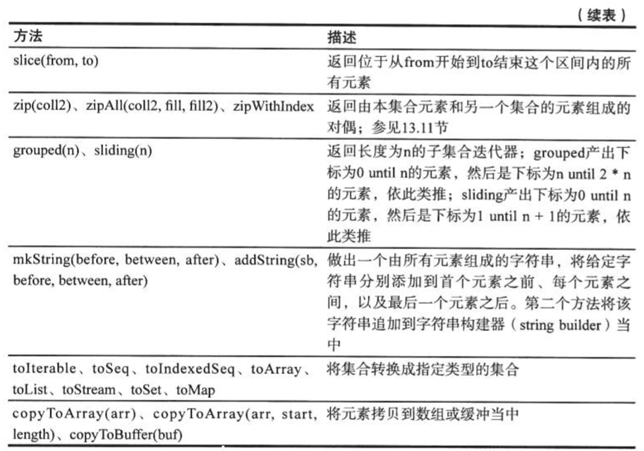

# Scala

[API地址：](www.scala-lang.org/api)

Scala是一门以虚拟机为运行环境并面向对象和函数式编程的最佳特性结合在一起的静态类型编程语言。

* 支持面向对象和函数式编程
* Scala代码会被编译成`.class`文件在虚拟机上运行


实际发生的是：你输入的内容被快速的编译成字节码，然后这段字节码交给Java虚拟机去执行。

在Scala中，

~~~scala
// 你可以对数字执行方法操作：
scala> 1.toString
res11: String = 1

// 在scala中，使用java.lang.String来表示字符串，但可以通过StringOps类给字符串添加上百种操作
// String对象，"hello"被隐式转化为一个StingOps对象，接着StringOps的 intersect方法被调用
scala> "hello".intersect("world")  // 找出相同的部分
res12: String = lo

/*
Int  		RichInt
Double      RichDouble
Char		RichDouble
在对应的Rich**方法中，提供了更加丰富的方法，来进行数字的操作
*/

// 这里的1被转为RichInt对象，然后调用其to方法
scala> 1.to(6)
res14: scala.collection.immutable.Range.Inclusive = Range(1, 2, 3, 4, 5, 6)
~~~

### Chapter1

#### 算术和操作符号的重载

在Scala中，

~~~scala
// 在Scala中，a+b 其实是方法的调用，a.+(b)这里的
scala> 1+2
res18: Int = 3

scala> 1.+(2)
res17: Int = 3

/* 通常，你可以使用  
a 方法 b
来替代
a.方法（参数）
*/
~~~

#### Scala中的方法和函数

函数：在Scala中，你不需要调用某个特定类的静态方法来实现类似与求平方等操作。只是需要一个导包的操作：

~~~Scala
scala> import scala.math._  // 以 scala为前缀的包，可以省略scala.
import scala.math._

scala> pow(2,2)
res20: Double = 4.0
~~~

通常在Scala中，每一个类都会有一个伴生对象，其方法和Java的静态方法一样。例如，`BigInt`类有一个生成随机素数的方法，调用的形式和java几乎是一样的：

~~~scala 
scala> BigInt.probablePrime(100,scala.util.Random)
res23: scala.math.BigInt = 940640853769843387998341502449
~~~

#### apply方法

在Scala中使用**apply**方法构建对象的手法是`scala`创建对象的常用手法

~~~scala
scala> "Hello"(4)
res25: Char = o

// 上述的写法实际上是下面写法的简写
scala> "Hello".apply(4)
res26: Char = o

// 将数字转为BigInt对象的apply方法，
scala> BigInt("12334")
res27: scala.math.BigInt = 12334

// 上面语句是下面语句的简写，这个语句构建了一个新的BigInt对象，而不使用new
scala> BigInt.apply("12334")
res28: scala.math.BigInt = 12334
~~~

### Chapter2

#### 表达式

***Scala语言中的表达式是有值，有类型的。***

~~~scala
if(x >0) 1 else -1

// 上述的表达式是有值的，要么为1，要么为-1，
val s = if(x > 0) 1 else - 1  // 此时的s可以为val

// 也就等价于
if(x > 0) s = 1 else s = -1  // 此时的s必须是var
~~~

上述的表达式是有类型的，上面的表达式的类型是`Int`，因为两个分支都是`Int`类型，如果两个分支的类型不一样，那么就是两个类型的超类型。例如：

~~~scala
if (x > 0) "positive" else -1 // 此时该表达式的类型就是两个类型的公共超类型：Any

// 如果是下面的这个语句，没有else的情况的时候，这个表达式的值是Unit类型，该类型只有一个值（）
if (x>0) 1  // 这个语句等同于
if(x>0) 1 else ()  
~~~

在REPL中键入多行代码：

~~~scala
scala> :paste
// Entering paste mode (ctrl-D to finish)

val x = 2
if (x > 0 ) "positive" else -1

// Exiting paste mode, now interpreting.  使用  ctrl + D来结束输入

x: Int = 2
res40: Any = positive
~~~

**语句块{} 的值取决于语句块中最后一个表达式的值**，

#### 循环

**to ** 和 **until**  的区别在于，前者包含最后一个元素，而后者不包含

~~~scala
for(i <- 表达式)  // 让变量i去遍历表达式所有的值，举个例子

for(i <- 1 to n) // i 遍历 [1,n] 之间所有的值

// 直接遍历字符串所有的值
scala> for(i<-"Hello") print(i+"\t")
H       e       l       l       o
~~~

#### 如何break

这里提供一种方法是：`scala.util.control.Breaks`

#### 双层for循环

~~~scala
// 这里生成器之间要使用；隔开
scala> for(i<-1 to 3;j <- "cat") print( i+""+ j + "\t")
1c      1a      1t      2c      2a      2t      3c      3a      3t

// 每个生成器后面可以添加守卫
scala> for(i<-1 to 3;j <- "cat" if j != 'c') print( i+""+ j + "\t")
1a      1t      2a      2t      3a      3t

// for 循环体以yield开始的话，则该循环会构造出来一个集合
scala> for(i <- 1 to 6) yield i % 3
res8: scala.collection.immutable.IndexedSeq[Int] = Vector(1, 2, 0, 1, 2, 0)
~~~

#### 函数

Scala处了方法，还支持函数，方法对对象进行操作，函数不是。在Java中我们只能使用静态方法来模拟函数。

下面是Scala中函数的定义和使用：


函数的返回值类型，Scala自己会根据函数体的最后一个表达式的值来进行确定，所以不指定返回类型是很好的，除了**该函数是递归函数，如果是递归函数，必须指定该函数的返回类型**

#### 默认参数


#### 变长参数

如下例子：


#### 过程

Scala对于不返回值的函函数叫做过程，**过程** 不返回值，调用它仅仅是为了她的副作用。例如下面的box过程例子：

~~~java
/**
  * -------------
  * |Hello world|
  * -------------
  */

object ScalaGrammer {
  def main(args: Array[String]): Unit = { // 
    box("Hello world")
  }
  def box(s:String): Unit = {
    val border = "-" * s.length + "--\n"
    println(border + "|" + s + "|\n" + border)
  }
}
~~~

上面的过程是显示定义返回类型是***Unit***，下面的方式是直接省略这一过程：


#### Lazy懒值

懒值对于开销较大的初始化语句比较有用，懒值是位于***`val`和def***的中间状态：

~~~ scala
// 在word1定义的时候即被取值
val word1 = scala.io.Source.fromFile("").mkString

// 在words首次被使用的是时候，被取值
lazy val word2 = scala.io.Source.fromFile("").mkString

// 在每一次words首次使用的时候取值
def words = scala.io.Source.fromFile("**").mkString
~~~

### Chapter3 数组

* 若长度固定使用 ***Array*** ，如果长度不固定，使用***`ArrayBuffer`***

* 提供初始值的时候不要使用new
* 使用***（）***来访问元素
* 使用***`for(ele <-arr)`***来遍历元素
* 使用***`for(ele<-arr if...)...yield...`*** 来讲原数组转型为新数组
* Scala数组和java数组可以相互转化：用`ArrayBuffer`，使用`scala.collection.JavaConversions`中的转换函数。

#### 定长数组

Scala中的Array是Java数组方式实现的，下面例子中的Array[String] 的类型在JVM中就是`java.lang.String[]` ，Array[1,2,3] 在JVM中就是***`int[]`***


#### 变长数组：数组缓冲

长度变化的数组在java中的是`ArrayList`，在Scala中等效是`ArrayBuffer`


遍历数组：


**从数组出发，你会得到一个新的数组，从缓冲数组出发，你会得到一个缓冲数组**


#### 算法

~~~java
val sum = Array(4, 2, 3)
println(sum.sum) // 9
println(ArrayBuffer("Mary", "had", "a", "little", "boy").max) // little
// sorted方法将原有的数组或者是缓冲数组排序
// 并返回新的数组或者是数组缓冲,原有的数组或者是缓冲数组不会被改变
val sorted: Array[Int] = sum.sorted
for (i <- sorted) print(i + "\t")  // 2	3	4
val arr = Array(1,7,2,9)
// 可以直接对一个数组排序，但是不能直接对缓冲数组排序
scala.util.Sorting.quickSort(arr)
// 此时arr的被改变了 ,参数的为是三个的时候，前缀，分隔符，后缀
println(arr) // [I@6574b225 直接打印一个Array没有意义
println(arr.mkString("<", ",", ">"))  // <1,2,7,9>
~~~

### Character4：映射和元组

#### 映射的创建，添加，更新，删除

~~~scala
// 构建一个不可变的Map[String,Int] 其值不能被改变
val score1 = Map("Alice" -> 10,"Bob" -> 3,"Cindy" -> 8)
// 构建一个可以改变的映射，-> 操作符号用来创建对偶
val score2 = scala.collection.mutable.Map("Aice"->10,"Bob" -> 3,"Cindy"->8)

// 更新Map的值
score2("Alice") = 100

// 使用 +=操作来添加多个关系
score2 += ("Ice" -> 20,"Linda" -> 22)

// 使用 -= 来减少多个关系
score2 -= ("Ice") // 注意这里只是需要填写键就OK了

// 如果想从一个空的映射开始，需要选定映射的实现并给出参数类型
val scores = new mutable.HashMap[String,Int]()

// 使用括号的方式来构建映射
val score3 = Map(("Alice",10),("Bob",3),("cindy",8))

// 获取score3中的值
val bobsScore: Int = score3.getOrElse("Bob",0)

// 你不能更新一个不可变的映射，但是你可以根据一个不可变的映射得到一个新的映射
val newScore: Map[String, Int] = score1 + ("Baby" -> 33,"Lind"-> 23)
~~~

#### 映射的迭代和反转

~~~scala
// 构建一个不可变的Map[String,Int] 其值不能被改变
val score1 = Map("Alice" -> 10, "Bob" -> 3, "Cindy" -> 8)
// 映射的迭代
for ((k, v) <- score1) println(k + "->" + v)

// 分别迭代映射的key 和value
for (k <- score1.keySet) print(k + "\t")
for (v <- score1.values) print(v + "\t")

// 将映射反转
for ((k,v) <- score1) yield (v,k)
~~~

在操作映射的时候，你需要选定一个实现，一个哈希表或者是一个平衡树，默认情况下，Scala给的是哈希表，`scala`中的不可变的树形映射是：

~~~scala
val sortedMap = scala.collection.immutable.SortedMap("A" -> 1,"B"-> 2)

// 如果希望按照插入的顺序访问所有的键，和java一样使用LinkedHashMap
scala.collection.mutable.LinkedHashMap("Jun"->1,"Fub"->2)
~~~

#### 元组

~~~scala
// 元组
val tuple: (String, Int, Boolean) = ("Bob",20,false)
// 获取tuple的第二个值
tuple._2

// 通常使用模式匹配来获取元组的组元，如下，并不是所有的部件都需要类型，不需要的使用_
val tuple2: (String, Int, _) = tuple

// 元组可以用于函数需要返回不止一个值的情况，如StringOps的partition方法
println("New York".partition(_.isUpper)) // (NY,ew ork)
~~~

#### 拉链

使用元组的目的：把多个值绑定在一起，以便他们能够被一起处理。通常使用**Zip**方法来完成

~~~scala
val symbols = Array("<", "-", ">")
val counts = Array(2,10,2)
// 拉链，将两个数组的值拉在一起
val pairs: Array[(String, Int)] = symbols.zip(counts)
for ((s,n)<-pairs) print(s * n) //<<---------->>

// 将对偶的集合转为映射
val map: Map[String, Int] = pairs.toMap
~~~

### Chapter5：类

* 类中的字段自动带有getter和setter方法
* 你可以用定制的getter/setter方法替换掉字段定义，而不必修改使用类的客户端--即统一访问原则
* 使用`@BeanProperty` 注解来生成`JavaBean`的`getXxx/setXxx`方法
* 每个类都有一个主要的构造器，这个构造器和类定义，交织在一起，他的参数直接成为类的字段，主构造器执行类中所有的语句。
* 辅助构造器是可选的，他们都叫***this***

#### 简单类和无参方法

~~~scala
object ScalaGrammer {
  def main(args: Array[String]): Unit = {
    val myCounter = new Counter
    // 对于调用无参方法，可以写上括号，也可以不写
    myCounter.increment() // 对于改值器的方法，即改变对象状态的方法，使用()
    println(myCounter.current) // 对于取值器的方法（不会改变对象状态的方法）去掉()
  }
}

// 在Scala中，类并不声明为public，Scala源文件可以包含多个类，所有的这些类都具有公有可见性
class Counter{
  private var value = 0 // 你必须初始化字段
  def increment() = {value += 1 }

  def current() = value
  def cur = value // 可以使用通过不带()的方法声明current来强制以上的风格
}
~~~

#### `getX和setX`

```scala
class Person{
  var age = 0 // 必须初始化
}

// scala在生成面向JVM的类的啥时候，其中有一个私有的age字段和相应的getter和setter方法
// 这两个方法是公有的，因为我们没有将age声明为private，对私有的字段来说，getter和setter
// 方法是私有的。scala中的getter和setter叫做：age 和 age_=

/**
  * 如果字段是私有的，则getter和setter方法也是私有的
  * 如果字段是val，则只有getter方法被生成
  */
```

#### 只带getter属性

如果属性的值在对象构建完成之后就不在改变，则可以使用***`val`***字段，

~~~scala
class Message{
  val date = new java.util.Date
  // scala会生成一个私有的final字段和一个getter方法，没有setter
}
~~~

**Scala中，方法可以访问该类的所有对象的私有字段，和java一样。**

~~~scala
class Counter{
  private var value = 0
  def increment() {value += 1}
  def isLess(other:Counter) = value < other.value
  // 可以访问另外一个对象的私有字段
}
~~~

很多Java工具有依赖setter和getter的命名习惯，如果想要这样的方法：

~~~scala
class Person{
  @BeanProperty var name :String = _
  /**
    * 会生成：
    *       name
    *       name_=
    *       getName()
    *       setName()
    */
}
~~~

#### 辅助构造器

* 辅助构造器的名字是***this***
* 每一个辅助构造器都由其他辅助构造器或者是主构造器开始

#### 主构造器

下面是一个java类：

```java 
public class PersonJ {
    private String name;
    private int age;
    public PersonJ(String name,int age){
        this.name = name;
        this.age = age;
    }
    public String nage(){return name;}
    public int age(){return age;}
}
```

Scala只需要下面的代码就能搞定

~~~scala 
class PersonS(val name:String,val age :Int){ // 注意这里是val，是没有set方法的
}
~~~

Scala中，每一个类都有主构造器，***主构造器和类交织在一起***。

~~~scala
class PersonS(val name:String,val age :Int){
  print("PersonS is coming...")
  // print语句是主构造器的一部分，每当有对象被构造出来的时候，上述的代码就会被执行
  // 当你需要在构造的过程中配置某个字段的时候，特别有用
}
~~~

通常可以通过在主构造器中使用默认参数来避免过多的使用辅助构造器。

~~~scala
class Person(val name:String="",val age:Int=0)
~~~

**在Scala中，类也接收参数，就像方法一样。** 如果构造参数不带`val`或`var`的参数至少被一个方法使用，她将被升为字段。否则，该参数将不被保存为字段，仅仅是一个可以被主构造器访问的普通参数。


#### 嵌套类

在Scala中，你可以在函数中定义函数，在类中定义类：

### Chapter6 对象

* 用对象作为单例或者存放工具方法
* 类可以拥有一个同名的伴生对象
* 对象可以扩展类或特质
* 对象的apply方法通常用来构造伴生类的新实例
* 如果不想显示定义main方法，可以扩展APP特质的对象
* 你可以通过enumeration对象来实现枚举

#### 单例对象

Scala中没有静态方法或者静态字段，你可以用object这个语法来达到同样的目的，对应定义了某个类的单个实例，包含你想要的特性，如：

~~~scala
object Accounts {
  private var lastNumber = 0 
  def newUniqueNumber() = { lastNumber += 1; lastNumber}
} 
// 当你的程序需要一个新的唯一的账号的时候，调用
Account.newUniqueNumber() //即可
~~~

对象的构造器在对该对象第一次调用时使用，如果一个对象从未被使用，那么其构造器也不会被执行。对象本质上拥有类的所有特性。scala中使用对象来实现：

* 作为存放工具函数或者是常量的地方
* 高效的共享单个不可变实例
* 需要单个实例来协调调某个服务的时候

类和它的 伴生对象可以相互访问私有属性，但是他们必须在同一个文件中。

#### 扩展类或者特质的对象

一个object可以扩展类以及一个或者多个特质，其结果是扩展了指定类和特质类的对象，同时拥有堆中定义中给出的所有特性。

#### apply方法

通常会定义和使用对象的apply方法，如果遇到

~~~scala
Object(parm1,,parmN)
~~~

通常apply方法返回的是伴生类的对象。如：Array对象定义了apply方法，让我们可以使用下面的方法来创建数组：

~~~scala 
Array("marry","had","a","toy")
~~~

为什么不使用构造器呢？对于嵌套表达式来说，省去new关键词会很方便：

~~~scala 
Array(Array(1,7),Array(2,3))
~~~

这里注意的：

~~~scala 
Array(100)  # 调用的是：apply(100)，单元素Array[Int]
new Array(100)  # 调用的是 this(100),Array[Nothing] 包含100个null元素
~~~

#### 应用程序对象

每个`scala`程序都必须从一个对象的main方法开始，处理每次都提供自己的main方法之外，还可以扩展APP特质，然后将程序代码放入构造器方法体内：

~~~scala 
object Hello{
  def main(args: Array[String]): Unit = {
    println("hello scala....")
  }
}

object HelloAPP extends App{
  println("hello , app")
}
~~~

### 特质

#### 当做接口使用

~~~scala
trait Logger{
    def log(msg:String)// 这是个抽象方法，不需要声明为abstract，特质中未被实现的方法就是抽象方法
}
~~~

子类可以给出实现：

~~~scala 
class ConsoleLogger extends Logger with AnotherTrait{ 
    // 这里使用extend不是implements
    def log(msg:String) {println(msg)} //  不需要写override
}
~~~

和java一样，`scala`类只能有一个超类，但可以有任意数量的特质。在Scala中，特质中的方法不一定是抽象的。这一点和java是不一样的。

### Character 8 

关于Scala继承：

* extend ，final，和java使用相同，扩展类使用extend关键字，final修饰字段，不能被重写，修饰类不能被继承
* 只有主构造器可以使用超类的主构造器
* 你可以重写字段

#### 重写方法

在Scala中重写一个非抽象方法，必须使用***override***修饰符。

#### 类型检查和转化

要测试某个对象是否属于某个给定的类，可以使用***`isInstance`*** ，如果测试通过，可以使用***`asInstance`***方法将引用转化为子类的引用。例如：

~~~scala
if(p.isInstance(Employee)) {
    val s = p.asInstanceOf([Employee]) // s的类型为Employee
} // 如果p指向的是Employee或者是其子类，可以和转化可以成功

// 如果你想要测试p指向的是一个Empoyee对象但又不是其子类的话：
if(p.getClass == classOf[Emplyee]) // classOf方法定义在scala.Predef对象中，会被自动引入
~~~

上述是使用类型检查和转化来实现，不过模式匹配通常是更好的选择：

~~~scala
p match{
    case s:Emplyee=>... // 将s作为Employee处理
    case => // p不是Employee
}
~~~

#### 抽象字段

处理抽象方法，类还可以有偶抽象字段，抽象字段就是一个没有初始值的字段例如：

~~~scala
abstract class Person{
    val id :Int // 没有初始化，这是一个带有抽象的getter方法的抽象字段
    var name:String // 另一个抽象字段，带有抽象的getter和setter方法
} // 具体的子类必须提供具体的字段。
~~~

### Character10 特质

* 类可以实现任意数量的特质
* 特质可以要求实现他们的类具备特定的字段，方法或者是超类
* 和Java接口不同，scala特质可以提供方法和字段的实现
* 当你将多个特质叠加起来时，顺序很中药，其方法先执行的特质排在更后面

### Chapter11 标识符

* 标识符由字母，数字，或者是运算符构成
* 一元和二元操作符其实是方法调用
* 操作符优先级取决于第一个字符，而结合性取决于最后一个字符
* apply和update方法对`expr(args)` 表达式求值的时候被调用
* 提取器从输入中提取元组或者是值的序列

#### 中置操作符

***a 标识符 b*** 其中标识符代表一个带有两个参数的方法（一个隐式的参数和一个显示的参数）例如：

~~~scala
1 to 10 // 其实就是
1.to(10)

1 -> 10 // 其实就是
1.->(10)
~~~

#### 一元操作符

中置操作符是二元的，他们有两个参数，只有一个参数的操作符称为一元操作符，如果它出现在参数之后，那么她就是一个后置操作符： ***a  标识符***  上述表达式等同于方法调用  ***a.表示符()***，例如：

~~~scala 
1 toString // 其实就是：
1.toString()

// 赋值操作符
a 操作符=b //即为：
a = a 操作符 b
~~~

#### apply方法和update方法

Scala允许你将如下的函数调用语法：

~~~scala 
f(arg1,arg2,...) // 如果f不是函数或者是方法，那么这个表达式就等同于调用：
f.apply(arg1,arg2,..) // 除非她出现在赋值语句的等号左侧
f(arg1,arg2,...) = value
~~~

该机制被用于数组和映射：

~~~scala 
val scores  = new scala.collection.mutable.HashMap[String,Int]
score("bob") = 100 // 调用score.update("bob",100)
val bobsScore = scores("bob") // 调用score.apply("bob")
~~~

apply方法也常用语伴生对象中，用来不使用new关键字构建对象。

~~~scala
class Fraction(n:Int,d:Int){  // 分数
    ....
}

object Fraction{
    def apply(n:Int,d:Int) = new Fraction(n,d)
}

// 利用apply方法构建一个分数
val result = Fraction(3,5) * Fraction(4,5)

// 利用unapply方法提取出分子和分母
var Fraction(a,b) = Fraction(3,4) * Fraction(3,5)

// a和b分别被初始化为分子和分母，或者是用于模式匹配
case Fraction(a,b) => ...  // a和b被绑定到了分子和分母，可能会失效，因为unapply方法返回的是Option，

~~~

#### 提取器

所谓的提取器就是一个带有`unapply`方法的对象，你可以把`unapply`是apply的反向操作，apply方法接收构造参数，然后把他们变成对象，而`unapply`方法接收一个对象，然后从中提取质，通常这些值就是当初构造该对象的值。

### Chapter12 函数

* 你可以创建匿名函数，通常还会把他们交给其他函数
* 函数参数可以给出需要稍后执行的行为
* 许多集合方法都接收函数参数，将函数应用到集合中的值
* 有很多语法上的简写让你以简短而且易读的方式表达函数参数
* 你可以创建操作代码块的函数，他们看上去就像是内建的控制语句

#### 作为值的函数

Scala中，你可以在变量中存放函数

~~~scala 
import scala.math._
val num = 3.14
val fun = ceil _ // ceil后面的 _ 意味着你确实指得是这个函数，而不是忘记了加上参数， _ 将ceil方法转成了函数，在scala中，你无法直接操纵方法，只能直接操作函数
~~~

~~~scala
scala> val fun = ceil _
fun: Double => Double = <function1>  // 表名这是一个函数，输入的参数是Double，输出的类型是Double
~~~

那么上述我们定义的函数能够做什么呢？

* 调用这个函数
* 传递她，放在一个变量中，或者是作为参数传递给另外一个函数

~~~scala 
Array(3.12,1.3,2.0).map(fun) // 
scala> Array(3.12,1.3,2.0).map(fun)
res0: Array[Double] = Array(4.0, 2.0, 2.0)
~~~

#### 匿名函数

在Scala中你不需要给一个函数命名，

~~~scala
（x:Double) => 3 * x

// 当然你可以把这函数存放到变量中
val triple = (x:Double) => 3 * x

// 这就和你用def一样
def triple(x:Double)  = > 3 * x

// 但是你不需要给函数命名，你可以直接将她传递给另外一个函数
Array(3,14,3.12,3).map((x:Double) => 3 * x)
~~~

#### 带函数参数的函数

比如map()

#### 参数（类型）推断

当你将一个匿名函数传递给另外 一个函数或者方法的时候，Scala会尽可能帮助你推断出类型信息，比如：

~~~scala
valueAtOneQuarter((x:Double) => 3 * x) 

// 由于valueAtOneQuarter知道你会传入一个类型为（Double）=> Double的参数，你可以简单写为：
valueAtOneQuarter((x) => 3 * x) // 而且，作为只有一个参数的函数，可以省去
valueAtOneQuarter(x => 3 * x)
~~~

#### 闭包

在Scala中，你可以在任何作用域内定义函数：包，类，甚至是另一个函数或者方法，在函数体内，你可以访问到相应的作用域的任何变量。这里请注意，你的函数可以 在变量不在处于作用域内时被调用。**`mulBy`**函数。

~~~scala 
def mulBy(factor:Double) = (x:Double) => factro * x

// 考虑如下的调用
val triple = mulBy(3)
val half = mulBy(0.5)
print(triple(14) + " " + half(14)  // 42  7
~~~

**上述的函数被叫做是闭包，闭包有代码和代码用到的任何非局部变量定义构成**。 这些的一个函数实际上是以类的对象的方式实现的，该类有一个实例变量factor和一个包含了函数体的apply方法。如此一来Scala编译器会确保你的函数会访问到非局部变量。

#### 柯里化

**指的是将原来接收两个参数的函数变成新的接收一个参数的函数的过程，新的函数返回一个以原有第二个参数作为参数的函数。**如下：

~~~scala
def mul(x:Int,y:Int) = x * y  // 接收两个参数

// 一下函数接收一个参数，生成另一个接收单个参数的函数
def mulOneAtATime(x:Int) = (y:Int) => x * y

// 如果要计算两个数的乘积，需要调用：
mulOneAtATime(6)(7)


// Scala支持如下的简写来定义如下的柯里化函数
def mulOneAtATime(x:Int)(y:Int) = x * y
~~~

可以看到，多参数不过是个虚饰，并不是编程语言的什么根本特性，有时候，你时候你想要用柯里化来把某个函数参数单拎出来，以提供更多的用于类型推断的信息。如下

~~~scala
val  a = Array("Hello","World")
var b = Array("hello","world")
a.corresponds(b)(_.equalsIgnoreCase(_))

// 这里函数_.equalsIgnoreCase(_)是一个经过柯里化的参数的形式传递信息的，有自己独立的(...)，corresponds的类型声明如下：
def corresponds[B](that:Seq[B])(p:(A,B)=> Boolean):Boolean
~~~

在这里that序列和前提函数p是分开的两个柯里化的参数，类型推断器可以分析出B出自that的类型，因此就可以用这个信息来分析作为参数p传入的函数。拿本例来说，that是一个String类型的序列，因此，前提函数应有的类型为`(String,String)=> Boolean` ，有了这个信息，编译器就可以接受`_equalsIgnoreCase(_)`作为`(a:String,b:String)=>a.equalsIgnoreCase(b)`的简写。

### Character13 集合

* 所有的集合都扩展自`Iterable`特质
* 集合有三大类，分别为序列，集和映射
* 几乎所有的集合类，Scala都同时提供了可变和不可变版本
* Scala列表要么是空的，要么有一头一尾，其中尾部本身又是一个列表
* 集是无先后次序的集合
* 用`LinkedHashSet`来保留插入顺序，用`SortedSet`来按顺序进行迭代
* +将元素添加到无先后次序的集合中；**+：和:+向前后向后追加到序列，++将连个集合串接在一起，-，-- 移除元素
* `Iterable和Seq`特质有数十个用于常见操作的方法，在编写冗长繁琐的循环之前，你先看看这些方法是否满足你的需要
* 映射，折叠和拉链都是很有用的 技巧，用啦将函数或者是操作音乐宫到集合中的元素

每个Scala集合特质或者是类都有一个带有`apply`方法的伴生对象，这个apply方法可以用来构建该集合中的实例。

#### 可变和不可变集合

不可变集合不可改变，即便是多个线程的应用程序，也可以安全的共享其引用，Scala优先使用不可变集合

#### Range和Vector

Vector向量，支持随机访问，以树的形式来构建

Range表示一个整数序列，Range对象只是不存储所有的值，只是存储起始值，终止值，和增加值，可以使用to 和until来构建 Range对象

#### 列表

在Scala中，列表要么是Nil（即空表）要么是一个head元素加上一个tail，而tail还是一个列表，如：

~~~scala
val d = List(4,3) // d.head的值是4，head.tail是List(2)  d.tail.head是2，d.tail.tail是Nil
~~~

#### `Iterable` 特质的重要方法





#### `Seq` 特质的重要方法

以下的这些方法不该变原有的集合，他们返回一个和原集合类型相同的新集合，“统一返回类型”


如果你应用到各个元素仅仅是为了它的副作用，而不关心函数值的话，那么可以使用**`foreach`**，

#### 化简，折叠，扫描

~~~scala
scala> List(1,7,2,9).reduceLeft(_ - _)  // 将方法应用于同一个集合中的相邻元素
res1: Int = -17
~~~


#### 拉链

该操作以将相互对应的元素结合在一起：

~~~scala 
num: List[Int] = List(1, 2, 3)

scala> val param = List("a","b","c")
param: List[String] = List(a, b, c)

scala> num zip param  // zip拉链操作
res2: List[(Int, String)] = List((1,a), (2,b), (3,c))
~~~


### character14 模式匹配

* 优先选择模式匹配，而不是**`isInstanceOf、asInstanceOf`**

* 在for表达式中，不能匹配的情况会被安静的跳过
* Option来存放可能存在或不存在的值，比null更安全

~~~scala

~~~

### Character 21 隐式转化

所谓的隐式转化函数指的是那种以**`implicit`**关键字声明的带有单个参数的函数，


## Scala开发环境的搭建

和安装JDK的步骤几乎一致，这里不做介绍。在Windows环境和Linux环境下均可。

## Scala的hello-world

基于在IDEA的环境下开发，第一次使用开发工具开发`Scala`的项目的时候，注意要引入Scala框架

## Scala的数据类型等

* `val` 表示的是常量的定义，常量确定值之后是不能被修改的

* `var` 表示的变量的定义，声明变量的时候必须进行初始化，不能先声明在初始化，声明变量的时候可以不进行初始化，Scala会进行类型推断

* 每个语句的后面不需要添加分号；

* Scala中的数据类型主要有两类，值类型`AnyVal`和引用类型`AnyRef`


注释和java一样，单行注释，多行注释，文档注释


Scala中的运算符都是以方法的形式存在的。


## 伴生对象

* 使用 **Object** 来声明，伴生对象中声明的都是"静态内容" 可以用伴生对象名称直接调用。
* 和伴生对象对应的是伴生类，伴生类的所有的静态信息都可以放置在伴生对象中。

## 样例类和模式匹配

- 样例类是为了模式匹配而生
- 在样例类对应的伴生对象中提供了`apply`方法，可以让你不需要new就可以创建对象。
- 提供了`unapply`方法可以让模式匹配可以工作

## Spark源码中常用Scala语法

~~~scala
// ClassTag 表示可推断类型  
map[U: ClassTag]

//表示类型是可以变化的。
(f: T => U) 

def parallelize[T: ClassTag](
    seq: Seq[T],
    numSlices: Int = defaultParallelism): RDD[T] = withScope {
  assertNotStopped()
  new ParallelCollectionRDD[T](this, seq, numSlices, Map[Int, Seq[String]]())
}

// 这就是Scala的函数，一个函数其中有两个参数，函数的返回类型是RDD[T] 函数体就是 withScopt{}   	defaultParallelism 是默认并行度，这是一个方法。Parallelize 方法调用了 withScope方法,其中withScope{ } 也是已给方法，{ }中放置的是该函数的的参数，Scala中的
= test（x,y,z）// 可以直接变为 
= test{
	X,
	Y,
	Z
	}
//如果test方法没有参数，直接 = test

TraversableOnce  // 表示的是可迭代的
def flatMap[U: ClassTag](f: T => TraversableOnce[U])
// 表示的是转换为一个可迭代的类型。也就是说T可以是任意的类型，但是转换之后，必须是可迭代的类型。


object TestT {
  def main(args: Array[String]): Unit = {
    def mul(x :Int)(y:Int) = x * y // 参数以多个括号的方式罗列在函数的后面
    println(mul(13)(3))
  }
}

// 在Scala中，ConsumerRecord[String,String]就表示了一个Map，[K,V]指代的是K，和V 的泛型。Map集合中的元素，实际上就是Truple2类型，也就是Map中的元素即为二元组。
val map3 = mutable.Map(("Alice" , 10), ("Bob" , 20), ("Kotlin" , 30))


// Scala中map.get(key) 如果key存在，则返回Some，如果key不存在则返回None，两者都是Option对象。算子（=>）表示该算子需要传入一个函数，能够接收一个函数作为参数的函数叫做高阶函数，比如

Test(f:Double=>Double){
   f(3.2)
}//这里面，f就是形式参数的名字，Double表示传入的函数的形参是Double,并且该函数的返回类型也是Double，=> 仅仅就是一个规定。

// 另外=>的用法：在模式匹配中，相当于java 中switch的 ：

// 体会一下scala的能省则省：
object TTT {
  def main(args: Array[String]): Unit = {
    val result1: Array[Int] = Array(1,2,3).map(plus2)
    println(result1.mkString(","))  // 3,4,5

    val result2: Array[Int] = Array(1,2,3).map(plus3(_))
    println(result2.mkString("--"))  // 4--5--6
  }
  def plus3(x : Int) = {
     x + 3
  }

  def plus2(x : Int) = x + 2
  /**
    * scala这个语言，是能省则省，如果函数只有一行，干脆就写一行
    * map传入的参数确定是Int类型的，plus2传入的参数也是Int，推断出来了，直接省掉
    */
}

// 体会一下匿名函数：
object TTT {
  def main(args: Array[String]): Unit = {
    val mul3 = (x : Int) => x * 3
    println(mul3(4)) // 12
  }

  /**
    * 匿名函数：就是没有名字的函数， (x:Int)是函数的形参部分，x * 3 是函数体，
    * 返回类型有类型推导完成
    * mul3是代表该该匿名函数的变量，通过他可以实现函数的调用
    */
}


// 体会高阶函数：能够接收一个函数作为参数的函数，即为高阶函数
object TTT {
  def main(args: Array[String]): Unit = {
    val f1 = minusxy(10)
    println("f1=" + f1) // function1
    println(f1(1)) //  9
    println(f1(2)) //  8
    println(minusxy(20)(9))  // 20 - 9  = 11

    //f1 就是  (y :int ) = { x - y}
  }

  //高阶函数，可以返回一个函数类型
  //1. minusxy 返回的类型是函数 (y: Int) => x - y
  //2. 返回的匿名函数，使用到本身函数的外部变量 x, 这时匿名函数和x 构成一个闭包: 一个函数和其相关的引用环境（变量）组合成一个整体。

  /**
    *   说明: def minusxy(x: Int) = (y: Int) => x - y
    * 1) 函数名为 minusxy
    * 2) 该函数返回一个匿名函数
    * (y: Int) = > x -y
    *
    *   说明val result3 = minusxy(3)(5)
    *
    * 1) minusxy(3)执行minusxy(x: Int)得到 (y: Int) => x - y 这个匿名函
    * 2) minusxy(3)(5)执行 (y: Int) => x - y 这个匿名函数
    * 3) 也可以分步执行: val f1 = minusxy(3);   val res = f1(90)
    */
}
// 类型推断时候的省略：当传入的函数，只有单个参数的时候，可以省略括号，如果变量只在=>右边只出现一次，可以使用_来替代。

object TTT {
  def main(args: Array[String]): Unit = {
    val list = List(1,2,3)

    list.map((x:Int) => x + 1) // 正常的写法，传如一个匿名函数

    list.map((x) => x + 1) // 编译器可以推断出来类型，因此类型省略

    list.map(x => x + 1) // 传入的函数，只有单个参数，因此类型括号

    println(list.map(_ + 1))// 变量只在=>的右边出现一次，使用_替代，并将参数去掉

    println(list.map{
      _ + 1
    }) // 使用{}可以放置多行代码
  } 
}
~~~

