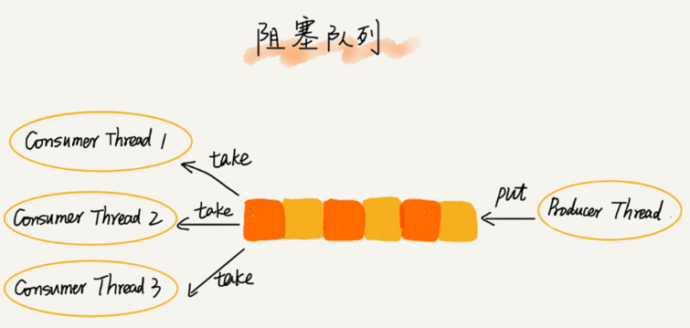

# 数据结构和算法

##### QA

~~~markdown
约瑟夫问题的两个步骤？
~~~


## 数据结构和算法是什么？

从广义上讲，数据结构就是指一组数据的存储结构。算法就是操作数据的一种方法。举个例子来说，图书馆中的图书按照类别分类存储，和每个图书特定的编号，和查找这些图书使用的方法，前者可以看作是数据的结构，后者查找书籍的方法都算作是算法。然而：

**数据结构是为了算法服务的，算法要建立在特定的数据结构之上**

数据结构和算法要解决的是如何更省，更快地存储和处理数据问题，因此就需要一个考量效率和资源消耗的方法，这就是复杂度分析方法。

完整的看一下一个普通的程序员要掌握的数据结构和算法内容：


这里面有 10 个数据结构：数组、链表、栈、队列、散列表、二叉树、堆、跳表、图、`Trie` 树；10 个算法：递归、排序,二分查找、搜索、哈希算法、贪心算法、分治算法、回溯算法、动态规划、字符串匹配算法。学习这些数据结构和算法的时候要注意到**他的来历，自身的额特点，适合解决的问题，实际的应用场景**，在学习的时候

* 边学变练，适量刷题
* 多问，多思考，多互动
* 最重要的，坚持下来
* 慢慢来，一年的时间足够入门了，知识需要沉淀，学习需要反复的迭代。

## 复杂度分析

事后统计法：就是将代码扔到机器上运行一遍，观察运行时间，这样的测试方法有一定的局限性，比如：

* 测试结果非常依赖测试环境
* 测试结果受数据规模的影响大，如排序算法中对于有序度高的数据来说，排序是相对快的

所以我们需要一种方法来估计计算方法的执行效率。

### 时间复杂度

**渐进时间复杂度，表示算法的执行时间与数据规模之间的增长关系**

#### 大O表示法

举个例子来说：

~~~java
 int cal(int n) {
   int sum = 0;
   int i = 1;
   for (; i <= n; ++i) {
     sum = sum + i;
   }
   return sum;
 }
~~~

站在CPU的角度来说，这段代码的每一行都在进行类似的操作，**读数据，运算，写数据**，这里我们假设每行代码的执行时间都一样，设为`unit_time` ，则这段代码的执行时间为：**(2n+2)\* unit_time** ，所有代码的执行时间和每行代码的执行次数成正比。

~~~java
 int cal(int n) {
   int sum = 0;
   int i = 1;
   int j = 1;
   for (; i <= n; ++i) {
     j = 1;
     for (; j <= n; ++j) {
       sum = sum +  i * j;
     }
   }
 }
~~~

这段代码的执行时间为：`T(n) = (2n2+2n+3)*unit_time`


大O表示法的特点是：

* 只保留最高次幂，对复杂度贡献最大的
* 忽略系数，但是又不能完全忽略，也就是看情况忽略系数

**常见的时间复杂度案例分析**


前面都是**多项式量级**，后面两个是**非多项式量级**，非多相式量级的算法问题叫做NP（***Non-Deterministic Polynomial***）问题，接下来说下，常见的时间复杂度：

##### O（1）

~~~java
 int i = 8;
 int j = 6;
 int sum = i + j;
~~~

一般而言，只要算法中不存在循环，递归，即便有成千上万行的代码，其时间复杂度也是O（1）

##### O(`logn`)、O(`nlogn`)

~~~java
 i=1;
 while (i <= n)  {
   i = i * 2;
 } // 这里的while循环执行多少次？决定了这段代码的时间复杂度，指数级的增长，x的多少次幂等于n？x=log2N（以2为底N的对数）
~~~

如果我们将2更改为3，或者或者是其他数，复杂度还是`logN`，这是有对数的运算性质和复杂度忽略系数决定的：

~~~java
log3n = log32 * log2n 
log32作为系数可以忽略
~~~

##### O(m+n)、O(m*n)

代码的复杂度由两个数据项决定，由于我们事先无法评估m和n的量级，因此都要保留下来。

### 空间复杂度

**渐进空间复杂度（asymptotic space complexity），表示算法的存储空间与数据规模之间的增长关系**

~~~java
void print(int n) {
  int i = 0;
  int[] a = new int[n]; // 这里申请了一个长度为n的辅助数组
  for (i; i <n; ++i) {
    a[i] = i * i;
  }

  for (i = n-1; i >= 0; --i) {
    print out a[i]
  }
}
~~~

对于时间复杂度而言，还有以下的几个概念需要知道：

* 最好时间复杂度
* 最坏时间复杂度
* 平均时间复杂度
* 均摊时间复杂度

## 数组

数组是一种线性数据结构，他用一组**连续的内存空间**，来存储一组具有**相同类型的数据**在Java中，容器类`ArrayList`是动态数组的有力实现。该类，每次存储空间不够的时候，她都会自动扩容为原来的1.5倍。数组为什么能随机访问的原因？


数组的优势是：随机访问

数组的不擅长做的操作是对于数据的插入和删除，如果要进行这样的操作，数组不得不进行数据的迁移，在数据的迁移的时候，为了避免数据被迁移多次，可以对删除的数据进行一个标记，当数组没有更多的空间存储数据的时候，在进行数据的删除。这样可以大大的减少因为数据的删除而导致的迁移工作。


几点总结：

* Java中的`ArrayList`没有办法 存储基本数据类型，对于基本数据类型只能封装为对应的Integer类型，这样会有性能的消耗，如果很关注性能，可以选择数组

## 链表

我能想到的链表的特点：

* 节省内存，内存地址不连续
* 拿到表头即可拿到所有的元素
* 擅长的是值的删除，添加，不擅长随机访问

### 单链表


### 循环链表


[约瑟夫问题](<https://zh.wikipedia.org/wiki/%E7%BA%A6%E7%91%9F%E5%A4%AB%E6%96%AF%E9%97%AE%E9%A2%98>)使用循环链表实现就会简单很多。

约瑟夫问题（有时也称为约瑟夫斯置换，是一个出现在计算机科学和数学中的问题。在计算机编程的算法中，类似问题又称为约瑟夫环。又称“丢手绢问题”.）在下面的代码中，解决的是n个人排成一圈，这n个人的序号分别是1 ~ n， 给定一个数m,从头1开始报数，每报到m时，这个人出列，然后下个人从1开始报数，直到最后一个人留下，求最后一个人的序号

~~~java
//tmd
package com.isea.dw.algo;
public class YueSeFu {
    public static class Node {
        private int val;
        private Node next;
        public Node(int val) {
            this.val = val;
            this.next = null;
        }
        @Override
        public String toString() {
            return "" + val;
        }
    }

    // 形成一个单向循环链表
    public static Node generateList(int n) {
        if (n <= 0) {
            throw new IllegalArgumentException("N 必须大于0");
        }
        Node head = new Node(1);
        Node p = head; // 尾节点指向头结点
        for (int i = 2;i <= n ; i ++){
            p.next = new Node(i);
            p = p.next;
        }

        p.next = head;
        // 返回链表的尾
        return p;
    }

    public static  void printCircleQueue(Node tail){
        Node p = tail.next;
        while(p != tail){
            System.out.print(p.val + "->");
            p = p.next;
        }
        System.out.print(tail);
        System.out.println();
    }

    private static int getLuckyBoy(int n, int m) {
        Node p = generateList(n);
        while(p != p.next){
            for (int i = 1; i < m; i ++){
                p = p.next;
            }
            // 删除m位置的元素
            p.next = p.next.next;
        }
        return p.val;
    }

    public static void main(String[] args) {
        printCircleQueue(generateList(8));
        System.out.println(getLuckyBoy(8, 3));
    }
}
~~~

### 双向链表


在删除链表数据的时候，存在两种情况，第一种情况是：

* 删除指定的值
* 删除指定的指针指向的值

对于第一种删除，没有什么可说的，时间复杂度是O（n）因为需要从头开始遍历链表。对于第二种删除，如果是单链表的话，还是需要遍历，因为要删除一个节点还需要知道该节点的前一个节点，但是对于双向链表而言，由于该链表中保留了前驱节点，因此时间复杂度为O（1）。在指定的位置删除某个节点同理。

但是双向链表比单向链表更消耗内存，在Java语言中的`LinkedHashMap`这个容器，其中就用到了双向链表这种数据结构。

### 双向循环链表


缓存的应用非常广泛，比如常见的CPU缓存，数据库缓存，浏览器缓存，缓存的大小有限，当缓存用满的时候，哪些数据应该被保留，哪些数据应该被清理，这就由缓存淘汰算法来决定，常见的策略有：

* 先进先出FIFO
* 最少使用策略
* 最近最少使用策略

**使用链表实现LRU缓存淘汰算法：** （*LRU*, Least Recently Used）：最近最少使用*LRU*法是依据各块使用的情况， 总是选择那个最长时间未被使用的块替换。我的实现的思路是：维护一个固定长度的单链表，当有新的数据访问的时候，我们从头开始遍历链表：

* 若访问的数据已经在链表中了，那么直接将该元素从链表中删除，然后在将该节点插入链表的头部
* 如果访问的元素不在链表中，有两种情况
  * 如果链表达到长度，则删除最后一个元素，将访问的元素插入到头结点
  * 如果链表没有达到长度，直接插到链表的头部

**哨兵节点的链表**：即为带有虚拟头接点的链表。

除此之外，如果你的代码对内存的使用非常苛刻，那数组就更适合你，因为链表中的每个结点都需要消耗额外的存储空间去存储一份指向下一个结点的指针，所以内存消耗会翻倍。而且，对链表进行频繁的内存申请和释放，容易造成内存碎片，如果是 Java 语言，就有可能会导致频繁的GC（Garbage Collection，垃圾回收）

### 链表和数组的对比


CPU在从内存读取数据的时候，会先把读取到的数据加载到CPU的缓存中。而CPU每次从内存读取数据并不是只读取那个特定要访问的地址，而是读取一个数据块(这个大小我不太确定。。)并保存到CPU缓存中，然后下次访问内存数据的时候就会先从CPU缓存开始查找，如果找到就不需要再从内存中取。这样就实现了比内存访问速度更快的机制，也就是CPU缓存存在的意义:为了弥补内存访问速度过慢与CPU执行速度快之间的差异而引入。

对于数组来说，存储空间是连续的，所以在加载某个下标的时候可以把以后的几个下标元素也加载到CPU缓存这样执行速度会快于存储空间不连续的链表存储。

**思考** 判断一个字符串是否是回文结构，并计算其时间复杂度和空间复杂度   ***（这里暂时只是给出一种写法）***

~~~java
public class IsPalindromeList {
    public static class Node{
        private int value;
        private Node next;
        public Node(int data){
            this.value = data;
        }
    }

    // need extra space:定义一个stack，连快慢指针都不需要设置
    public static boolean isPalindroneOne(Node head){
        Stack<Node> stack = new Stack<>();
        Node cur = head;
        while(cur != null){
            stack.push(cur);
            cur = cur.next;
        }
        while(head != null){
            if (head.value != stack.pop().value){
                return false;
            }
            head = head.next;
        }
        return true;
    }

    public static void  printLinkedList(Node head){
        System.out.print("LinkedList:");
        while(head != null){
            System.out.print(head.value + "->");
            head = head.next;
        }
        System.out.print("Null");
        System.out.println();
    }
    public static void main(String[] args) {

        Node head = null;
        head = new Node(1);
        head.next = new Node(2);
        head.next.next = new Node(3);
        head.next.next.next = new Node(2);
        head.next.next.next.next = new Node(1);
        printLinkedList(head);
        System.out.println(isPalindroneOne(head));
    }
}
~~~

### 如何轻松写出正确的链表代码

* 理解指针的或者是引用的含义


~~~java
x.next = p.next;
p.next = x;
~~~

* 利用哨兵模式化简难度

如果我们需要在P节点的后面添加一个新的节点，假如P节点是最后一个节点，同样适用。

~~~ java
new_node.next = p.next;
p.next = new_node;
~~~

但是当我们要向一个空链表插入一个节点的时候，刚才的逻辑就不能用了，我们需要下面的特殊处理，我们可以发现对于链表的插入操作，第一个节点和其他节点的插入逻辑是不一样的。

~~~java
if(head == null){
    head = new_node;
}
~~~

如果我们要删除p节点的后继节点（单链表而言，如果我们要删除链表的某个节点，需要知道被删除链表的前驱节点）

~~~java
p.next = p.next.next;
p.next.next = null ; // 这一步可有可无
~~~

使用带头节点来解决这个问题：


* 留意边界条件，代码在边界或者异常情况下，最容器产生bug，经常需要检查链表的边界条件有这样几个：
  * 如果链表为空，是否能够正常工作
  * 如果链表只包含一个节点，能否正常工作
  * 如果链表只包含两个节点，能否正常工作
  * 代码逻辑在处理头结点和尾节点的时候，能否正常工作

实际上在写任何代码的时候，你都要想想你的代码是否能够应对各种边界条件？

* 动手画图，比如：


* 多加练习，下面的几个操作要熟练掌握：
  * 单链表反转
  * 链表中环的检测
  * 两个有序链表的合并
  * 删除链表中导数第n个节点
  * 求链表的中间节点。

带有头结点的链表

~~~java
package com.isea.dw.linkedlist;

/**
 * 手动实现一个LinkedList，要求满足如下的功能：
 * <p>
 * 向链表的任意一个位置添加元素
 * 向链表的头部添加元素，向链表的尾部添加元素
 * 删除链表的头部，尾部，任意位置的元素
 * 随机获取元素的值，传入index，获取链表的最后一个元素，或者是第一个元素
 * <p>
 * 查找链表中是否包含元素t
 * 判断链表是否为空
 * 判断链表的长度是多大
 * <p>
 * 技巧：使用虚拟头结点，这样能够在配合size，对链表删除和添加都不需要考虑特殊的情况。
 */
public class LinkedList2<T> {
    private class Node {
        private T val;
        private Node next;

        public Node() {
        }

        public Node(T val) {
            this();
            this.val = val;
        }

        public Node(T val, Node next) {
            this(val);
            this.next = next;
        }

        @Override
        public String toString() {
            return this.val.toString();
        }
    }

    // 为链表创建虚拟头结点
    private Node dummyHead;
    private int size; // 表征链表的长度信息

    public LinkedList2() { // 初始化链表，size 为零，虚拟头结点是的val值是为null的
        dummyHead = new Node(null, null);
        size = 0;
    }

    // 返回链表的长度
    public int getSize() {
        return size;
    }

    // 判断链表是否是null
    public boolean isEmpty() {
        return size == 0;
    }

    // 获取index位置的元素
    public T get(int index) {
        if (index < 0 || index >= size) {
            throw new IllegalArgumentException("Illegal index...");
        }
        Node cur = dummyHead.next;
        for (int i = 0; i < index; i++) {
            cur = cur.next;
        }
        return cur.val;
    }

    // 获取表头
    public T getFirst() {
        return get(0);
    }

    // 获取链表的尾部元素
    public T getLast() {
        return get(size - 1);
    }

    // 在链表的index位置添加元素
    public void add(int index, T t) {
        if (index < 0 || index > size) {
            throw new IllegalArgumentException("Illegal index...");
        }
        Node pre = dummyHead;
        for (int i = 0; i < index; i++) {
            pre = pre.next;
        }
        pre.next = new Node(t, pre.next);
        size++;
    }

    // 在表头添加元素
    public void addFirst(T t) {
        add(0, t);
    }

    // 在表尾添加元素
    public void addLast(T t) {
        add(0, t);
    }

    // 删除链表index位置的元素
    public T remove(int index) {
        if (index < 0 || index >= size) {
            throw new IllegalArgumentException("Illegal index...");
        }

        Node pre = dummyHead;
        for (int i = 0; i < index; i++) {
            pre = pre.next;
        }
        Node res = pre.next;
        pre.next = res.next;
        res.next = null;
        size--;

        return res.val;
    }

    // 删除链表头部元素
    public T removeFirst() {
        return remove(0);
    }

    // 删除链表的尾部的元素
    public T removeLast() {
        return remove(size - 1);
    }

    @Override
    public String toString() {
        StringBuilder res = new StringBuilder();
        Node cur = dummyHead;
        while (cur != null) {
            res.append(cur.val + "->");
            cur = cur.next;
        }
        res.append("NUll");

        return res.toString();
    }

    public static void main(String[] args) {
        LinkedList2<Integer> linkedList = new LinkedList2<>();
        for (int i = 0 ; i < 5 ; i ++){
            linkedList.addFirst(i);
            System.out.println(linkedList);
        }

        linkedList.add(2,666);
        System.out.println(linkedList);

        linkedList.remove(2);
        System.out.println(linkedList);

        linkedList.removeFirst();
        System.out.println(linkedList);

        linkedList.removeLast();
        System.out.println(linkedList);
    }
}
~~~

## 栈

一种先进后出的数据结构


### 顺序栈

使用固定数组实现的栈：

~~~java
package com.isea.springboot;

/**
 * @author isea_you
 * @date 2019/8/21
 * @time 20:38
 * @target:
 */
public class ArrayStack {
    private int[] stack;
    private int size;

    public ArrayStack(int initialSize) {
        stack = new int[initialSize];
        size = 0;
    }

    // 入栈的元素
    public void push(int val) {
        if (size == stack.length) {
            throw new IllegalArgumentException("栈满..");
        }
        stack[size++] = val;
    }

    // 出栈
    public int pop() {
        if (size == 0) {
            throw new IllegalArgumentException("栈空...");
        }
        int res = stack[--size];
        return res;
    }

    // 看栈顶
    public int peek() {
        if (size == 0) {
            throw new IllegalArgumentException("栈空..");
        }
        return stack[size - 1];
    }

    public static void main(String[] args) {
        ArrayStack stack = new ArrayStack(10);
        for (int i = 0; i < 10; i++) {
            stack.push(i);
        }
        System.out.println(stack.pop());
        while (stack.size != 0) {
            System.out.print(stack.pop() + ",");
        }
        System.out.println();
    }
}
~~~

**基于动态扩容的顺序栈**


动态的顺序栈的时间复杂度仍然是O(1)，这里均摊时间复杂度是非常好实现的：


**均摊时间复杂度一般都等于最好情况时间复杂度**

### 链式栈

使用链表实现的栈。

### 应用场景

#### 函数调用

操作系统给每个线程分配了一块独立的内存空间，这块内存被组织成“栈”这种结构, 用来存储函数调用时的临时变量。

~~~java
int main() {
   int a = 1; 
   int ret = 0;
   int res = 0;
   ret = add(3, 5);
   res = a + ret;
   printf("%d", res);
   reuturn 0;
}

int add(int x, int y) {
   int sum = 0;
   sum = x + y;
   return sum;
}
~~~


#### 表达式求值

**编译器是如何进行表达式的计算的？**

* 使用两个栈，一个保存操作数`numStack`栈，一个保存运算符的栈`operatorStack`，

* 然后从表达式的左边开始，操作数进入操作`numStack`，
* 如果是运算符号，和`operatorStack`栈顶的元素比较，
  * 如果运算符比栈顶的元素等级更高的话，就入栈。
  * 如果运算级相等或者更低的话，`operatorStack`栈顶的元素出栈，`numStack`拿出两个元素，进行运算，运算之后的结果入`numStack`栈。


表达式计算：

~~~java

~~~

#### 在括号匹配中，

也可使用栈来解决。

其实很简单：从表达式的左边开始扫描，如果遇到{，（，[压入栈，如果遇到右边的，从栈顶取出一个元素，是否匹配，如果不匹配或者是栈中没有元素了，就是不匹配的表达式。

~~~java
public class MatchBrackets {
    public static void main(String[] args) {

        System.out.println(matchBrackets("{[()]}")); // true
        System.out.println(matchBrackets("][{")); // false
        System.out.println(matchBrackets("(]")); // false
    }

    public static boolean matchBrackets(String brackets) {
        Stack<Character> stack = new Stack<>();

        for (int i = 0; i < brackets.length(); i++) {
            char bracket = brackets.charAt(i);
            if (bracket == '{' || bracket == '[' || bracket == '(') {
                stack.push(bracket);
            }
            if (bracket == '}' || bracket == ']' || bracket == ')') {
                if (stack.isEmpty()) {
                    return false;
                }
                char topStack = stack.pop();
                if (bracket == ')' && topStack != '('){
                    return false;
                }
                if (bracket == ']' && topStack != '['){
                    return false;
                }
                if (bracket == '}' && topStack != '{'){
                    return false;
                }
            }
        }
        return stack.isEmpty();
    }
}
~~~

#### 例子

浏览器回看和前进的实现：

假设现在从a到了b，从b到了c：


从c回退到a


又想看b


从b到d


## 队列

CPU的资源有限的，任务的处理速度和线程的个数并不是呈线性相关的，相反，过多的线程会导致CPU的频繁切换，处理性能下降，所以线程池的大小一般都是要综合考量处理任务的特点和硬件的环境，来进行事先的设置才能完成的。

当我们向固定大小的线程池请求一个线程的时候，如果线程中没有空闲资源了，这个时候线程如何处理这个请求呢？

我们一般有两种处理策略，第一种是非阻塞的方式，直接拒绝任务的请求。另外一种是阻塞的处理方式，将请求排队，等到有线程空闲的时候，取出排队中的请求继续处理，那么如何处理排队中的请求？这就是队列需要解决的内容。

如果我们需要公平的处理每个排队的请求，也即先进者先服务，这就是队列的使用场景，其实队列有两种实现方式，基于数组实现和基于链表实现。基础链表实现的队列能够实现**无边际队列**这有可能会导致过多的请求排队等候，请求处理相应的时间过长，所以针时间敏感的系统基于链表的实现的无限排队的线程池是不合适的。

基于数组实现的有边界队列，由于队列的大小 有限，所以线程池中排队请求超过队列的大小的时候，接下来的请求就会被拒绝，这种方式对时间敏感的系统来说，比较合适，设置一个合理的数值也非常的考究！**连接池**也一样。


### 顺序队列

使用数组实现的队列。start或者是head（下一次增加的元素放置的位置），tail（下一次要取出的元素），size（当前的队列有多少元素。***写好队列代码的关键是：head和tail都指向的下一次出队的元素和下一次入队的元素。***

~~~java
// 用数组实现的队列
public class ArrayQueue {
  // 数组：items，数组大小：n
  private String[] items;
  private int n = 0;
  // head 表示队头下标，tail 表示队尾下标
  private int head = 0;
  private int tail = 0;

  // 申请一个大小为 capacity 的数组
  public ArrayQueue(int capacity) {
    items = new String[capacity];
    n = capacity;
  }

  // 入队
  public boolean enqueue(String item) {
    // 如果 tail == n 表示队列已经满了
    if (tail == n) return false;
    items[tail] = item;
    ++tail;
    return true;
  }

  // 出队
  public String dequeue() {
    // 如果 head == tail 表示队列为空
    if (head == tail) return null;
    // 为了让其他语言的同学看的更加明确，把 -- 操作放到单独一行来写了
    String ret = items[head];
    ++head;
    return ret;
  }
}
~~~

### 链式队列

使用链表实现的栈，**使用代码实现**


### 循环队列


**head 下一次要出队列的原素，tail下一次要入队的元素。循环队列的需要浪费数组的一个存储空间。**当然也可以不浪费，只是需要添加一个size表来标记队列的长度即可。

~~~java
/**
 * 使用数组实现固定大小的队列，该队列是循环队列
 */
public class ArrayCircleQueue {

    private int[] queue;
    private int head; // 队首
    private int tail; // 队尾
    private int size; // 队里中有多少个元素

    public ArrayCircleQueue(int initialSize){
        if (initialSize <  0 ){
            throw new IllegalArgumentException("Illegal param...");
        }
        queue = new int[initialSize];
        head = 0;
        tail = 0;
        size = 0;
    }

    // 入队
    public void inqueue(int target){
        if (tail == queue.length){
            throw new IllegalArgumentException("queue full...");
        }
        queue[tail] = target;
        tail = (tail + 1) % queue.length;
        size ++;
    }

    // 出队
    public int dequeue(){
        if (size == 0){
            throw new IllegalArgumentException("queue empty..");
        }
        int res = queue[head];
        head = (head + 1) % queue.length;
        size --;
        return res;
    }

    // 查看队首的元素
    public int peek(){
        if (size == 0){
            throw new IllegalArgumentException("queue empty..");
        }
        return queue[head];
    }
}
~~~

### 拥塞队列

拥塞队列就是在队列的基础上增加了阻塞操作。当队列为空的时候，从队首取数据会被阻塞；如果队列已满，那么入队的操作就会被阻塞，直到队列有了空闲的位置之后，才能插入数据。


以发现，上述的定义就是一个“生产者-消费者模型“，所以我们还可以提高消费效率：



#### 并发队列

线程安全的队列我们称之为并发队列，最简单直接的实现方式就是在`enqueue(),dequeue()`方法上添加上锁，但是**锁的粒度大，并发度会降低** ，同一时刻，只能允许一个存或者取操作。事实上基于数组的循环队列，利用CAS原理可以实现非常高效的并发队列，例如**Disruptor**。

## 递归

A推荐了B，B推荐了C，A没有推荐人


这就是一个递归的例子，如果你在电影院看电影，不知道是第几排，你问前排的人，前排的人也不知道，那么前排的人继续问前排的人，直到第一排，然后第一排的人开始返回，一直返回到你，**递归，去的过程叫做递，回来的过程是归**。写一下递退公式： 

~~~xml
f(n) = f(n - 1) + 1
f(1) = 1;
~~~

可以写递归的前提：

* 一个问题可以分解为几个子问题的解
* 这个问题和分解之后的子问题，除了数据规模不同，求解思路完全一样
* 存在递归终止条件

~~~java
int f(int n) {
  if (n == 1) return 1;
  if (n == 2) return 2;
  return f(n-1) + f(n-2);
}
~~~

动态规划和递归是两个比较难以理解的知识点。在学习的过程中，我们需要学会将递归修改为动态规划。

### 堆栈溢出

使用递归的时候，要警惕递归深度太深造成的堆栈溢出，解决的方法可以如下：

~~~java
// 全局变量，表示递归的深度。
int depth = 0;

int f(int n) {
  ++depth；
  if (depth > 1000) throw exception;
  
  if (n == 1) return 1;
  return f(n-1) + 1;
}
~~~

### 递归代码需要警惕重复计算

N步阶梯的问题：会出现递归代码重复计算的问题， 

为了避免重复计算，我们可以通过一个数据结构（比如散列表）来保存已经求解过的f（k）当递归到了f（k）的时候，先看看是否已经求解过了。

~~~java
public int f(int n) {
  if (n == 1) return 1;
  if (n == 2) return 2;
  
  // hasSolvedList 可以理解成一个 Map，key 是 n，value 是 f(n)
  if (hasSolvedList.containsKey(n)) {
    return hasSovledList.get(n);
  }
  
  int ret = f(n-1) + f(n-2);
  hasSovledList.put(n, ret);
  return ret;
}
~~~

对于递归的时间复杂度问题，是比较难分析出来的，但是可以使用到master公式。

递归的代码有的时候写起来非常的简洁，但是其弊端就是空间复杂度很高，有堆栈溢出的风险，还可能有重复计算的问题，很多的函数调用可能会比较耗时。

任何递归都可以有递归修改为非递归，因为递归是系统帮助我们压栈，我们只需要自己压栈就OK了。 

实例：如何使用递归来解决寻找最终推荐人的问题？题意：A推荐了B，B推荐了C，所以C的最终推荐人是A，我们如何来寻找最终的关系呢？


~~~scala
long findRootReferrerId(long actorId) {

  Long referrerId = select referrer_id from [table] where actor_id = actorId;
  if (referrerId == null) return actorId;
  return findRootReferrerId(referrerId);
}
~~~

如果我们使用了上述上递归办法，会存在一个问题就是如何和解决A-B-C-A，这种环的问题？**关于递归的debug，应该如何做？把日志打印出来**。

## 基于比较的排序

下图是排序算法的对比图：


**原地排序**：也就是**额外空间复杂度是O（1）**的排序算法。

**排序的稳定性**：相等的元素在排序之前和排序之后的相对次序是不变的，下面解释一下稳定性的意义：假如有一个订单表我们要求按照订单的金额从小到大排序，相同金额的订单按照时间早晚排序。

我们先按时间排序，在使用稳定的排序算法，对金额排序：


### 冒泡排序：

第一次冒泡排序过程：


冒泡排序如何做到稳定性？在元素相等的时候，不做交换即可保证原本相等的元素的相对次序保持不变。

**有序度**：有序度是数组中具有有序关系的元素对的个数，如：


如果完全有序，则叫做**满有序度**，计算公式是：n * (n – 1) / 2。在存在最好和最坏的情况复杂度不一样的情况的时候，可以使用有序度的概念来预估时间复杂度。

冒泡排序的代码实现：

~~~java
package com.jb.application;
// 冒泡排序的实现
public class BubbleSort {

    public static void bubbleSort(int[] arr) {
        if (arr == null || arr.length == 1) {
            return;
        }

        for (int end = arr.length - 1; end > 0; end--) {
            for (int j = 0; j < end; j++) {
                if (arr[j] > arr[j + 1]) {
                    swap(arr, j, j + 1);
                }
            }
        }
    }

    private static void swap(int[] arr, int i, int j) {
        int tmp = arr[i];
        arr[i] = arr[j];
        arr[j] = tmp;
    }

    private static void printArr(int[] arr){
        for (int i = 0; i < arr.length; i++) {
            System.out.print(arr[i] + "\t");
        }
    }

    public static void main(String[] args) {
        int [] arr = {8,5,3,9,1,0,2,4,7,6};
        printArr(arr);
        bubbleSort(arr);
        System.out.println();
        System.out.println("------排序之后-------");
        printArr(arr);
    }
}
~~~

冒泡排序是否是原地排序算法呢？**是原地排序算法**

是否是稳定的排序算法？在前后两个元素相等的时候，不发生交换行为即可， 是稳定的排序算法。

### 插入排序


思想：默认左边有序，右边元素找到合适的位置，向有序的部分插入。插排在代码实现的时候，外层循环从1开始，内层循环时减1操作（只有自己看得懂）

代码实现：

~~~java
package com.jb.application;

/**
 *  插入排序实现 1,23,4,8,9
 *  选择排序的思路：默认当前i位置之前的元素都已经排好了序了，当前的i位置和i之前位置（到index = 0）的元素进行比较，
 *  外层循环控制次数，
 */

public class InsertSort {
    private static void insertSort(int[] arr) {
        if (arr.length == 1 || arr == null) {
            return;
        }
        for (int i = 0; i < arr.length - 1; i++) {
            for (int j = i + 1; j > 0; j--) {
                if (arr[j] < arr[j - 1]) {
                    swap(arr, j, j - 1);
                }
            }
        }
    }

    private static void swap(int[] arr, int j, int i) {
        int tmp = arr[i];
        arr[i] = arr[j];
        arr[j] = tmp;
    }

    private static void printArr(int[] arr) {
        for (int i : arr) {
            System.out.print(i + "\t");
        }
        System.out.println();
    }

    public static void main(String[] args) {
        int[] arr = {1, 88, 9, 5, 100, 2, 5, 34};
        printArr(arr);
        insertSort(arr);
        printArr(arr);
    }
}
~~~

***插入排序是原地排序么？是的；插入排序是稳定的排序么？是的，***如果发现当前的元素和前面有序的元素相等，不发生交换行为即可。插入排序的时间复杂度最好是O（N），也就是有序的时候，这个时候的时间只是单纯的遍历一下数组。

### 选择排序


每一次循环，找到最大的元素，严格的时间复杂度是O(N^2)，***选择排序做不到稳定性。***例如：

`5，8，5，2，9`

极客时间版权所有: 这样一组数据，使用选择排序算法来排序的话，第一次找到最小元素5与第一个 5 交换位置，那第一个 5 和中间的 5 顺序就变了，所以就不稳定了。

代码实现：

~~~java
public class SelectSort {
    public static void selectSort(int[] arr){
        if (arr.length == 1 || arr == null){
            return;
        }
        for (int i = 0; i < arr.length - 1; i ++){
            int minIndex = i; // 找到最小的元素放在数组的左边
            for (int j = i ; j < arr.length; j ++){
                if (arr[j] < arr[minIndex]){
                    swap(arr,j,minIndex);
                }
            }
        }
    }

    private static void swap(int[] arr, int j, int i) {
        int tmp = arr[i];
        arr[i] = arr[j];
        arr[j] = tmp;
    }
    private static void printArr(int[] arr) {
        for (int i : arr) {
            System.out.print(i + "\t");
        }
        System.out.println();
    }

    public static void main(String[] args) {
        int[] arr = {1, 88, 9, 5, 100, 2, 5, 34};
        printArr(arr);
        selectSort(arr);
        printArr(arr);
    }
}
~~~

### 希尔排序

希尔排序是对插入排序的优化，

以上的排序算法时间复杂度都是O（N^2），所以比较适合小规模数据的排序，接下来是O（`n*logn`）的排序。接下来是归并排序，快排，堆排。

### Gudience


以上的三种排序对于小数据集的排序都是非常好用的，但是对于大数据来说，就需要使用`N*logN`的排序来实现了。

# that is what I watch！！！

### 归并排序

归并排序，非常的巧妙，是冯诺依曼发明的一种排序方式，用到了**分治思想**。归并排序的思路是，**先将左边和右边排序，然后在merge使得整体有序**。这里的分治思想和函数的递归很像，一般而言，分治都是用递归实现的，**分治是一种解决问题的处理思想，递归是一种编程技巧**。


**哨兵**：一般是用来解决国家之间的边界问题，代码中的哨兵也是用来解决“边界问题”的，一般不会参与业务逻辑。利用哨兵能够简化编程难度，在插入排序，归并排序，动态规划，链表中中都可以用到。

归并排序的代码实现：

~~~java
public class MergeSort {
    public static void mergeSort(int[] arr) {
        if (arr.length  == 1 || arr == null){
            return;
        }

        sortProcess(arr,0 , arr.length - 1);
    }

    // 核心
    private static void sortProcess(int[] arr, int L, int R) {
        if (L == R){
            return;
        }
        int middle = L + (R - L ) / 2;
        sortProcess(arr,L,middle);
        sortProcess(arr,middle + 1 , R);
        merge(arr,L , middle , R);
    }

    private static void merge(int[] arr, int L, int middle, int R) {

        int[] help = new int[R - L + 1];
        int p1 = L;
        int p2 = middle + 1;
        int i = 0;
        while(p1 <= middle && p2 <= R){
            help[i ++] = arr[p1] < arr[p2] ? arr[p1 ++] : arr[p2 ++];
        }

        while(p1 <= middle){
            help[i ++] = arr[p1 ++];
        }

        while(p2 <= R){
            help[i ++] = arr[p2 ++];
        }

        for (int j = 0; j < help.length; j++) {
            arr[L + j] = help[j];
        }
    }

    private static void printArr(int[] arr){
        for (int i = 0; i < arr.length; i++) {
            System.out.print(arr[i] + "\t");
        }
        System.out.println();
    }

    public static void main(String[] args) {
        int[] arr = {9,4,88,44,3,2};
        printArr(arr);
        mergeSort(arr);
        printArr(arr);
    }
}
~~~

**归并排序是否是稳定的？**归并排序能够做到稳定排序，在merge的时候，如果两个元素相等的话，那么让左边的元素先进入辅助数组。

由于归并排序涉及到了递归，时间复杂度不是很好分析，但是可以使用master公式来求解。归并排序的时间复杂度非常稳定得维持在O（`N^logN`）,但是**归并排序并不是原地排序**。额外空间复杂度是O（N）

### 堆排

在java中，**堆用来实现优先级队列**，在java中，优先级队列如果没有传入比较器的话，会默认生成一个小根堆。

堆的实现是使用数组来实现的，在java中，使用堆来实现优先级队列。堆结构是一个满二叉树。那么基于数组实现的堆将满足下面的性质：

一颗树的左孩子的索引值是 2 * I + 1； 右孩子的索引值是 2 * I + 2；一个节点的父节点的下标是： （i- 1）/ 2

**`Heapinsert`**的过程：往一个已经是堆的结构中添加数据，使得该结构还保持堆的结构类型，一直和父元素比较，直到不再比父节点元素大了。

**`Heapify`**的过程：如果堆中有个数据发生了变化，该过程使得结构仍然保持堆的结构，具体的策略是，找到当前节点的左右两个孩子中的最大的节点，和当前节点交换，index移动，直到左右孩子不在比当前节点大。**即index位置的元素变小了，下沉的过程**。

**堆的弹出操作**：将堆的最后一个元素和堆顶的元素替换，替换之后进行`heapify`操作（`heapSize`要减1）。

### 快速排序

Pivot：中心点。快排我实现了两个版本，经典快排+随机快排。本文中仅仅给出随机快排的版本，随机快排的思路是，随机数组中的任意一个元素和数组的最后一个元素交换位置记为pivot，然后在partition（小于pivot在数组的左边，等于的在中间，大于的在后面）然后在

快排的代码实现：

~~~JAVA
import java.util.Random;

public class QuickSort {

    // 随机快排
    public static void quickSort(int[] arr) {
        if (arr.length < 2 || arr == null) {
            return;
        }
        sortProcess(arr, 0, arr.length - 1);
    }

    private static void sortProcess(int[] arr, int L, int R) {
        if (L < R) {
            swap(arr, (L + new Random().nextInt(R - L + 1)), R);
            int[] p = partition(arr, L, R);
            sortProcess(arr, L, p[0] - 1);
            sortProcess(arr, p[1] + 1, R);
        }
    }

    private static int[] partition(int[] arr, int L, int R) {

        int less = L - 1;
        int more = R;
        while (L < more) {
            if (arr[L] < arr[R]) {
                swap(arr, ++less, L++);
            } else if (arr[L] > arr[R]) {
                swap(arr, --more, L);
            } else {
                L++;
            }
        }
        swap(arr, R, more);
        return new int[]{less + 1, more - 1};
    }

    private static void swap(int[] arr, int i, int j) {

        int tmp = arr[i];
        arr[i] = arr[j];
        arr[j] = tmp;
    }

    private static void printArr(int[] arr) {
        for (int i = 0; i < arr.length; i++) {
            System.out.print(arr[i] + "\t");
        }
        System.out.println();
    }

    public static void main(String[] args) {
        int[] arr = {9, 4, 88, 44, 3, 2};
        printArr(arr);
        quickSort(arr);
        printArr(arr);
    }
}
~~~

***快排做不到稳定性。*** 

我们来对比一下快速排序和归并排序：

可以发现，**归并排序的处理过程是由上到下的，先处理子问题，然后在合并；而快速排序正好相反，她处理的过程是由上到下的，先分区然后在处理子问题**。

​                                                  

利用快排求出`topK `并做到时间复杂度是O（N），据说可以做到，但是我并没有使用代码实现。思想：

比如，4， 2， 5， 12， 3 这样一组数据，第 3 大元素就是 4。我们选择数组区间 A[0…n-1] 的最后一个元素 A[n-1] 作为 pivot，对数组 A[0…n-1] 原地分区，这样数组就分成了三部分，A[0…p-1]、A[p]、A[p+1…n-1]。（我记得有对应的题目，到时候有机会的时候认真地写一下。）

## 非基于比较的排序

我们前面学习过的排序的方法都是通过比较大小来实现的，下面的这几种排序方式不需要对元素的大小进行比较，主要是**桶排序，计数排序，基数排序，这三种排序算法能够做到时间复杂度是O(N)。**

### 桶排序（bucket sort）

桶排序的核心思想就是将要排序的数据分到几个有序的桶中，每个桶中的数据在单独进行排序，桶排序之后，在把每个桶里的数据按照顺序依次取出，组成的序列就是有序的。


假设要排序的元素有n个，有m个桶，那么每个桶就有k=n/m 个元素，每个桶内都使用快速排序，时间复杂度可以看成是：`m * (k * logk)` 如果m等于n，那么时间复杂度就是O（n）。

我们的桶是有编号的，然后分别对桶中的数据排序，如果桶的数量足够多，极端的例子，假设50个数最小的1，最大的50，50个桶（**此时就是计数排序**），遍历数组，将其放置到对应的桶的编号中，然后直接按照桶的编号取出，就得到了排好序的顺序。

桶排序对数据的要求很严格，如果数据划分到桶中的数据规模不一样，你没有办法控制时间复杂度。

#### 桶排序的应用：

桶排序一般比较适合外部排序，所谓的外部排序就是数据全部存储在外部的磁盘中，数据量比较大，而内存比较有限，无法将所有的数据都加载到内存中，比如说我们有10G的订单数据，但是内存只有几百M，此时我们应该如何对这些数据进行排序，可以借助桶排序的思想来解决这个问题：

将10G订单数据按照订单的金额进行排序，我们可以先扫描一下文件，查看订单的所处的数据范围，假设为1到10万元，（10G= 1000M * 10 = 10000 M = 100M * 100 ），我们可以将这些订单数据划分到100个桶里，第一个桶在1-1000元，依次类推，每个桶对应一个文件，并且按照订单的金额命名：（00，01，02..99）

理想状态下，订单数据会被较为均匀的划分到每个桶里，这样一来，每个小文件中的数据大约就是100M，读到内存中，进行一个快排，等到所有的文件都排好序之后，我们在依次读取每个小文件中的订单数据，然后在将其写入到一个大文件中，就OK了。

不理想状态，我们可以对桶内的数据二次划分，比如1-1000元的订单数据有1000M，划到10个桶中，在进行上述的操作。

**桶排序是一种排序的思想**，基数排序和计数排序是其的实现。

### 计数排序（Counting sort）

上面的那个极端的例子说的就是计数排序。高考的查分系统，总分是750分，最低分是0分，我们使用751个桶，将某省的考生的全部分数放入到对应的桶中，相同的桶中的分数放置到一个数组中。因为只是涉及到了遍历操作，所以时间复杂度是：O（N）

计数排序，只能用在数据范围不大的场景中，而且只能给**非负整数排序**。

计数排序为什么要叫做计数排序，我也不知道！！，这个如果需要的话，到时候可以再补。

### 基数排序

假设 有10万个手机号，希望将这10万个手机号按照从小到大的顺序进行排列，能否做到O(N ) 的时间复杂度呢？对于桶排序和计数排序来说，这个数据的范围太大，所以排不上用场，这里可以使用基数排序。

该问题有一个规律：a和b手机号，如果在前面几位中，a手机号已经比b手机号大了，那么后面几位就不用在看了，我们可以按照上面的说过的按照订单的金额和时间来排序的思想来解决这个问题：先按照最后一位来排序号码，然后再按照倒数第二位来排序，依次类推，经过11次排序之后，号码就有序了。

具体的思路如下：


注意此时按照每一位来排序的时候，需要使用稳定的排序。


### 排序总结


这里需要的注意的是，

* 工程中的排序算法是混用的，如果数据很长如果是五种基本类型：`int，double,char,flout,short `会直接使用快排。如果不是基础类型，会使用归并排序，**（稳定性）**
* 如果数据很短（60），会使用插入排序，因为数据量很小的情况下，插入排序因为**常数项比较小**，会显示出优势
* 工程中的快排，都是非递归版本，因为递归系统自动压栈，这样会存储过多的信息，如果压栈过多，会发生Stack Overflow。
*  快排其实也可以做到稳定性，见论文：01 stable sort

## 二分查找

### 思想

也叫做折半查找，假设有10个订单，并且按照从小到达的顺序排列好，查看某金额是否在：


**2的三十二次方大约是42亿，O（1）的时间复杂度>>O（`logN`）**

### 简单折半实现

~~~java
package com.isea.dw.search;

/**
 * @author isea_you
 * @date 2019/8/23
 * @time 9:12
 * @target: 简单的二分查找，假设有序数组中不存在重复的元素
 */
public class BinarySearch {
    // 返回数据对应的下标
    public static int binarySearch(int[] arr,int value){
        if (arr.length <= 0 || arr == null){
            return -1;
        }
        int high = arr.length - 1;
        int low = 0;
        while(low <= high){ // 容易出错
            int middle = low + (high - low) / 2;  // 防止溢出，提高性能的写法如下
            // int middle = low + ((high - low) >> 1); // 注意这里要加括号
            if (arr[middle] == value){
                return middle;
            }else if (arr[middle] < value){
                low = middle + 1;  // low的更新
            }else {
                high = middle - 1; // high的更新
            }
        }
        return -1;
    }
    public static void main(String[] args) {
        int[] arr = {1,2,3,4,5,6,9};
        System.out.println(binarySearch(arr, 3));
    }
}
~~~

上述的代码注意我标注的最容易出错的地方，上面是非递归的实现，下面是**递归**的实现

~~~java
public class BinarySearch {
    public static int binarySearch(int[] arr,int value){
        if (arr.length <= 0  || arr == null){
            throw new IllegalArgumentException("illegal param...");
        }
        return binarySearch(arr,0,arr.length - 1,value);
    }

    private static int binarySearch(int[] arr,int low, int high, int value) {
        if (low <= high){
            int middle = low + (high - low) / 2;
            if (arr[middle] == value){
                return middle;
            }else if (value > arr[middle]){
                return binarySearch(arr,middle + 1,high,value); // 这里不要忘记了return
            }else {
                return binarySearch(arr,low,middle - 1, value); // 这里不要忘记了return
            }
        }
        return -1;
    }

    public static void main(String[] args) {
        int[] arr = {1,2,3,4,5,6,9};
        System.out.println(binarySearch(arr, 3));
    }
}
~~~

### 二分查找的局限性：

* 依赖顺序的结构，也就是数组，因为数组支持随机访问，时间复杂度是O（1）
* 数组必须是有序的，如果是静态的数据，我们可以先进行排序，然后在进行多次的二分查找，这样排序的成本就会被均摊，二分查找的边际成本（在经济学和金融学中，边际成本亦作增量成本，指的是每增产一单位的产品所造成的总成本的增量）就会很低，对于非静态的数据，也即为插入和删除的操作比较频繁的数据，维护的成本是很高的
* 数据量太小不适合二分查找，但是有一个例外，就是如果数据之间的比较比较耗时的时候，不管数据量，推荐二分，例如数组中存储的数据是长度超过300的字符串，如此长的字符串的比较是比较耗时的，所以为了尽可能的减少比较次数，推荐使用二分查找。
* 数据量太大不适合做二分查找，为什么呢？以为二分查找依赖的数组，而数组是连续的存储空间，假设数据量有1G，那么就要求1G的连续的内存。

### 问题

1000万个数据，每个数据8个字节，内存限制100M，如何在这1000万个整数中快速查找某个数？

### Answer

8000万字节，80 000 000 字节 = 80 000 K = 80 M ，直接使用数组进行一个存储然后进行一个排序，然后在使用二分查找来进行查找。

大部分情况下，**用二分查找能够解决的问题，散列表，二叉树都可以解决**，但是这样会消耗较多额外的内存空间，如果散列表或者二叉树来存储1000万数据，100MB的内存存不下，而二分查找底层依赖的是数组，而数据除了数据本身之外，不在需要其他的存储空间，非常节省内存，所以能够实现这个需求。


### 二分查找的变种

尽管第一个二分查找算法于 1946 年出现，然而第一个完全正确的二分查找算法实现直到1962年才实现。其实二分查找是很难实现的，这句话是针对二分查找的变种来说的：


#### 查找第一个值等于给定值的元素

看下面的例子，如果按照上面的代码逻辑来解决上诉的问题，会出现什么问题呢？


经过分析，不难发现返回的是a[7] == 8 ,返回的index = 7 ，并不是我们想要的index = 5，

~~~java
package com.isea.kafka.producer;

/**
 * @author isea_you
 * @date 2019/8/25
 * @time 14:58
 * @target:
 */
public class BinarySearchFirst {
    public static int binarySearchFirst(int[] arr,int value){
        if (arr == null || arr.length <= 0){
            return -1;
        }
        int low = 0;
        int high = arr.length - 1;
        while(low <= high){
            int middle = low + (high - low) / 2;
            if (value > arr[middle]){
                low = middle + 1;
            }else if (value < arr[middle]){
                high = middle - 1;
            }else {
                if (middle == 0 || arr[middle - 1] != value){
                    return middle;
                }else {
                    high = middle - 1;
                }
            }
        }
        return -1;
    }

    public static void main(String[] args) {
        int[] arr = {1,3,4,5,6,8,8,8,11,18};
        System.out.println(binarySearchFirst(arr, 8)); // 5
    }
}
~~~

#### 查找最后一个值等于给定值的元素

按照上面的代码逻辑，我们可以很快速的写出这个变种的代码：

~~~java
package com.isea.kafka.producer;

/**
 * @author isea_you
 * @date 2019/8/25
 * @time 14:58
 * @target:
 */
public class BinarySearchLast {
    public static int binarySearchLast(int[] arr,int value){
        if (arr == null || arr.length <= 0){
            return -1;
        }
        int low = 0;
        int high = arr.length - 1;
        while(low <= high){
            int middle = low + (high - low) / 2;
            if (value > arr[middle]){
                low = middle + 1;
            }else if (value < arr[middle]){
                high = middle - 1;
            }else {
                if (middle == arr.length - 1 || arr[middle + 1] != value){
                    return middle;
                }else {
                    low = middle + 1;
                }
            }
        }
        return -1;
    }

    public static void main(String[] args) {
        int[] arr = {1,3,4,5,6,8,8,8,8,11,18};
        System.out.println(binarySearchLast(arr, 8)); // 8
    }
}

~~~

#### 查找第一个大于等于给定值的元素

例如，在 3 ， 4， 6 ，7 ，10 中找到第一个大于等于5 的元素，也就是6，返回index = 2

~~~java
package com.isea.kafka.producer;

/**
 * @author isea_you
 * @date 2019/8/25
 * @time 14:58
 * @target: 返回第一个大于等于给定元素的下标
 */
public class BinarySearchFirstBigger {
    public static int binarySearchLast(int[] arr,int value){
        if (arr == null || arr.length <= 0){
            return -1;
        }
        int low = 0;
        int high = arr.length - 1;
        while(low <= high){
            int middle = low + (high - low) / 2;
            if (arr[middle] >= value){
                if (middle == 0 || arr[middle - 1] < value){ // 此时只有 < value的时候才可以直接返回value
                    return middle;
                }else {
                    high = middle - 1;
                }
            }else {
                low = middle + 1;
            }
        }
        return -1;
    }

    public static void main(String[] args) {
        int[] arr = {3,4,6,7,10};
        System.out.println(binarySearchLast(arr, 5)); // 2
    }
}
~~~

#### 查找最后一个小于等于给定值的元素

例如： 3， 5， 6， 8， 9， 10 ，最后一个小于 7 的是6 ，所以index = 2 

```java
package com.isea.kafka.producer;

/**
 * @author isea_you
 * @date 2019/8/25
 * @time 14:58
 * @target: 返回最后一个小于等于给定元素的下标
 */
public class BinarySearchLastLesser {
    public static int binarySearchLastLesser(int[] arr,int value){
        if (arr == null || arr.length <= 0){
            return -1;
        }
        int low = 0;
        int high = arr.length - 1;
        while(low <= high){
            int middle = low + (high - low) / 2;
            if (arr[middle] <= value){
                if (middle == arr.length - 1 || arr[middle + 1] > value){
                    return middle;
                }else {
                    low = middle + 1;
                }
            }else {
                high = middle - 1;
            }
        }
        return -1;
    }

    public static void main(String[] args) {
        int[] arr = {3,5,6,8,9,10};
        System.out.println(binarySearchLastLesser(arr, 7)); // 2
    }
}
```

实际上，简单的二分查找实际应用的并不多，变体的才是应用相对更多的，例如百度中的IP地址定位问题，假如我们有**12万条IP地址区间和归属地的对应关系，如何快速定位出一个IP地址的归属地呢？** ，这里我们就可以使用 ： 12万条记录做排序，然后查找最后一个小于等于给定IP的IP区间，然后检查这个IP是否在这个区间内。如果有就显示归属地地址，如果没有就返回false，没有找到。

**思考：** 如果有序数据是一个有序循环数组，比如4， 5， 6， 1， 2， 3  如何实现给定值的index？**LeetCode33**

## 跳表

**跳表：链表上添加多级索引的结构，就是跳表。** 上面我们讲过了链表，其实只要对链表稍加改造，就可以支持类似“二分查找”的特性，我们把改造之后的数据结构称之为调表。

跳表存储的元素是有序的。


跳表是链表的一个演进版本。对于一个单链表来说，即便存储的数据是有序的，如果我们想要查找某个数据，也只能从头开始遍历，我们尝试提高效率。


这里可以发现，这里构建了另外一条链表，有两个指针，down指针和next指针。在查找数据的时候我们需要先遍历索引层，然后在下沉，找到需要目标数据。

 

我们在建立一层索引：


跳表的时间复杂度是O（logN），额外空间复杂度是O（N）

 

**跳表支持动态的插入，删除操作，而且时间复杂度都是O（logN）**

 

跳表索引动态更新：如果我们不断的往跳表中插入数据，如果不更新索引，就可能出现某2个索引节点之间数据非常多的情况，极端的情况，会退化成链表，如下图：


所以，我们需要一种手段，来维护索引和原始链表的大小之间的平衡，也即**如果链表中的节点增加了，索引节点就相应的增加一些**，来避免复杂度的退化。（就像红黑树，AVL这样的平衡二叉树，是通过左旋或者是右旋的方式来保持左右子树的大小平衡关系）**跳表是通过随机函数来实现来维持平衡性**。也即通过一个随机函数，来决定将这个节点插入到哪一级的索引中，比如随机函数生成了值K，那么我们就将这个节点添加到第一级到第k级的索引中。


`Redis`中的`SortSet`的实现就是使用跳表+散列表来实现的。在`Redis`中的有序集合支持的操作主要包括：

* 插入一个数据
* 删除一个数据
* 查找一个数据
* 按照区间查找数据（比如查找值在[100,234]之间的数据）
* 迭代输出有序序列

在工程中，跳表没有现成的实现，但是红黑树有现成的实现，比如Java中的Map就是使用红黑树实现的。

## Hash表（散列表）

哈希冲突必然存在，解决哈希冲突的办法有：

* 开放寻址法：也即当计算得出当前的位置有值的时候，寻找一个空闲的位置（探测的过程），然后将数据插入：探测的方法也有很多种，比如线性探测：如下的例子中，黄色表示还没有元素入住，


以上是数据的插入，数据的查找逻辑满足下面的图片：


在删除元素的时候，我们使用标记的方法，当线性探测进行查找的时候，遇到标记，我们不是停止，而是继续：


更好的解决哈希冲突的办法是：**链地址法**


* 可以认为散列表的查询效率是O（1）
* 解决哈希冲突的比较好的办法是**链地址法**，进一步优化就是将链式结构，修改为树结构，比如java的Map中，使用红黑树来替代链表。
* 装载因子：这个概念用来表示哈希表中的元素的多少，装载因子越大，说明散列表中的元素越多，空闲位置越少，发生哈希冲突的概率就越大。所以散列表需要动态扩容，也即当装载因子过大的时候，重新申请一个散列表，将数据搬移到新的散列表中，（假如每一次扩容都申请一个原来散列表大小两倍的空间，装载因子将变为原来的一半。）

***如何实现编辑器的有语法检查功能 ？*** 常用单词20万个，假设每个单词的长度是10个字母，平均每个单词占用10个字节，20万单词也就是200万字节，2000，000，才2M，最多也就20M，绝B够了，以散列表的形式存在内存中，每当用户输入一个单词，那就在内存中查找，很快就能检查出来拼写是否正确了。

Java中的`HashMap`的举例：

~~~java
// HashMap默认的初始大小是16
static final int DEFAULT_INITIAL_CAPACITY = 1 << 4; // aka 16

// 默认装载因子，当HashMap中的元素超过了0.75 * capacity的时候，扩容为原来的两倍
static final float DEFAULT_LOAD_FACTOR = 0.75f;

// 当链表的长度超过了8的时候，就需要treeify
static final int TREEIFY_THRESHOLD = 8;
~~~

哈希函数的性质：

* 输入域是无穷的，输出域是有穷的
* 如果输入是一样的，输出一定是一样的
*  一定会存在哈希冲突
* 哈希函数具备离散型，即将输入的内容均匀的分布在输出域上。
* 如果对哈希的输出域取模，得到的域还是离散的。也即均匀分布。 

**如果现在需要一千个哈希函数，应该获得到一千个哈希函数？要求这一千个哈希函数是相对独立的**（也即，两两哈希函数之间不存在相关性）

解决方法：使用一个哈希函数，修改出来1000个哈希函数，比如一个哈希函数得到的是一个十六字节的哈希值，取高八位作为h1，低八位作为h2，然后h1 + K * h2 不断改变K值来获取1000个哈希值。这里的h1和h2就是哈希函数的种子，h1也可以使用MD5，h2使用`sha`。 

为什么Hash表能够做到时间复杂度是O（1）？

因为在实际使用的过程中，即便是需要对哈希表进行扩容，也可以使用离线扩容的方式来进行扩容。所谓的离线扩容就是不需要用户等待，原来的哈希表仍然可以使用，在需要进行扩容的时候，用户的put操作，对新老的哈希表同时进行，用户的get操作只是针对老的哈希表，等到新的哈希表完全更新完毕之后，将用户的操作的哈希表切换到新的哈希表上。

而非离线扩容：是在用户操作的时候，当达到了扩容的阈值的时候，需要用户等待，等待哈希表扩容完毕之后，才能真正的对哈希表进行操作。 

**相同输入导致相同输出，不同输入均匀分布。**

### 练习题

1， 设计RandomPool结构，设计一种结构，该结构中有如下的三种功能 ，insert（key）：将某个值加入到该结构中，做到不重复加入；delete（key）将原本在结构中 的某个key移除；getRandom（key）等概论随机返回结构中的任何一个key，要求insert，delete，getRandom方法的时间复杂度都是O（1）

~~~java
package com.isea.spark.java_way;

import java.util.HashMap;
import java.util.Random;

public class RandomPoolTest {
    public static class RandomPool<K> {
        private HashMap<K, Integer> keyIndexMap;
        private HashMap<Integer, K> indexKeyMap;
        private Integer size;

        public RandomPool() {
            keyIndexMap = new HashMap<K, Integer>();
            indexKeyMap = new HashMap<Integer, K>();
            size = 0;
        }

        public void insert(K key) {
            keyIndexMap.put(key, size);
            indexKeyMap.put(size, key);
            size++;
        }

        public K getRandom() {
            if (size == 0) {
                return null;
            }
            int index = new Random().nextInt(size);
            return indexKeyMap.get(index);
        }

        public void delete(K target) {
            if (keyIndexMap.containsKey(target)) {
                int deleteIndex = keyIndexMap.get(target);
                int lastIndex = --size;
                K lastKey = indexKeyMap.get(lastIndex);
                keyIndexMap.put(lastKey, deleteIndex);
                indexKeyMap.put(deleteIndex, lastKey);
                keyIndexMap.remove(target);
                indexKeyMap.remove(lastIndex);
            }
        }
    }

    public static void main(String[] args) {
        RandomPool<String> pool = new RandomPool<String>();
        pool.insert("aaa");
        pool.insert("ccc");
        pool.insert("bbb");
        System.out.println(pool.getRandom());
        System.out.println(pool.getRandom());
        System.out.println(pool.getRandom());
        /**
         * bbb
         * aaa
         * bbb
         */
    }
}
~~~

