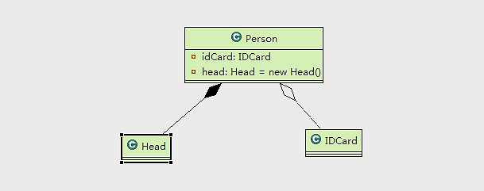

# 设计模式

**design pattern**

面向对象 =》功能模块 [设计模式+ 算法（数据结构）]=》框架 [会使用到多种设计模式]=》 架构 [服务器集群]

例如单例模式：我们不希望程序员总是去创建重量级的对象，这样的对象非常消耗内存。  

>  用过什么设计模式？怎么使用设计模式的？解决了什么问题？

**UML：（Unified Modeling Language）是一种统一建模语言，为面向对象开发系统的产品进行说明、可视化、和编制文档的一种标准语言**: 

## 设计模式本身要准守的原则：

设计模式为什么这样设计的依据：

* 单一原则
* 接口隔离
* 依赖倒转
* 里式替换
* 开闭原则
* 迪米特法则
* 合成复用原则

设计模式的存在是为了程序的，

* 代码的可重用性
* 可读性
* 可扩展性
* 可靠性（当我们增加了新的功能之后，对原来的功能没有影响）

使得我们的程序呈现高内聚，低耦合的特点。AB两个模块之间的异常仅仅存在于自身，而不会被带到其他的模块。

### 单一职责原则

#### 一：不遵循单一的原则

~~~java
package com.isea;

public class SingleOne {
    public static void main(String[] args) {
        Vehicle vehicle = new Vehicle();
        vehicle.run("火车");
        vehicle.run("汽车");
        vehicle.run("飞机");
    }
}

class Vehicle{
    public void run(String vehicle){
        System.out.println(vehicle + "在公路上跑..");
    }
}
~~~

#### 二：在类的级别上保持单一原则

~~~java
package com.isea;

public class SingleTwo {
    public static void main(String[] args) {
        RoadVehicle car = new RoadVehicle();
        WaterVehicle boat = new WaterVehicle();
        AirVehicle plane = new AirVehicle();

        car.run("汽车");
        boat.run("轮船");
        plane.run("飞机");
    }
}

class RoadVehicle{
    public void run(String vehicle){
        System.out.println(vehicle + "在公路上跑..");
    }
}

class WaterVehicle{
    public void run(String vehicle){
        System.out.println(vehicle + "在水上跑..");
    }
}

class AirVehicle{
    public void run(String vehicle){
        System.out.println(vehicle + "在天上飞..");
    }
}
~~~

#### 三：在方法的级别上保持单一原则

**只有在类中方法数量足够少，可以在方法级别上保持单一原则。**

~~~java
package com.isea;

public class SingleTwo {
    public static void main(String[] args) {
        Vehicle vehicle = new Vehicle();
        vehicle.runRoad("汽车");
        vehicle.runAir("飞机");
        vehicle.runWater("轮船");
    }
}

class Vehicle {
    public void runRoad(String vehicle) {
        System.out.println(vehicle + "在公路上跑..");
    }

    public void runWater(String vehicle) {
        System.out.println(vehicle + "在水上跑..");
    }

    public void runAir(String vehicle) {
        System.out.println(vehicle + "在天上飞..");
    }
}
~~~

### 接口隔离原则

客户端不应该依赖它不需要的接口，即一个类对另一个类的 依赖应该建立在最小接口上。举个例子：有个**interface1**，B和D类实现了该接口，该接口下有五个方法，A类通过接口**interface1**会依赖B，但是A中只会使用到其中的1,2,3三个方法，C类通过接口**interface1**会依赖D类，但是只会使用到接口的1,4,5三个方法。以上的设计就违反了最小接口的原则，B类和D类明明没有全部用到，但是还是得全部实现接口中的方法。


**代码：**

~~~java
package com.isea.single;

public class SegregationOne {

}

interface Interface1 {
    // 接口中的方法模式使用的是public和abstract来进行修饰
    void operation1();
    void operation2();
    void operation3();
    void operation4();
    void operation5();
}

class B implements Interface1 {
    public void operation1() {
        System.out.println("B实现了Operation1");
    }
    public void operation2() {
        System.out.println("B实现了Operation2");
    }
    public void operation3() {
        System.out.println("B实现了Operation3");
    }
    public void operation4() {
        System.out.println("B实现了Operation4");
    }
    public void operation5() {
        System.out.println("B实现了Operation5");
    }
}

class D implements Interface1 {
    public void operation1() {
        System.out.println("D实现了Operation1");
    }
    public void operation2() {
        System.out.println("D实现了Operation2");
    }
    public void operation3() {
        System.out.println("D实现了Operation3");
    }
    public void operation4() {
        System.out.println("D实现了Operation4");
    }
    public void operation5() {
        System.out.println("D实现了Operation5");
    }
}

class A {
 // A类通过接口interface1依赖（使用）B类，但是只会用到1，2，3方法
    public void depend1(Interface1 interface1){
        interface1.operation1();
    }

    public void depend2(Interface1 interface1){
        interface1.operation2();
    }

    public void depend3(Interface1 interface1){
        interface1.operation3();
    }
}

class C{
    // C类通过接口interface1依赖（使用）Ｄ类，但是只会用到1，4，5方法
    public void depend1(Interface1 interface1){
        interface1.operation1();
    }

    public void depend2(Interface1 interface1){
        interface1.operation4();
    }

    public void depend3(Interface1 interface1){
        interface1.operation5();
    }
}
~~~

**原则：按照隔离的原则来处理的话，将interface1拆分成几个独立的接口，类A 和类C分别和他们依赖的接口建立关系**，改进之后的如下：


~~~java
package com.isea.segregation;

public class SegregationOne {
    public static void main(String[] args) {
        A a = new A();
        a.depend1(new B()); // A类通过接口去依赖B类
        a.depend2(new B());
        a.depend3(new B());

        C c = new C();
        c.depend1(new D()); // C类通过接口去依赖D类
        c.depend4(new D());
        c.depend5(new D());

    }
}

interface Interface1 {
    // 接口中的方法模式使用的是public和abstract来进行修饰
    void operation1();
}

interface Interface2{
    void operation2();
    void operation3();
}

interface Interface3{
    void operation4();
    void operation5();
}


class B implements Interface1,Interface2{
    public void operation1() {
        System.out.println("B实现了Operation1");
    }
    public void operation2() {
        System.out.println("B实现了Operation2");
    }
    public void operation3() {
        System.out.println("B实现了Operation3");
    }
}

class D implements Interface1,Interface3{
    public void operation1() {
        System.out.println("D实现了Operation1");
    }
    public void operation4() {
        System.out.println("D实现了Operation4");
    }
    public void operation5() {
        System.out.println("D实现了Operation5");
    }
}

class A {
 // A类通过接口interface1，interface2依赖（使用）B类，但是只会用到1，2，3方法
    public void depend1(Interface1 interface1){
        interface1.operation1();
    }

    public void depend2(Interface2 interface2){
        interface2.operation2();
    }

    public void depend3(Interface2 interface2){
        interface2.operation3();
    }
}

class C{
    // C类通过接口interface1，interface3依赖（使用）Ｄ类，但是只会用到1，4，5方法
    public void depend1(Interface1 interface1){
        interface1.operation1();
    }

    public void depend4(Interface3 interface3){
        interface3.operation4();
    }

    public void depend5(Interface3 interface3){
        interface3.operation5();
    }
}

~~~

**如果一个类依赖的接口中有该类使用不到的方法，那么该我们应该将这个大的接口拆分成小的接口。**

### 依赖倒置原则（inversion）

* 高层模块不应该依赖底层模块，二者都应该依赖抽象
* 抽象不应该依赖细节，细节应该依赖抽象
* ***依赖倒置的中心思想是面向接口编程***
* 依赖倒置原则的设计基于这样的理念：相对于细节的多变性，抽象的东西要稳定的多，以抽象为基础搭建的架构比以细节为基础的架构要稳定的多，在java中抽象指的是接口或者是抽象类，细节就是具体的实现类。
* 使用接口和抽象的目的是为了定制好规范，而不涉及任何具体的操作，把具体的细节任务展现给他们的实现类去完成。

#### **案例**：

编程完成Person接收消息的功能

~~~java
package com.isea.inversion;

public class DependencyInversion {
    public static void main(String[] args) {
        Person person = new Person();
        person.receive(new Email());
    }
}

class Email{
    public String getInfo(){
        return "电子邮件信息：hello world.. ";
    }
}

class Person{
    public void receive(Email email){
        System.out.println(email.getInfo());
    }
}
/*
    这种设计问题：优点是容易，比较容易想到
    问题是：如果我们接收的对象是微信，短信，而不是邮件，需要新增新的类，同时Person也要增加相应的接受方法
    解决的思路：引入一个抽象的接口，表示一个接受者，这样Person类和这个接口发生依赖，此时，
    因为email，微信，都是属于接收的范围，他们各自实现该接口，如此一来就符合依赖倒置原则（面向接口编程）
 */

package com.isea.inversion;

public class DependencyInversion {
    public static void main(String[] args) {
        Person person = new Person();
        person.receive(new Email());
        person.receive(new WeChat());
    }
}

interface IReceiver{
    String getInfo();
}

class Email implements IReceiver{
    public String getInfo(){
        return "电子邮件信息：hello world.. ";
    }
}

class WeChat implements IReceiver{
    public String getInfo(){
        return "微信消息：hello weChat.. ";
    }
}

class Person{
    public void receive(IReceiver iReceiver){  // 这里我们是对接口的一个依赖
        System.out.println(iReceiver.getInfo());
    }
}
~~~

#### 依赖关系的三种传递方式

**1，通过接口传递实现依赖**

~~~java
package com.isea.inversion;

public class DependencyInversion {
    public static void main(String[] args) {
        OpenAndClose openAndClose = new OpenAndClose();
        openAndClose.open(new ChangHong());
    }
}

// 通过接口传递实现依赖
interface IOpenAndClose{
    void open(ITV tv);
}

interface ITV{
    void play();
}

class OpenAndClose implements IOpenAndClose{

    public void open(ITV tv) {
        tv.play();
    }
}

class ChangHong implements ITV{

    public void play() {
        System.out.println("长虹电视机打开....");
    }
}
~~~

**2，通过构造方法传递依赖**

~~~java
package com.isea.inversion;

public class DependencyInversion {
    public static void main(String[] args) {
        ChangHong changHong = new ChangHong();
        OpenAndClose openAndClose = new OpenAndClose(changHong);
        openAndClose.open();
    }
}

// 通过构造方法实现依赖的传递
interface IOpenAndClose{
    void open();
}

interface ITV{
    void play();
}

class OpenAndClose implements IOpenAndClose{
    public ITV itv;
    public OpenAndClose(ITV itv){
        this.itv = itv;
    }
    public void open() {
        this.itv.play();
    }
}

class ChangHong implements ITV{
    public void play() {
        System.out.println("长虹电视机打开....");
    }
}
~~~

**3，通过setter方法传递依赖**

~~~java
package com.isea.inversion;

public class DependencyInversion {
    public static void main(String[] args) {
        ChangHong changHong = new ChangHong();
        OpenAndClose openAndClose = new OpenAndClose();
        openAndClose.setItv(changHong);
        openAndClose.open();
    }
}

// 通过setter方法实现依赖的传递
interface IOpenAndClose{
    void open();
}

interface ITV{
    void play();
}

class OpenAndClose implements IOpenAndClose{
    public ITV itv;
    public void setItv(ITV itv){
        this.itv = itv;
    }

    public void open() {
        this.itv.play();
    }
}

class ChangHong implements ITV{
    public void play() {
        System.out.println("长虹电视机打开....");
    }
}
~~~

依赖倒置原则应该注意的细节：

* 底层模块尽量要有抽象类或者是接口，或者两者都有，程序的稳定性更好（不要出现一个类孤零零的放在哪里）
* 变量的声明类型尽量是抽象类或者是接口，这样我们的变量引用和实际对象的使用，就存在一个缓冲层，利于程序的扩展和优化 （也即**父类引用指向子类对象，或者是接口指向接口的实现**）
* 继承时要遵循里式替换原则

### 里式替换原则

* 继承包含的这样的一层含义：父类中凡是已经实现好的了方法，实际上是在设定的规范和契约，虽然它不强制要求所有的子类必须遵守这些契约，但是如果子类对这些已经实现了的方法任意的修改，就会对整个继承体系造成破坏。（如果此时有一个父类，自己实现了一些方法，子类继承它的时候，可以重写父类的方法，此时这个子类就会对整个继承体系造成破坏）
* 继承在给程序带来便利的同时，也带来了弊端，比如使用继承会给程序带来侵入性，程序的可移植性降低，增加对象的耦合性，**即**如果一个类被其他的类继承，则当这个类修改的时候，必须要考虑到所有的子类，并且父类修改后，所有涉及到的子类都有可能发生故障。
* 关于如何正确的使用继承，需要遵循里式替换原则

**遵循里式替换原则的要义是：在子类中尽量不要重写父类的方法**，继承实际上是让两个类的耦合性增大了，在适当的情况下，我们可以使用聚合，组合，依赖的方式来解决问题。例如：我们A类是一个父类，B类是A的子类，此时我们不要让B类继承A类，而是在建立一个基础的C类，AB继承C类，使用一个中间类来降低AB之间的耦合度。

~~~java
package com.isea.liskow;

public class LisKow {
    public static void main(String[] args) {
        A a = new A();
        System.out.println("11 - 3 =" + a.fun1(11,3));
        System.out.println("1 - 8 =" + a.fun1(1,8));

        B b = new B();
        System.out.println("11 - 3 =" + b.fun1(11,3)); // 这里程序员的本意是求出11 - 3的结果，他误以为调用的是fun1，实际上是fun2
        System.out.println("1 - 8 =" + b.fun1(1,8));
        System.out.println("11 + 3 + 9 =" + b.fun2(11,3));
    }
}


class A{ // A 类
    public int fun1(int num1,int num2){
        return num1 - num2;
    }
}

// B类继承了A，并对A中的fun1进行了重写（可能是无意识），fun2是B类自己的方法
class B extends A{
    public int fun1(int num1,int num2){
        return num1 + num2;
    }

    public int fun2(int a , int b){
        return fun1(a,b) + 9;
    }
}
~~~

我们发现运行原来的正常的相减功能发生了错误，原因就是类B无意中重写了父类的方法，造成了原来的错误。在实际的编程过程中，我们常常会通过重写父类的方法完成新的功能，这些写起来虽然简单，但是整个继承的复用性会变的非常复杂，特别是多态比较频繁的时候。**解决**的办法是改掉之前的继承关系，原来的父类和子类都继承一个更加基础的基类，采用聚合依赖，组合的关系来替代之前的继承关系。我们改造一下关系


~~~java
package com.isea.improve;

public class LisKow {
    public static void main(String[] args) {
        A a = new A();
        System.out.println("11 - 3 =" + a.fun1(11,3));
        System.out.println("1 - 8 =" + a.fun1(1,8));

        // 因为B类不在继承A类，因此调用者不会在认为fun1是减法，调用完成的功能就会很明确  
        B b = new B();
        System.out.println("11 + 3 =" + b.fun1(11,3));
        System.out.println("1 + 8 =" + b.fun1(1,8));
        System.out.println("11 + 3 + 9 =" + b.fun2(11,3));
    }
}

class Base{
   // 把更加基础的方法和成员写到Base类中
}

class  A extends Base{
    public int fun1(int num1,int num2){
        return num1 - num2;
    }
}

class B extends Base{

    // 如果B类需要使用到A类的方法，可以使用组合关系
    private A a = new A();

    public int fun1(int num1,int num2){
        return num1 + num2;
    }

    public int fun2(int a , int b){
        return fun1(a,b) + 9;
    }

    // 我们仍然可以使用到A的方法
    public int fun3(int a,int b){
        return this.a.fun1(a,b);
    }
}
~~~

### 开闭原则

开闭原则是编程中最基础，最重要的设计原则。也即对扩展开放，对修改关闭。**用抽象实现开放，用实现扩展细节**。当软件需要变化的时候，尽量通过软件的实体来实现变化，而不是通过修改现有的代码来变化。在软件开发的过程中，遵循其他的开发原则或者是设计模式最终的目的都是为了开闭原则。**对提供方开放，对使用方关闭**

~~~java
package com.isea.ocp;

public class OCP {
    public static void main(String[] args) {
        Graphic graphic = new Graphic();
        graphic.drawShape(new Rectangle());
        graphic.drawShape(new Circle());
    }
}

// 一个用于绘图的类
class Graphic {
    public void drawShape(Sharp s) {
        if (s.type == 1) {
            drawRectangle(s);
        } else if (s.type == 2) {
            drawCircle(s);
        }
    }

    private void drawRectangle(Sharp s) {
        System.out.println("绘制矩形...");
    }

    private void drawCircle(Sharp s) {
        System.out.println("绘制圆形...");
    }
}

class Sharp {
    int type;
}

class Circle extends Sharp {
    public Circle() {
        super.type = 2;
    }
}

class Rectangle extends Sharp {
    public Rectangle() {
        super.type = 1;
    }
}
~~~

上面的设计的优点是比较好理解，简单操作。但是违背了开闭原则，比如此时我们需要新增加一个三角形， 需要修改的位置已经在下面标出

~~~java 
package com.isea.ocp;

public class OCP {
    public static void main(String[] args) {
        Graphic graphic = new Graphic();
        graphic.drawShape(new Rectangle());
        graphic.drawShape(new Circle());
        graphic.drawShape(new Triangle());
    }
}

// 一个用于绘图的类
class Graphic {
    public void drawShape(Sharp s) {
        if (s.type == 1) {
            drawRectangle(s);
        } else if (s.type == 2) {
            drawCircle(s);
        } else if (s.type == 3){ // 这里需要修改
            drawTriangle(s);
        }
    }

    private void drawTriangle(Sharp s) { // 这里方法的使用者需要修改
        System.out.println("绘制三角形...");
    }

    private void drawRectangle(Sharp s) {
        System.out.println("绘制矩形...");
    }

    private void drawCircle(Sharp s) {
        System.out.println("绘制圆形...");
    }
}

class Sharp {
    int type;
}

class Circle extends Sharp {
    public Circle() {
        super.type = 2;
    }
}

class Rectangle extends Sharp {
    public Rectangle() {
        super.type = 1;
    }
}

class Triangle extends Sharp{
    public Triangle(){
        super.type = 3;
    }
}
~~~

那么接下来，我们按照**OCP**的开发原则来重构我们的代码：**我们把Sharp做成一个抽象类，并且提供一个抽象的方法，让子类去实现即可，如此一来我们使用的时候就不需要修改代码了。

~~~java
package com.isea.ocp;

// 抽象类下面可以有没有抽象方法，一旦一个类有一个抽象方法，该类必须被申明为抽象类
public abstract class Shape {
    abstract void draw();
}


class Triangle extends Shape{
    void draw() {
        System.out.println("绘制三角形");
    }
}

class Circle extends Shape{
    void draw() {
        System.out.println("绘制圆形");
    }
}

class Rectangle extends Shape{
    void draw() {
        System.out.println("绘制矩形");
    }
}
//————————————————————————————————————————————————————————————————————————————————————
package com.isea.ocp;

public class OCP {
    public static void main(String[] args) {
         Shape shape1 = new Rectangle();
         Shape shape2 = new Circle();
         Shape shape3 = new Triangle();
        Graphic graphic = new Graphic();
        graphic.drawShape(shape1);
        graphic.drawShape(shape2);
        graphic.drawShape(shape3);
    }
}


class Graphic{ // 图形自己不会画，所以需要在建立一个类来实现。
    public void drawShape(Shape shape){
        shape.draw();
    }
}
// 可以发现，如果在要增加新的图形，只需要添加继承shape类的类即可。
~~~

### 迪米特法则

最少知道原则。一个对象应该对其他对象保持最少的了解，类和类之间的关系越大，耦合度越大。对于被依赖的类不管其有多么的复杂，都尽量将逻辑封装在类的内部，对外处理暴露public方法，不暴露任何信息。

* 只和直接的朋友保持通信

**直接的朋友**： 每个对象都和其他的对象之间有耦合关系，只要两个对象之间有耦合关系，我们就说这两个对象之间是朋友关系，耦合的方式很多，依赖，关联，组合，聚合等。我们称出现成员变量，方法参数，方法返回值中的类为直接朋友。

（例如，A类中，B类的对象是A类的成员变量，我们就成B是A类的直接朋友；A类中有一个方法m(B b) 那么B也是A类的直接朋友，B f（）也即f方法返回一个B类的对象，那么B也是A类的直接朋友）如果一个类的方法中new了B类的一个对象，那么B不是A的直接朋友。

**陌生的类最好不要以局部变量的方式出现在类的内部。**

**案例**：有一个学校，下属有各个学院和总部，现在要求打印出学校总部员工ID，和学院员工ID。 

~~~java
package com.isea.ocp.demeter;

import java.util.ArrayList;
import java.util.List;

public class Demeter {
    public static void main(String[] args) {
        CollegeManager collegeManager = new CollegeManager();
        SchoolManager schoolManager = new SchoolManager();
        // 输出学院员工id和学校总部的员工id
        schoolManager.printAllEmployee(collegeManager);
    }
}

// 学校总部ID
class Employee{
    private String id;
    public Employee(String id){
        this.id = id;
    }

    public String getId() {
        return id;
    }

    public void setId(String id) {
        this.id = id;
    }
}

// 学院的员工
class CollegeEmployee{
    private String id;

    public String getId() {
        return id;
    }

    public void setId(String id) {
        this.id = id;
    }
}

// 管理学院员工的管理类
class CollegeManager{
    // 返回学院的所有员工
    public List<CollegeEmployee> getAllEmployee(){
        ArrayList<CollegeEmployee> list = new ArrayList<CollegeEmployee>();
        for (int i = 0; i < 10; i++) { // 临时添加10个员工
            CollegeEmployee collegeEmployee = new CollegeEmployee();
            collegeEmployee.setId("学院员工id=" + i);
            list.add(collegeEmployee);
        }
        return list;
    }
}

// 管理学校类
class SchoolManager{
    // 返回学校总部的员工
    public List<Employee> getAllEmployee(){
        ArrayList<Employee> list = new ArrayList<Employee>();
        for (int i = 0; i < 5; i++) {
            Employee employee = new Employee("学校员工id=" + i);
            list.add(employee);
        }
        return list;
    }

    // 打印学校总部员工和学院员工信息
    public void printAllEmployee(CollegeManager sub){
        List<CollegeEmployee> allEmployee = sub.getAllEmployee();
        System.out.println("----------分公司员工----------");
        for (CollegeEmployee collegeEmployee : allEmployee) {
            System.out.println(collegeEmployee.getId());
        }

        System.out.println("----------学校总部员工----------");
        for (Employee employee : this.getAllEmployee()) {
            System.out.println(employee.getId());
        }
    }
}
/**
 *  分析一下SchoolManager的直接朋友：Employee ，CollegeManager，
 *  非直接朋友 CollegeEmployee 如此一来违背了迪米特原则。 CollegeEmployee是一个陌生类，以局部变量的方式出现在方法中
 */
~~~

我们将违背了迪米特原则的类提取到类成员的位置

~~~java
package com.isea.ocp.demeter;

import java.util.ArrayList;
import java.util.List;

public class Demeter {
    public static void main(String[] args) {
        CollegeManager collegeManager = new CollegeManager();
        SchoolManager schoolManager = new SchoolManager();
        // 输出学院员工id和学校总部的员工id
        schoolManager.printAllEmployee();
        collegeManager.printAllEmployee();
    }
}

// 学校总部ID
class Employee{
    private String id;
    public Employee(String id){
        this.id = id;
    }

    public String getId() {
        return id;
    }

    public void setId(String id) {
        this.id = id;
    }
}

// 学院的员工
class CollegeEmployee{
    private String id;

    public String getId() {
        return id;
    }

    public void setId(String id) {
        this.id = id;
    }
}

// 管理学院员工的管理类
class CollegeManager{
    // 返回学院的所有员工
    public List<CollegeEmployee> getAllEmployee(){
        ArrayList<CollegeEmployee> list = new ArrayList<CollegeEmployee>();
        for (int i = 0; i < 10; i++) { // 临时添加10个员工
            CollegeEmployee collegeEmployee = new CollegeEmployee();
            collegeEmployee.setId("学院员工id=" + i);
            list.add(collegeEmployee);
        }
        return list;
    }

    // 输出学院员工的信息
    public void printAllEmployee(){
        List<CollegeEmployee> allEmployee = this.getAllEmployee();
        System.out.println("----------分公司员工----------");
        for (CollegeEmployee collegeEmployee : allEmployee) {
            System.out.println(collegeEmployee.getId());
        }

    }
}

// 管理学校类
class SchoolManager{
    // 返回学校总部的员工
    public List<Employee> getAllEmployee(){
        ArrayList<Employee> list = new ArrayList<Employee>();
        for (int i = 0; i < 5; i++) {
            Employee employee = new Employee("学校员工id=" + i);
            list.add(employee);
        }
        return list;
    }

    // 打印学校总部员工和学院员工信息
    public void printAllEmployee(){

        System.out.println("----------学校总部员工----------");
        for (Employee employee : this.getAllEmployee()) {
            System.out.println(employee.getId());
        }
    }
}
~~~

### 合成复用原则

尽量使用合成/聚合的方式，而不是继承的方式。举个例子：A类有两个方法，B类想要使用A类的方法，我们第一时间想到的就是使用继承，但是如果A类和B类之间没有什么关联的话，使用继承会让两个类耦合度增大。解决的办法就是，

* 我们可以在B类中设置一个方法，把A类的一个实例传进来，这样就可以使用到A类的方法了。B**依赖**于A。

  虚线+箭头，B指向A

* 或是，在B类中设置一个A的属性，并且设置 一个set方法，这种方式称之为，把A**聚合**到B中。单线+空心菱形，A指向B
* 我们在B类中设置`B b = new B` 这种关系称之为组合的关系，把A**组合**到B中。单线+实心菱形，A指向B。


## UML类图 

统一建模语言，常用的画图工具**Rational Rose** ，UML图的分类：

* 用例图
* 静态结构图：类图（最核心的就是类图），对象图，包图，组件图，部署图
* 动态行为图：交互图（时序图和协作图），状态图，活动图

类之间的关系一种由六种：**依赖、泛化（继承）、实现、关联、聚合、组合**

依赖：

* 依赖
* 泛化
* 实现

关联：

* 关联
* 聚合
* 组合


下面的几个标记要记住：

​	


聚合和组合是关联关系的特例，组合的关系比聚合强。

### 依赖关系

**只要是在类中使用到了对方，那么他们之间就存在依赖关系**，如果没有了对方，连编译都通过不了。 

* 如果是类的成员是属性
* 如果是类方法的返回类型
* 是方法接收的类型
* 方法中使用到了

~~~java
package com.isea.uml;
public class PersonServiceBean{
    private PersonDao personDao;
    public void save(Person person){

    }
    public IDCard getIDCard(Integer personid){
        return new IDCard();
    }
    public void modify(){
        Department department = new Department();
    }
}

class PersonDao{}
class IDCard{}
class Department{}
class Person{}
~~~

UML类图如下：

### 泛化关系（generalization）

**是依赖关系的特例，B继承了A，那么A和B的关系就泛化**

~~~java
package com.isea.uml.generalization;


public abstract class DaoSuport {
    public void save(Object entity){}
    public void delete(Object id){}
}

class PersonServiceBean extends DaoSuport{}
~~~


### 实现关系（implementation)

实现关系也是依赖关系的特例，A是一个接口，B实现了A，AB之间存在实现关系

~~~java
package com.isea.uml.impementation;

public interface PersonService {
    void delete(Integer id);
}

class PersonServiceImpl implements PersonService{
    public void delete(Integer id) {
        System.out.println("delete...");
    }
}
~~~


### 关联关系

实际上也是依赖关系的特例，表征的是类和类之间的关系。关联具有导航性，即有双向关系也有单向关系，单向一对一，双向一对一，一对多，或者是多对多；**一般是属性层面的依赖**

~~~java
// 单向一对一
public class PersonID {
    private Person person;
}
class Person{}


// 双向一对一
public class PersonID {
    private Person person;
}
class Person{
    private PersonID personID;
}
~~~


### 聚合关系

聚合关系表示的是整体和部分的关系，整体和部分可以分开，聚合关系是关联关系的特例，所以具有**导航性和多重性**。这里的导航型表示的是谁聚合谁。A，和B，之间存在聚合关系，是A聚合了B，还是B聚合了A，这里存在着导航的关系。多重性指的是A里面聚合了多少个B的对象实例，如果只是聚合一个，就是**单聚合**，如果聚合了多个，即使**多聚合**。

~~~java
package com.isea.uml.aggregation;


// 这里的Computer和Monitor，Mouse之间如果可以分开的话，就是聚合的关系，如果不可以分开就是组合的关系
// 这里分析可以发现，Mouse 和Monitor可以独立电脑而存在。所以三者构成了聚合的关系
public class Computer {
    private Monitor monitor;
    private Mouse mouse;
    public void setMonitor(Monitor monitor) {
        this.monitor = monitor;
    }
    public void setMouse(Mouse mouse) {
        this.mouse = mouse;
    }
}
class Monitor{}
class Mouse {}
~~~


### 组合关系

共生共灭，不可分割的关系

~~~java
package com.isea.uml.aggregation;

// 这里的Computer和Monitor，Mouse之间如果可以分开的话，就是聚合的关系，如果不可以分开就是组合的关系
// 这里分析可以发现,一旦Computer对象创建起来了，Mouse和Monitor对象也会被创建起来，不可分割，所以这里就是组合的关系，三者共生共灭
public class Computer {
    private Monitor monitor = new Monitor(); //  显示器和电脑不可分离
    private Mouse mouse = new Mouse(); // 鼠标和电脑不可分离
    public void setMonitor(Monitor monitor) {
        this.monitor = monitor;
    }
    public void setMouse(Mouse mouse) {
        this.mouse = mouse;
    }
}
class Monitor{}
class Mouse {}
~~~


案例

~~~java
package com.isea.uml.composition;

public class Person {
    private IDCard idCard; // 人的可分割部分，聚合关系
    private Head head = new Head(); // 人的不可分割的一部分，组合关系
}
class IDCard{}
class Head{}
~~~



但是如果在程序中Person实体中定义了对`IDCard`进行级联删除，即删除Person的时候，连同`IDCard`一起删除，那么`IDCard`和Person就是组合了。

## 设计模式学习

设计模式的出发点并不是软件的功能实现的角度，而是站在系统，结构的角度去进行功能的实现，兼顾软件可用性，可扩展性等。**某类问题的通用解决方案** 

### 设计模式的分类

设计模式分为三种类型：

* 创建型模式：单例模式，抽象工厂模式，原型模式，建造者模式，工厂模式。
* 结构型模式：适配器模式，桥接模式，装饰模式，组合模式，外观模式，享元模式，代理模式。站在了结构的角度，如何设计让软件的结构更加合理。
* 行为型模式：模板方法模式，命令模式，访问这模式，迭代器模式，观察者模式，中介者模式，备忘录模式，解释器模式，状态模式，策略模式，职责链模式。站在了如何设计我们的方法更加合理的角度进行设计的。

### 单例模式

**某类只存在 一个对象实例**，并且该类只是提供一个获取其对象实例的方法（静态方法）。在开发中一共有八种写法：

```java
// 饿汉，有两种

// 懒汉，有三种

// 双重检查

// 静态内部类

// 枚举
```

#### 八种单例模式介绍

##### 静态常量饿汉式

**可用，但是可能会造成内存的浪费**

~~~java
package com.isea.singleton.hungry;

public class HungrySingletonOne {
    public static void main(String[] args) {
        // 测试
        Singleton instance1 = Singleton.getInstance();
        Singleton instance2 = Singleton.getInstance();
        System.out.println(instance1 == instance2); // true
    }
}
// 静态常量饿汉式
class Singleton{
    // 私有化构造方法
    private Singleton(){}

    // 本类的内部创建实例对象
    private final  static  Singleton instance = new Singleton();

    // 对外暴露一个共有的静态方法
    public static Singleton getInstance(){return instance;}
}
/**
 * 优点：
 *      这种写法比较简单，就是在类加载的时候完成了实例化，避免了线程同步的问题，为什么这样说呢？
 * 缺点
 *      在类装载的时候就完成了实例化，没有达到lazy loading的效果，也就是说如果这个类没有用过，也会被加载，这样会造成内存的浪费
 * 这种方式基于classloader的方式避免了线程同步的问题，不过instance在类装载的时候就进行了实例化，在单例模式中大多都是调用
 * getInstance方法，但是导致类装载的原因有很多，因此不能确定有其他的方式（或者是其他的静态方法）导致类的装载，这是初始化instance就没有达到lazy loading的效果
 */

~~~

##### 静态代码块饿汉式

~~~java
package com.isea.singleton.hungry;

public class HungrySingletonTwo {
    public static void main(String[] args) {
        // 测试
        Singleton instance1 = Singleton.getInstance();
        Singleton instance2 = Singleton.getInstance();
        System.out.println(instance1 == instance2); // true
    }
}
// 静态代码块饿汉式
class SingletonTwo{
    // 私有化构造方法
    private SingletonTwo(){}

    // 本类的内部创建实例对象，带有final关键字的变量必须进行初始化
    private  static  SingletonTwo instance;

    static {
        instance = new SingletonTwo();
    }

    // 对外暴露一个共有的静态方法
    public static SingletonTwo getInstance(){return instance;}
}

/**
 * 优缺点和静态常量饿汉式一样
 */
~~~

##### 线程不安全懒汉式

~~~java
package com.isea.singleton.lazy;


public class LazyOne {
    public static void main(String[] args) {
        // 测试
        LazySingletonOne instance1 = LazySingletonOne.getInstance();
        LazySingletonOne instance2 = LazySingletonOne.getInstance();
        System.out.println(instance1 == instance2); // true
    }
}

// 线程不安全的懒汉式
class LazySingletonOne {
    private static LazySingletonOne instance;
    private LazySingletonOne() {
    }
    public static LazySingletonOne getInstance() {
        if (instance == null) {
            instance = new LazySingletonOne();
        }
        return instance;
    }
}

/**
 * 优点：懒加载
 * 缺点：只能在单线程中使用，为什么？如果在多线程中，一个线程进入了if(singleton == null) 判断语句块，还没有来得及往下执行，另一个
 * 线程也通过了这个判断语句，此时便会产生多个实例，所以多线程的时候不能使用这样的。
 *
 * 实际的开发中，不能使用这样的方式，因为存在着潜在的风险。
 */
~~~

##### 线程安全的懒汉式，同步方法

~~~java
package com.isea.singleton.lazy;


public class LazyTwo {
    public static void main(String[] args) {
        // 测试
        LazySingletonTwo instance1 = LazySingletonTwo.getInstance();
        LazySingletonTwo instance2 = LazySingletonTwo.getInstance();
        System.out.println(instance1 == instance2); // true
    }
}

// 线程安全的懒汉式
class LazySingletonTwo {
    private static LazySingletonTwo instance;
    private LazySingletonTwo() {
    }
    // synchronized 解决线程安全的问题
    public static synchronized LazySingletonTwo getInstance() {
        if (instance == null) {
            instance = new LazySingletonTwo();
        }
        return instance;
    }
}

/**
 * 优点：懒加载 + 解决了线程安全的问题
 * 缺点：效率低，每个线程在获得实例的时候，执行getInstance方法都要进行同步，而其实这个方法只是执行一次实例化就够了，后面的想要获得
 * 实例直接return就行了，方法的同步效率太低
 *
 * 实际的开发中，不推荐这样的方式，效率低。
 */
~~~

**伪改进**

~~~java
class LazySingletonTwo {
    private static LazySingletonTwo instance;
    private LazySingletonTwo() {
    }
    
    public static synchronized LazySingletonTwo getInstance() {
        if (instance == null) {
           // synchronized 解决线程安全的问题 ,可能会产生多个实例，和第一种情况一样
           synchronized (LazySingletonTwo.class){
               instance = new LazySingletonTwo();
           }

        }
        return instance;
    }
}
// 实际开发中，不能用，但是有人这么玩
~~~

##### 双重检查

解决了效率问题和安全问题

~~~java
class Singleton{
    // volatile关键字的作用是一旦instance发生变化，可以立刻同步
    private static volatile  Singleton instance;
    private Singleton(){}
    public static Singleton getInstance(){
        if (instance == null){ // a线程和b线程都停留在这里，a线程进入创建实例，b在外面等着，a创建完成，b进入之后
            // ，发现不空，出来，以后的其他线程，直接发现第一判断instance不空，直接返回实例，效率高，线程安全。
            
            synchronized (Singleton.class){
                if (instance == null){
                    instance = new Singleton();
                }
            }
        }
        return instance;
    }
}
// 推荐使用，开发中推荐。常用。
~~~

##### 静态内部类实现的单例

首先我们要清楚的知道静态内部类的特点：

* 外部类装载的时候，静态内部类不会被装载
* 静态内部类在装载的时候，是线程安全的

~~~java
/**
 * 这种方式采用了类装载的机制来保证初始化实例时只有一个线程，静态内部类在外部类装载的时候，并不会装载，在外部类用到了内部类的时候
 * 才进行类的装载，懒加载也实现了。
 */
class StaticInnerClassSingleton{
    // 私有化构造器
    private StaticInnerClassSingleton(){}
    // 一个静态内部类，有一个外部类的成员属性
    private static class InnerClass{
        private static final StaticInnerClassSingleton  INSTANCE = new StaticInnerClassSingleton();
    }
    public static StaticInnerClassSingleton getInstance(){
        return InnerClass.INSTANCE;
    }
}
~~~

##### 枚举单例

**枚举复习：** Java.md文件， 枚举

```java
package com.isea.singleton.recommend;

public class EnumSingleton {
    public static void main(String[] args) {
        SingletonEnum singletonEnum1 = SingletonEnum.INSTANCE;
        SingletonEnum singletonEnum2 = SingletonEnum.INSTANCE;
        System.out.println(singletonEnum1 == singletonEnum1); // true
        singletonEnum1.hello(); // hello singleton
    }
}
enum SingletonEnum{
    INSTANCE;
    public void hello(){
        System.out.println("hello singleton...");
    }
}
```

#### JDK中单例举例：Runtime类

**Runtime**类的复习：Java.md中


#### 单例总结：

* 饿汉式+双重检查+枚举重点掌握。

* 使用的场景：需要频繁的创建和销毁对象，创建对象的时候消耗太多的资源，***工具类对象，***频繁访问数据库或者是文件的对象（如***数据源，session工程***等）

### 工厂模式

#### 简单工厂模式

需求：设计一个披萨的项目，要便于披萨种类的扩展，便于维护

* 披萨的种类很多，比如（Chinese pizza，Greek pizza）
* 披萨的制作比较固定，有prepare，bake，cut，box
* 完成披萨店订购的功能。

传统的实现，这里就不在实现了，如果使用简单工厂模式来实现的话，我们将创建pizza对象封装到到一个类（工厂）中，这样我们有了新的pizza的时候，只需要修改该类（工厂类）就可以了，其他有创建pizza对象的代码就不需要修改了。这就是**简单工厂模式**

**简单工厂模式属于创建型模式，简单工厂模式由一个工厂对象决定创建出哪一种产品类的实例。简单工厂模式是工厂模式家族中最简单最实用的模式**

简单工厂模式：创建一个创建对象的类，这个类来封装实例化对象的行为。在软件开发过程中，当我们需要创建某类，某种，某批对象的时候，就会使用到工厂模式。UML类图如下：


**简单工厂模式代码**

~~~java
package com.isea.factory.simple.pizza;

public abstract class Pizza {
    private String name;

    public String getName() {
        return name;
    }

    public void setName(String name) {
        this.name = name;
    }

    // 准备pizza的过程是不一样的，因为要准备不同的源材料
    public abstract void  prepare();

    // 其他的过程都是一样的
    public void bake(){
        System.out.println(this.name + "baking...");
    }

    public void cut(){
        System.out.println(this.name + "cutting...");
    }

    public void box(){
        System.out.println(this.name + "boxing...");
    }
}

//****************************

package com.isea.factory.simple.pizza;

public class ChinesePizza extends Pizza {

    public void prepare() {
        System.out.println("准备ChinesePizza....");
    }
}

// ***************************
package com.isea.factory.simple.pizza;

public class PepperPizza extends Pizza {

    public void prepare() {
        System.out.println("准备PepperPizza...");
    }
}
// *************************
package com.isea.factory.simple.order;

import com.isea.factory.simple.pizza.ChinesePizza;
import com.isea.factory.simple.pizza.PepperPizza;
import com.isea.factory.simple.pizza.Pizza;

public class SimpleFactory {

    public Pizza createPizza(String orderType) {
        Pizza pizza = null;

        System.out.println("开始制作pizza");
        if (orderType.equals("greek")) {
            pizza = new PepperPizza();
            pizza.setName("制作希腊pizza");
        } else if (orderType.equals("chinese")) { // else if 后面可以没有else了诶
            pizza = new ChinesePizza();
            pizza.setName("制作中国pizza");
        }
//  如果说有新的pizza，我们只是需要修改简单工厂类即可，不需要修改其他的类
        return pizza;
    }
}
//**************************
package com.isea.factory.simple.order;

import com.isea.factory.simple.pizza.Pizza;

import java.io.BufferedReader;
import java.io.IOException;
import java.io.InputStreamReader;

public class OrderPizza {

    Pizza pizza = null;
    SimpleFactory simpleFactory;

    public OrderPizza(SimpleFactory simpleFactory) {
        setFactory(simpleFactory);
    }

    private void setFactory(SimpleFactory simpleFactory) {
        String orderType = ""; //

        this.simpleFactory = simpleFactory; //

        do {
            orderType = getType();
            pizza = this.simpleFactory.createPizza(orderType);

            //输出pizza
            if(pizza != null) { //
                pizza.prepare();
                pizza.bake();
                pizza.cut();
                pizza.box();
            } else {
                System.out.println("订购pizza失败");
                break;
            }
        }while(true);
    }

    private String getType() {
        try {
            BufferedReader strin = new BufferedReader(new InputStreamReader(System.in));
            System.out.println("input pizza 种类:");
            String str = strin.readLine();
            return str;
        } catch (IOException e) {
            e.printStackTrace();
            return "";
        }
    }
}
// *****************************
package com.isea.factory.simple.order;

public class PizzaStore {
    public static void main(String[] args) {
        OrderPizza orderPizza = new OrderPizza(new SimpleFactory());
    }
}
~~~

**另外**：简单工厂模式也叫静态工厂模式，因为有一写法直接工厂中创建对象的方法写成静态方法

#### 工厂方法模式

Pizza项目的新需求，客户在点Pizza的时候，可以点不同口味的Pizza，比如北京的胡椒pizza，北京的奶酪pizza，伦敦的奶酪pizza，伦敦的胡椒pizza。

工厂方法模式的设计方案：将pizza项目的实例化功能抽象成抽象方法，在不同的口味点餐子类中具体实现。

工厂方法模式：定义了一个创建对象的抽象方法，由子类决定要实例化的类，工厂方法模式将对象的实例化推迟到子类。

 


这里的`OrderPizza`就充当了工厂


> 纸上得来终觉浅，觉知此事要躬行
>
> 无他，手熟而


